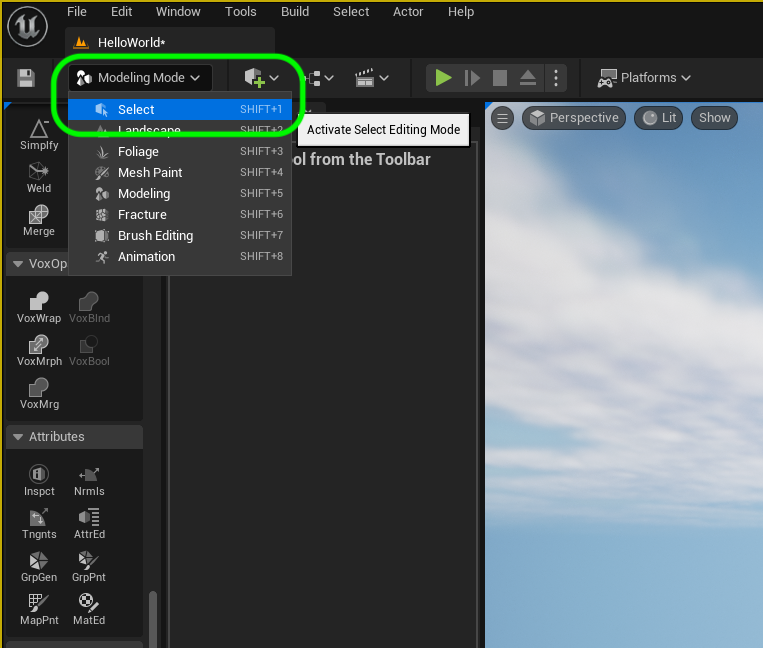
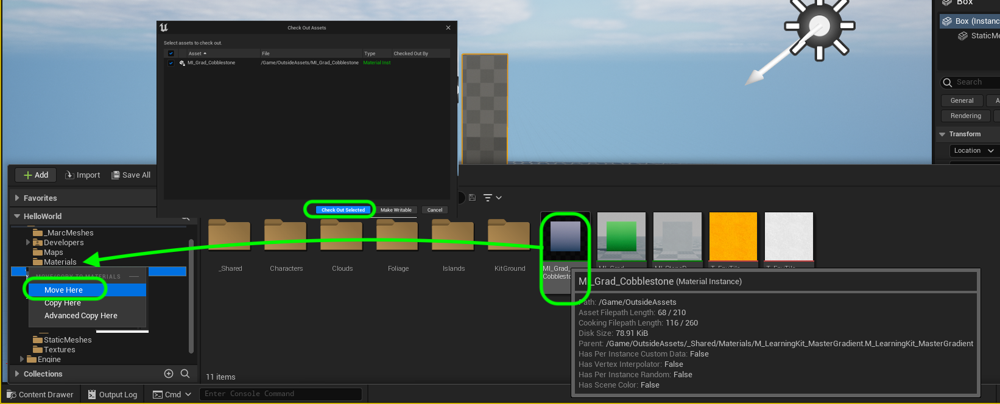
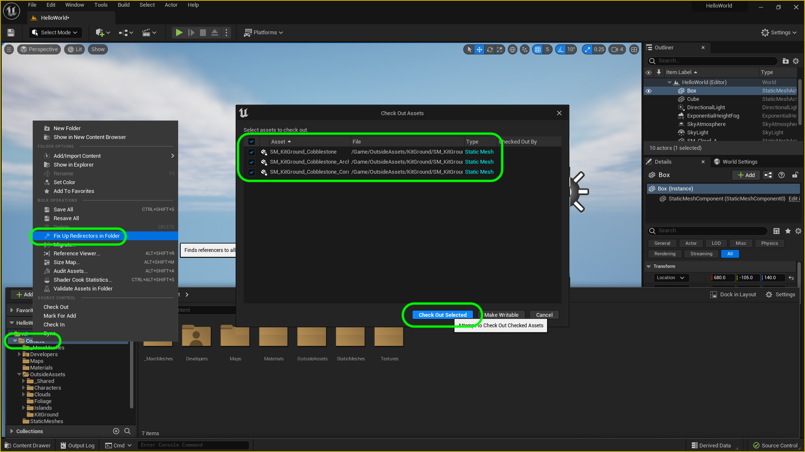
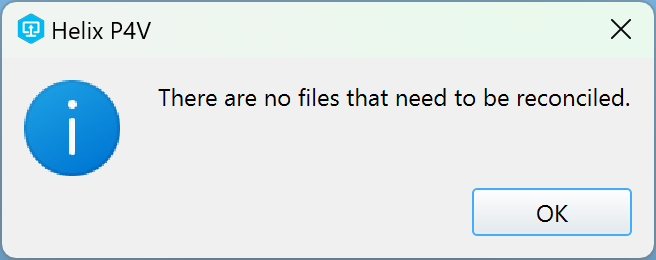

### Building The Letter H II

[previous](../building-h/README.md#user-content-building-the-letter-h) • [home](../README.md#user-content-ue4-hello-world) • [next](../displacement-h/README.md#user-content-displacment-h)

Finish up with the simple geometric H by assigning a new material, renaming it and placing it in its correct folder.

 

---

##### `Step 1.`\|`UE5HW`|:small_blue_diamond:

We are done with modeling mode for now.  Go back to the **Mode Select** drop down and pick `Select`.

##### `Step 2.`\|`UE5HW`|:small_blue_diamond: :small_blue_diamond: 

Now lets put a material on the **H** to make it look nice.  I have included a few in the **OutsideAssets** folder.  I am picking **M_Grad_Cobblestone** and dragging it into my **Materials** folder.  I select **Move**.  It will then prompt me to check out the file which I accept.

##### `Step 3.`\|`UE5HW`|:small_blue_diamond: :small_blue_diamond: :small_blue_diamond:

When moving files it is a very good idea to right click on the **Content** folder and select **Fix Up Redirects**.  Unreal doesn't move files in the way you think it does and leave redirectors for other assets referencing to them.  To actually move the files in the game as you see it in the **Content** folder you need to fix these redirections.  You will be prompted to **Check Out** files which you will have to so the action can be completed.

##### `Step 4.`\|`UE5HW`|:small_blue_diamond: :small_blue_diamond: :small_blue_diamond: :small_blue_diamond:

Select the **Letter H** in your **outliner**.  Select the **Material** slot and pick `M_Grad_Cobblestone` as the material for the letter.  Now press the play button and look at your fine work in action! 

https://user-images.githubusercontent.com/5504953/173236984-5435c0c6-828f-4148-b05a-565d4e1d4c93.mp4

##### `Step 5.`\|`UE5HW`| :small_orange_diamond:

Now move the newly created model from your working folder to **StaticMeshes**.  Rename it to `SM_H`. Fix up your redirectors again.

##### `Step 6.`\|`UE5HW`| :small_orange_diamond: :small_blue_diamond:

Now that we are done with the letter H lets submit all of your changes to **Perforce**.  Select the **H** in the **Outlinder**, right click and select **Browse to Asset**.

Select **File | Save All**. Go to the bottom right and press the <kbd>Source Contro</kbd> button and select **Submit**.  Enter a descriptive message then press the <kbd>Submit</kbd> button. You will receive a confimation of the changelist.   

https://user-images.githubusercontent.com/5504953/173236994-ae1922fe-c57f-4534-a119-1c5d5b9df331.mp4

##### `Step 7.`\|`UE5HW`| :small_orange_diamond: :small_blue_diamond: :small_blue_diamond:

Sometimes not all files get submitted to Unreal especially for files that don't show up in the editor.  It is good practice one you submit in **Unreal** and quit the game to right click on the top most project folder and select **Reconcile Offline Work...**.

This will either give a message saying ther is nothing to reconcile or bring up a tab.  Make sure that these are **NOT** files in the **Intermediate** and **Saved** folders as these should be ignored from the `.p4ignore`.

If the files are in **Content** or **Configuration** then press the <kbd>Reconcile</kbd> button.  Then submit the changes with a message and press the <kbd>Submit</kbd> button.

| [previous](../building-h/README.md#user-content-building-the-letter-h)| [home](../README.md#user-content-ue4-hello-world) | [next](../displacement-h/README.md#user-content-displacment-h)|
|---|---|---|
