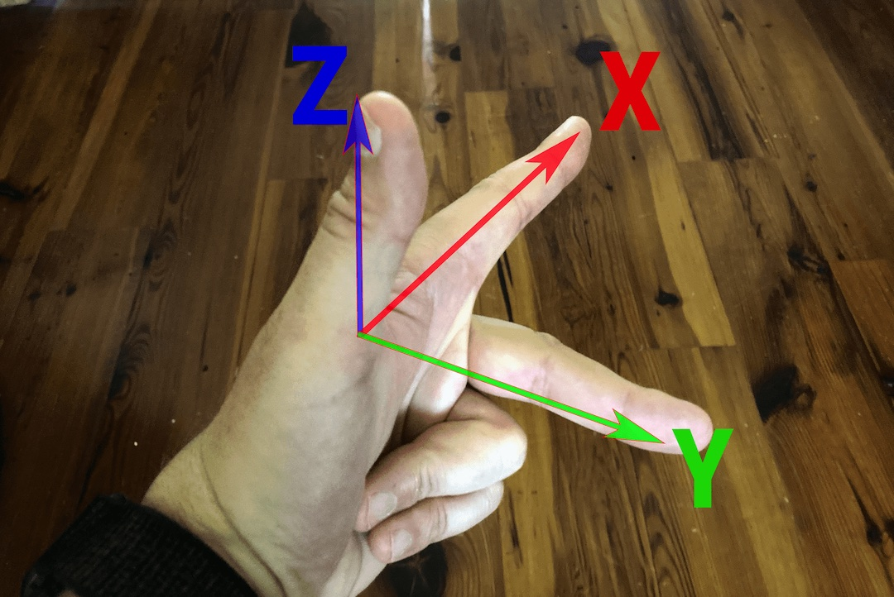
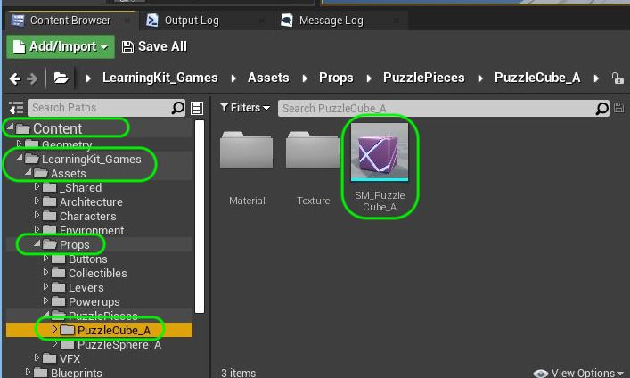
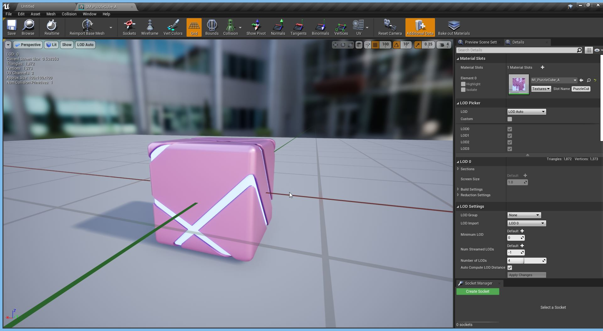
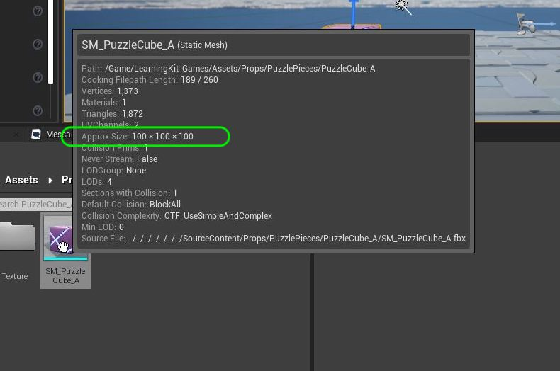
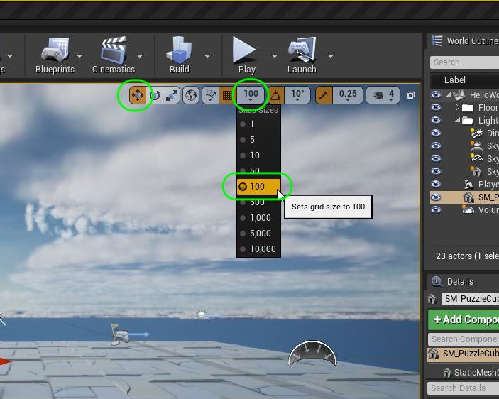
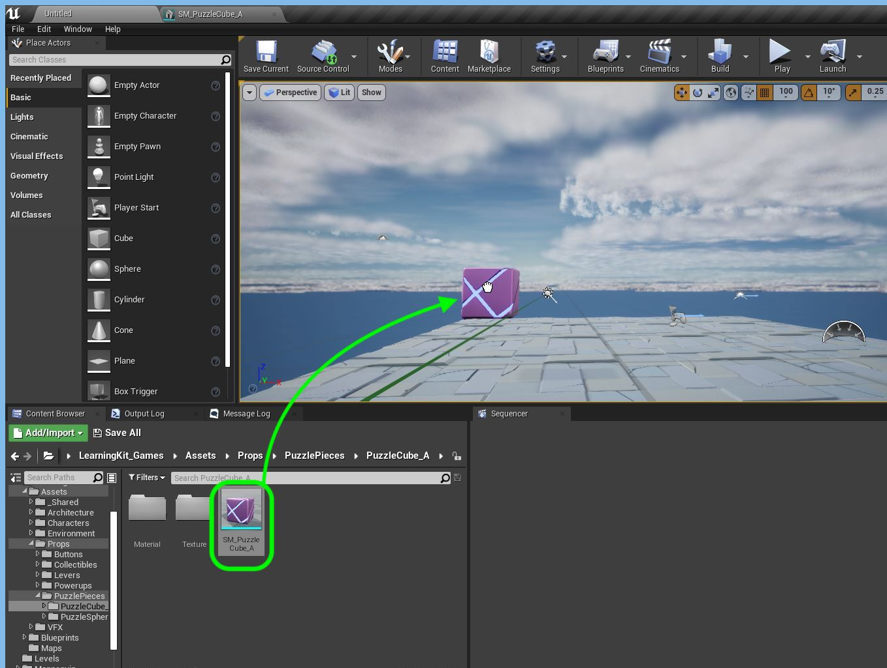
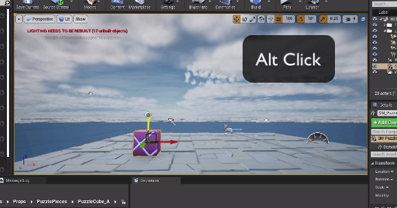
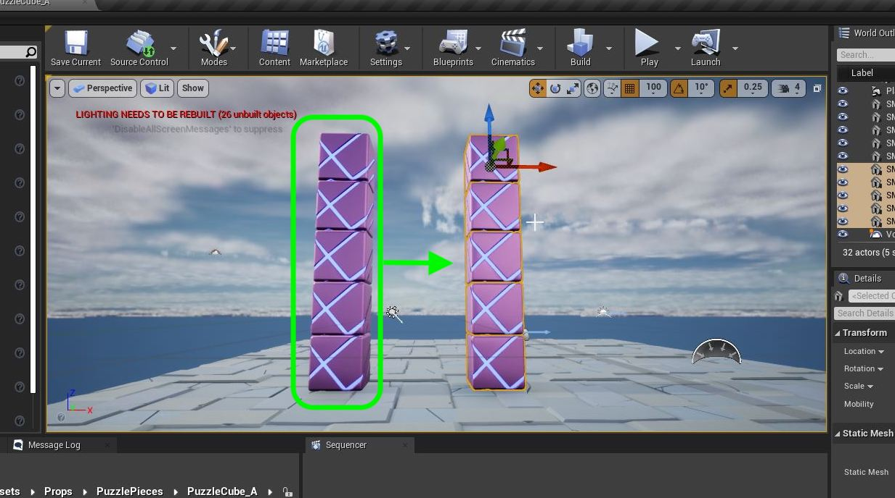
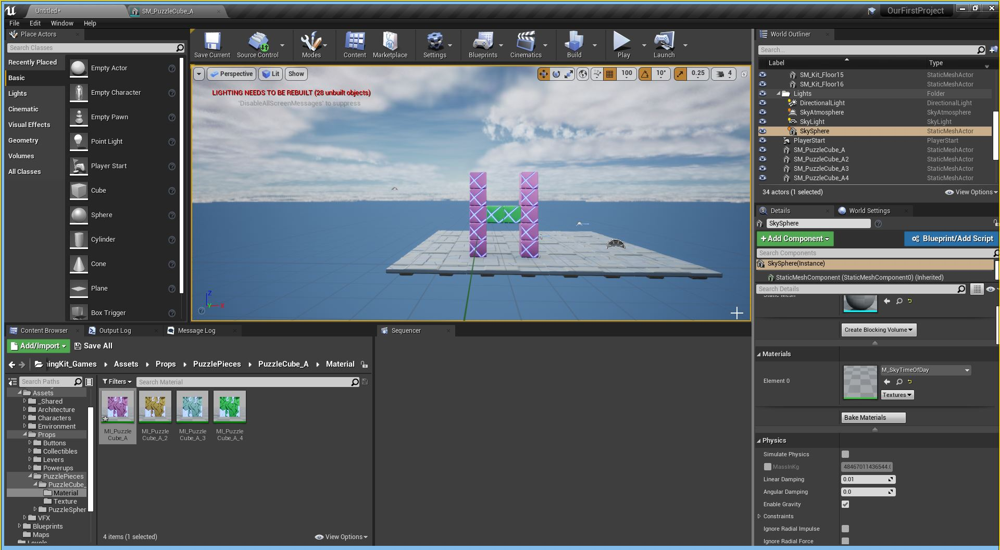

### Build The Letter H

[previous](../setting-sky/README.md#user-content-finish-setting-up-sky) • [home](../README.md#user-content-ue4-hello-world) • [next](../readme/README.md#user-content-readmemd-file)

Chapter introduction here.

 

---

##### `Step 1.`\|`SUU&G`|:small_blue_diamond:

Unreal uses a 3-D left-handed [cartesian coordinate system](https://en.wikipedia.org/wiki/Cartesian_coordinate_system).  `x` is facing forward with positive `x` to the front away from you.  `z` is up and down with positive being `z` up.  Finally, `y` is left and right with positive `y` being towards the right. We will look at placing our letters with X facing forward, Z up and Y to the right.

##### `Step 2.`\|`FHIU`|:small_blue_diamond: :small_blue_diamond: 

I am going to start building the letter **H** with cube meshes.  Now the project we imported in the **UE4** walk through has some neat shapes.  Go to the **Content Browser** and find `Content | LEarningKit_Games | Assets | Props| PuzzleCube_A | SM_Puzzle_Cube_A`. This is a nice building block for our letter H.

##### `Step 3.`\|`SUU&G`|:small_blue_diamond: :small_blue_diamond: :small_blue_diamond:

Double click on the puzzle cube static mesh and look at it in the editor. Noitce that it has a static mesh and material associated with it.  

##### `Step 4.`\|`SUU&G`|:small_blue_diamond: :small_blue_diamond: :small_blue_diamond: :small_blue_diamond:

Back in the content browser put your cursor on the puzzle piece and notice that it is **100 x 100 x 100**.  This means that we can set the translation distance to **100** so that it can perfectly snap to the right spot.

##### `Step 5.`\|`SUU&G`| :small_orange_diamond:

Drag the cube into the scene. on top of the ground pieces that are already there.

##### `Step 6.`\|`SUU&G`| :small_orange_diamond: :small_blue_diamond:
Now rather than trying to guess where the ground is there is a hot key to snap the object to the lowerst part of the surface (down on the **Z** axis).  So the <kbd>end</kbd> key snaps to ground.

##### `Step 7.`\|`SUU&G`| :small_orange_diamond: :small_blue_diamond: :small_blue_diamond:

Now since we have set the snap to **100** we can press the <kbd>alt</kbd> key and pull the handle up once to duplicate the cube.  Do this 5 times to build up the left wall of the letter **H**.

##### `Step 8.`\|`SUU&G`| :small_orange_diamond: :small_blue_diamond: :small_blue_diamond: :small_blue_diamond:

<kbd>shift</kbd> select the 5 cubes and <kbd>alt</kbd> click and drag a duplicate to get the right side of the letter **H**.

##### `Step 9.`\|`SUU&G`| :small_orange_diamond: :small_blue_diamond: :small_blue_diamond: :small_blue_diamond: :small_blue_diamond:

Add the middle portion of the H on your own.  Lets look now at altering the color of the cubes.

##### `Step 10.`\|`SUU&G`| :large_blue_diamond:

We can change the material of the cube to get a different color combination.  Go to the **Material** folder under the puzzle piece and you will find multiple difference **Material Instances**.  These are the same underpinnings of a material with different settings (in this case color).  We will look at this in the next section.  For now select a group of cubes and drag the different materials to see the different color combinations you can achieve.

##### `Step 11.`\|`SUU&G`| :large_blue_diamond: :small_blue_diamond: 

I settled on a green middle for the H.

##### `Step 12.`\|`SUU&G`| :large_blue_diamond: :small_blue_diamond: :small_blue_diamond: 

##### `Step 13.`\|`SUU&G`| :large_blue_diamond: :small_blue_diamond: :small_blue_diamond:  :small_blue_diamond: 

##### `Step 14.`\|`SUU&G`| :large_blue_diamond: :small_blue_diamond: :small_blue_diamond: :small_blue_diamond:  :small_blue_diamond: 

##### `Step 15.`\|`SUU&G`| :large_blue_diamond: :small_orange_diamond: 

##### `Step 16.`\|`SUU&G`| :large_blue_diamond: :small_orange_diamond:   :small_blue_diamond: 

##### `Step 17.`\|`SUU&G`| :large_blue_diamond: :small_orange_diamond: :small_blue_diamond: :small_blue_diamond:

##### `Step 18.`\|`SUU&G`| :large_blue_diamond: :small_orange_diamond: :small_blue_diamond: :small_blue_diamond: :small_blue_diamond:

##### `Step 19.`\|`SUU&G`| :large_blue_diamond: :small_orange_diamond: :small_blue_diamond: :small_blue_diamond: :small_blue_diamond: :small_blue_diamond:

##### `Step 20.`\|`SUU&G`| :large_blue_diamond: :large_blue_diamond:

##### `Step 21.`\|`SUU&G`| :large_blue_diamond: :large_blue_diamond: :small_blue_diamond:

___

| [previous](../setting-sky/README.md#user-content-finish-setting-up-sky)| [home](../README.md#user-content-ue4-hello-world) | [next](../readme/README.md#user-content-readmemd-file)|
|---|---|---|
