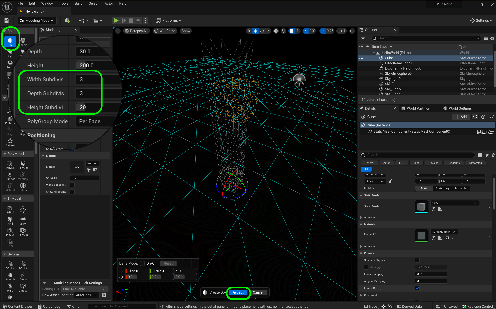

### Building The Letter H

[previous](../floor-level/README.md#user-content-adding-floor-and-sky-to-level) • [home](../README.md#user-content-ue4-hello-world) • [next](../readme/README.md#user-content-readmemd-file)

UE5 provides a great set of modelling tools where can model in engine without using a DCC such as **Maya**. Lets craft the letter H. We will try two techniques.  This first one is using the geometry editing tools of Unreal to create a blocky H.

 

---

##### `Step 1.`\|`UE5HW`|:small_blue_diamond:

First make sure in **Edit | Plugins** that **Modelling Tools Editor Mode** is enabled.  If not enable them and you might have to reboot **Unreal**.

##### `Step 2.`\|`UE5HW`|:small_blue_diamond: :small_blue_diamond: 

I want to alter the default settings.  I want all models I create using the tool to start in a scratch directory.  Go to **Edit | Project Settings** and look in **Plugins** for **Modeling Mode**.

I changed the **Auto Generated Asset Path to `MarcMeshes` and made sure the **Asset Generation Locations** was set to `Auto Generated Global Asset Path` and set **Store Unsaved Level Assets in Top Level Game Folder** to `true`.

![add folder to store models(images/settings.png)

##### `Step 3.`\|`UE5HW`|:small_blue_diamond: :small_blue_diamond: :small_blue_diamond:

Now go back to our **HelloWorld** level and selecdt **Place Actors | Shapes Cube** to add a 1 meter cube square for reference.  This is 3.2 feet squared for reference.

##### `Step 4.`\|`UE5HW`|:small_blue_diamond: :small_blue_diamond: :small_blue_diamond: :small_blue_diamond:

It can be tricky to get an object to sit right on the ground.  There is a hot key that you can use that will snap the actor downwards to the closes surface (in our case the floor).  Just click on the object in the editor and press the <kbd>End</kbd> key.

https://user-images.githubusercontent.com/5504953/173193202-b8e28f9b-c908-4e12-888a-d74d974b03db.mp4

##### `Step 5.`\|`UE5HW`| :small_orange_diamond:

Click on the cube in the scene and in the **Outliner** panel click on the **Folder** icon next to the static mesh.  This takes you to the location of the file.  It is in the engine folder.  Put your cursor on top of the cube and you will see it is `100` cm cubed.  This is `1` meter cubed.  Lets leave this in the scene as a reference.  1 meter is 3.28 feet.

https://user-images.githubusercontent.com/5504953/173210035-4a9d754e-93ff-49e3-8677-9b4138904e1c.mp4

##### `Step 6.`\|`UE5HW`| :small_orange_diamond: :small_blue_diamond:

Now lets switch the default material to see how it looks on this reference model.  We can use this as a judgement when we have to UV our modeled shapes.  Click on the material then on the **Gear** icon.  Turn on **Show Engine Content**.  Then look for the `Default Material` and select this for the cube.  You should see a cube with 10cm grid pieces.

https://user-images.githubusercontent.com/5504953/173210038-5375d3cd-4179-49af-aa34-c39c06e97d74.mp4

##### `Step 7.`\|`UE5HW`| :small_orange_diamond: :small_blue_diamond: :small_blue_diamond:

The default editing mode we we start with the editor is **Select** mode. Click the **Select Mode** button and switch to **Modeling** mode. This will change us to a new mode where we can access an extensive set of modeling tools.

##### `Step 8.`\|`UE5HW`| :small_orange_diamond: :small_blue_diamond: :small_blue_diamond: :small_blue_diamond:

Click in the **Shapes** menu and select a **Box**.  Set the **Width** and **Depth** to `30` cm and the height to `200` cm (2 meters).  Move the cursor around and you can see the one side of our **H** letter.

##### `Step 9.`\|`UE5HW`| :small_orange_diamond: :small_blue_diamond: :small_blue_diamond: :small_blue_diamond: :small_blue_diamond:

Now click on the top left button **Perspective** and select **Wireframe**.  This will show you the model in triangles.  You will notice you have only 2 triangles per face.

##### `Step 10.`\|`UE5HW`| :large_blue_diamond:

Lets subdivide the faces so that they end up being square. Lets put 6 triangles (or 3 polygons) along the shor 30 cm sides.  So how many triangles do we need for the 200 cm face.  Well we can divide 200 cm by 30 cm to find the ratio and multiply it by 3 polygons.  This leaves us with 20 polygons or 40 triangles.

##### `Step 11.`\|`UE5HW`| :large_blue_diamond: :small_blue_diamond: 

So lets subivide the **Depth** by `3` and the **Height** by `20`. Now while still in **Wireframe** mode we can see that we have subdivided the faces with perfectly square polygons. Press the **Complete** button so that we can start to form the bridge on the **H**.

##### `Step 12.`\|`UE5HW`| :large_blue_diamond: :small_blue_diamond: :small_blue_diamond: 

Go back to **Perspective** mode so we do not just see triangles on screen. Now in the **Tri Model** menue select **TriSet**.  We will then want to select the 6 middle polygons (12 triangles) on the inside face so we can extrude the bridge of the **H**.  First we need to turn `off` **Hit Back Faces** so that we do not select all polygons around the entire circumpherence.

##### `Step 13.`\|`UE5HW`| :large_blue_diamond: :small_blue_diamond: :small_blue_diamond:  :small_blue_diamond: 

Adjust the **Brush | Size** and select the 6 middle polygons.  If you select too many you can press the <kbd>Shift</kbd> button to deselect them.  It should be easy to pick the 12 triangles in the middle of the **H**.

##### `Step 14.`\|`UE5HW`| :large_blue_diamond: :small_blue_diamond: :small_blue_diamond: :small_blue_diamond:  :small_blue_diamond: 

Now we want to manupulate the entire set of them (we want to extrude them) so lets create a **Polygroup** by pressing the **Mesh Edit | Creaet Polygroup** button.

##### `Step 15.`\|`UE5HW`| :large_blue_diamond: :small_orange_diamond: 

We are going to build half of the letter and mirror it since it is symmetrical.  I want the horizontal bridge of the **H** to be 30 units so half would be `15`.  We need to change the snapping of displacement to `5`.  Then three ticks will be `15` units. 

Then click the **PolyModel | PolyEd** button and select the group where the bridge is supposed to be. Select the **Face Edits | Extrude** button.  Now take the mouse back to the face and move it out three units.  Press the left mouse button then the <kbd>Accept</kbd> button at the bottom.

https://user-images.githubusercontent.com/5504953/173234122-96514203-f5aa-424c-8827-4eebfca2f2af.mp4

##### `Step 16.`\|`UE5HW`| :large_blue_diamond: :small_orange_diamond:   :small_blue_diamond: 

https://user-images.githubusercontent.com/5504953/173234638-01d7a97b-d309-4589-bed1-d41ba9b59be8.mp4

##### `Step 17.`\|`UE5HW`| :large_blue_diamond: :small_orange_diamond: :small_blue_diamond: :small_blue_diamond:

##### `Step 18.`\|`UE5HW`| :large_blue_diamond: :small_orange_diamond: :small_blue_diamond: :small_blue_diamond: :small_blue_diamond:

##### `Step 19.`\|`UE5HW`| :large_blue_diamond: :small_orange_diamond: :small_blue_diamond: :small_blue_diamond: :small_blue_diamond: :small_blue_diamond:

##### `Step 20.`\|`UE5HW`| :large_blue_diamond: :large_blue_diamond:

##### `Step 21.`\|`UE5HW`| :large_blue_diamond: :large_blue_diamond: :small_blue_diamond:

___

| [previous](../floor-level/README.md#user-content-adding-floor-and-sky-to-level)| [home](../README.md#user-content-ue4-hello-world) | [next](../readme/README.md#user-content-readmemd-file)|
|---|---|---|
