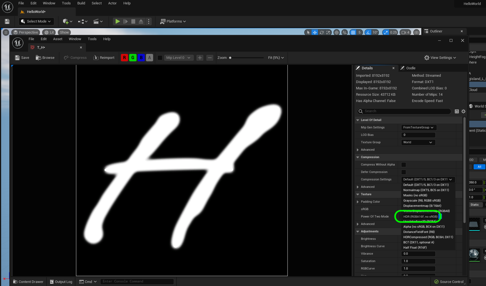

### Displacement H

[previous](../building-h/README.md#user-content-building-the-letter-h) • [home](../README.md#user-content-ue4-hello-world) • [next](../readme/README.md#user-content-readmemd-file)

Now that builds a very blocky H.  Now that we have nanite support we can have many more faces and have a fancier font.  How would we take a handwriting font and extrude it with lots of detail?  We can use a displacement map.  Lets do it!

 

---

##### `Step 1.`\|`UE5HW`|:small_blue_diamond:

We will be using a displacement map to create a nice font from a plane in UE5.  What is a [displacement map](https://en.wikipedia.org/wiki/Displacement_mapping)? This is a way to use a grayscale map to displace an the points on a model to push them up or down.  Take a look at the video below by clicking on the picture.

*Click on above photo to watch video.*

##### `Step 2.`\|`UE5HW`|:small_blue_diamond: :small_blue_diamond: 

Open up **Photoshop** and create a new file.  Select a **Custom** size.  We want to use a standard texture so we will pick a square resolution with a power of 2 with the most detail we can get.  The more dense the pixels, the greater definition we will have in our displacement map.

The maximum we can use is an 8K texture but what is the exact pixel resolution.  Lets look at the power of 2.  2, 4, 8, 16, 32, 64, 128, 256, 512, 1024, 2048, 4096, 8192.  We want a file that is `8192` square with a **black** background.  Remember that black is no displacement, and white is maximum displacement. We will draw out text in white which will be the extruded letter.

##### `Step 3.`\|`UE5HW`|:small_blue_diamond: :small_blue_diamond: :small_blue_diamond:

Now before I booted up **Photoshop** I installed a font that I wanted to use.  You need to have your font loaded **before** you start photoshop.  I select the **Text** tool and picked the `Vujahday Script` font (from Google Fonts).  The maximum size I can make it is `1296` points but we can scale it more.  Make sure the font color is **PURE** white - `255`, `255` by `255` in the **RGB** channels.

I typed in a capital `H`.

##### `Step 4.`\|`UE5HW`|:small_blue_diamond: :small_blue_diamond: :small_blue_diamond: :small_blue_diamond:

While selecting the text layer go to **Edit | Transform | Scale** and scale it up to fill most of the window but giving it some space for an outer glow.  No we cannot have a completely flat extrude we need to have some slope to it.

##### `Step 5.`\|`UE5HW`| :small_orange_diamond:

So to create a gradation from white to black I have selected a **Layer Style | Outer Glow** and set the **Blend Mode** to `Normal`, the color to `White`, the **Size** to a maximum of `250` px, and added a rounded **Contour**. Please feel free to experiement with your own settings.

##### `Step 6.`\|`UE5HW`| :small_orange_diamond: :small_blue_diamond:

Now when you are happy with it we can press **File | Export |Quick Export as PNG**.  Create a new directory in the **Hello World** folder (the same folder that your `.uproject` file is in) and call it `SourceFiles`.  Press the <kbd>Save</kbd> button.

##### `Step 7.`\|`UE5HW`| :small_orange_diamond: :small_blue_diamond: :small_blue_diamond:

Now in case we want to make tweaks to the **Photoshop** file lets save the source PSD so you can come back to it.  Press **File | Save** and put it in the same **SourceFiles** folder that you used above. Call it `H.psd`.

##### `Step 8.`\|`UE5HW`| :small_orange_diamond: :small_blue_diamond: :small_blue_diamond: :small_blue_diamond:

Now UE4 only track files in the **Content** and the **Config** folders.  So since we added a folder to put our source files that are not in engine we will have to add these in **Perforce** ourselves.  Open up **P4V** and login.  Select the **SourceFiles** folder and press the <kbd>Add</kbd> button.

Select `New` under the changelist and add an appropriate description.  Press the <kbd>OK</kbd> button.

##### `Step 9.`\|`UE5HW`| :small_orange_diamond: :small_blue_diamond: :small_blue_diamond: :small_blue_diamond: :small_blue_diamond:

Now we can drag the `T_H.png` into the **Textures** folder in the **Content Drawer**.

##### `Step 10.`\|`UE5HW`| :large_blue_diamond:

Now double click on **T_H** texture to open up the texture editor.  Change the **Compression Settings** to `HDR (RGB no sRGB)`.

##### `Step 11.`\|`UE5HW`| :large_blue_diamond: :small_blue_diamond: 

Now press the **Select Mode** drop down and pick the **Modeling** mode.  Now pic the **Rect** shape (for a plane) and select a **Width** and **Depth** of `200` cm.  Then lets subdivide the polygons by `10` by `10` for 
**Width** and **Depth**. Left click on the screen and select the <kbd>Complete</kbd> button.

##### `Step 12.`\|`UE5HW`| :large_blue_diamond: :small_blue_diamond: :small_blue_diamond: 

We want to deform this mesh, so go to the **Deform | Displce** tool. Notice it is using perlin noise to randomly deform the mesh.  

##### `Step 13.`\|`UE5HW`| :large_blue_diamond: :small_blue_diamond: :small_blue_diamond:  :small_blue_diamond: 

Change the texture displacement type from **Perlin Noise** to `Texture2D Map`.

##### `Step 14.`\|`UE5HW`| :large_blue_diamond: :small_blue_diamond: :small_blue_diamond: :small_blue_diamond:  :small_blue_diamond: 

 Change the **Displacement Map** to `T_H`, the displacement texture map we just created and imported.

##### `Step 15.`\|`UE5HW`| :large_blue_diamond: :small_orange_diamond: 

We can adjust the height of the **Displacement Intensity** to something closer to `18`.  This exaggerates the effect and really extrudes from the plane.  You then notice that 200 triangles is not nearly enough to represent the detail in an 8K map.  You will see that it is all jaggy.

##### `Step 16.`\|`UE5HW`| :large_blue_diamond: :small_orange_diamond:   :small_blue_diamond: 

We can further increase the **Subdivisions**.  It is good to do this slowly as if the number is too big the engine will crash.  I found `14` to produce very high fidelity results.

##### `Step 17.`\|`UE5HW`| :large_blue_diamond: :small_orange_diamond: :small_blue_diamond: :small_blue_diamond:

Now I need to cut of the original plane that we used to start so we just have the letter **H**.  Select the **TriModel | PlyCut** tool.  Drag the blue arrow up and down to change the height of where it is cutting.  Be patient when you let go it needs to cut through millions of polygons so there is a temporary texture while it is making its calculations. 

##### `Step 18.`\|`UE5HW`| :large_blue_diamond: :small_orange_diamond: :small_blue_diamond: :small_blue_diamond: :small_blue_diamond:

You might need to **Actions | Flip Plane** if it is cutting from the wrong direction.  Work it so that it is just cutting off the very bottom of the plane and not cutting into the letter. Press the <kbd>Accept</kbd> button.

##### `Step 19.`\|`UE5HW`| :large_blue_diamond: :small_orange_diamond: :small_blue_diamond: :small_blue_diamond: :small_blue_diamond: :small_blue_diamond:
 I find the edges a bit rough as the displacement map has a hard time with steep drop offs as well as photoshop maybe not being the best tool for the job. Also, the UV's are going to be very hard to create properly in such a dense mesh.  

 So I am going to reduce the poly count to remov some of the noise.  I go to **MeshOps** and selecxt **Simplify**. I set the **Target Percentage** to `1` %.  I like the poly flow much better now.

##### `Step 20.`\|`UE5HW`| :large_blue_diamond: :large_blue_diamond:

Now we need to create proper uvs.  Press the **UVs | AutoUV** and it will do a good enough job for us. Press the <kbd>Accept</kbd> button.

___

| [previous](../building-h/README.md#user-content-building-the-letter-h)| [home](../README.md#user-content-ue4-hello-world) | [next](../readme/README.md#user-content-readmemd-file)|
|---|---|---|
