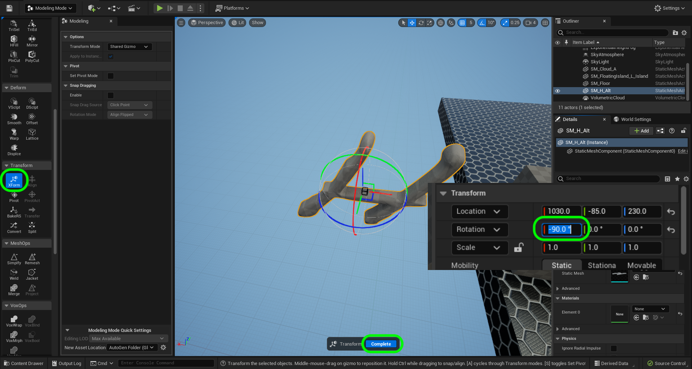
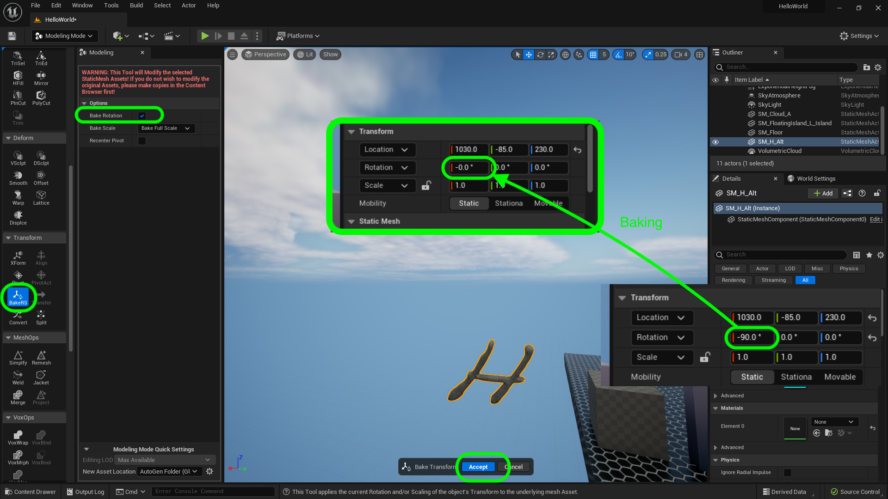
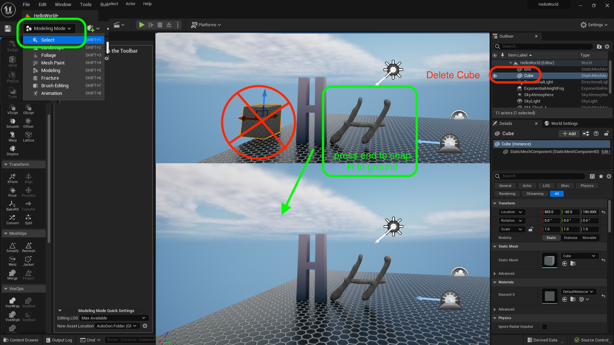
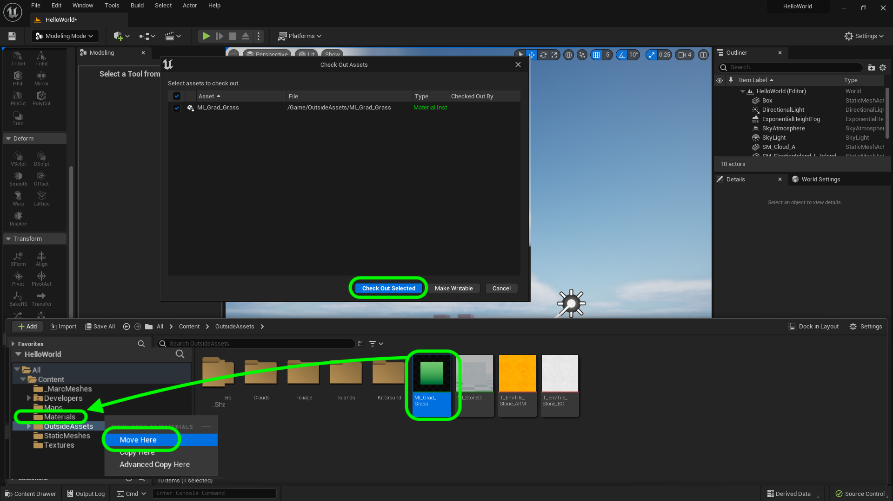
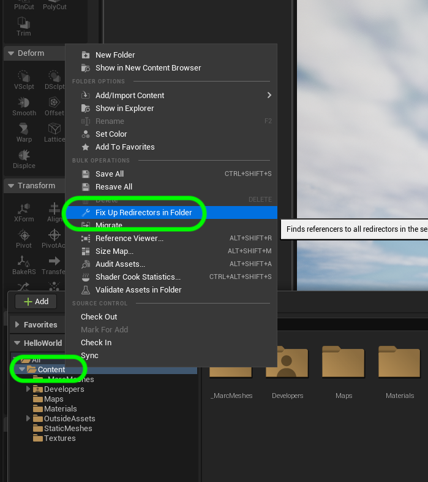
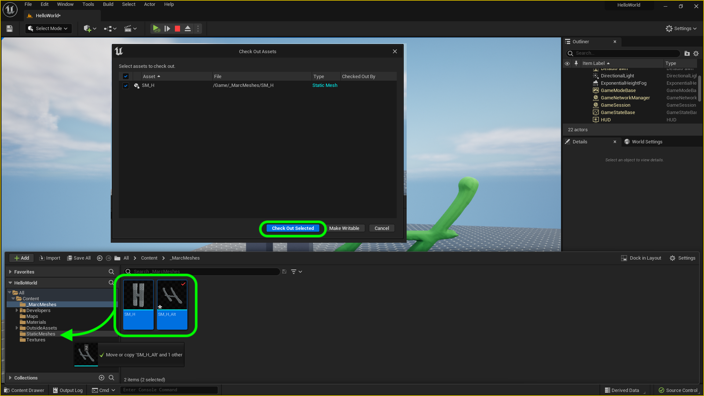
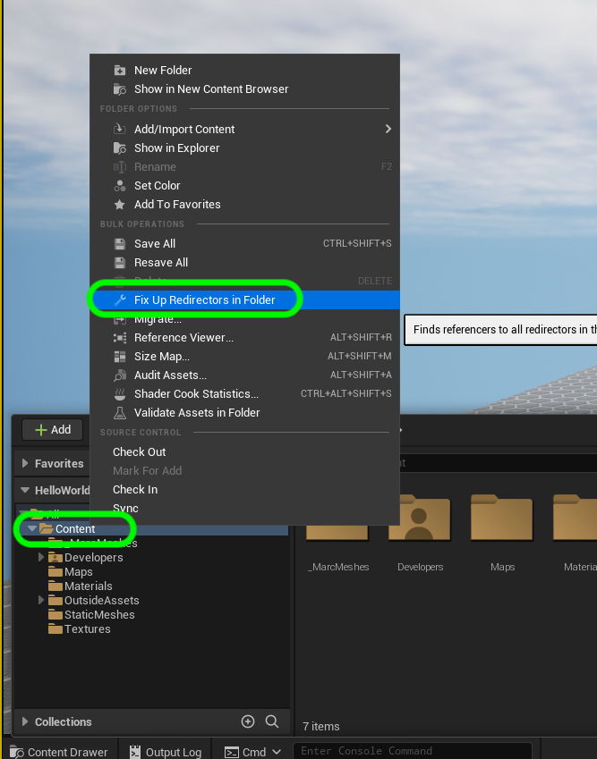
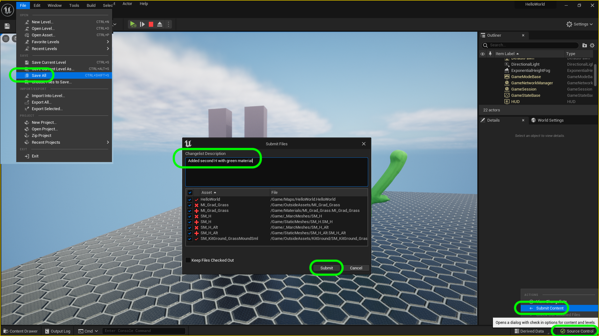

### Displacement H II

[previous](../displacement-h/README.md#user-content-displacment-h) • [home](../README.md#user-content-ue4-hello-world) • [next](../juice/README.md#user-content-making-it-juicy)

Lets finish up by correcting the direction of the model then adding a material.  We can then save our work and push to **Perforce**.

 

---

##### `Step 1.`\|`UE5HW`|:small_blue_diamond:

Now the model is pointing in the wrong diretion.  It is lying along the ground and we want it upright.  Go to 
**Transform | XFrom** and rotate on the **X** axis by -90 degrees. Now it is upright.  But we want this to be the default, `0`,`0`,`0` angle.  Press the <kbd>Complete</kbd> button. So lets bake this in.

##### `Step 2.`\|`UE5HW`|:small_blue_diamond: :small_blue_diamond: 

Now we want this to be the default baked position.  Go to **Transform | BakeRS** and make sure that **Bake Rotation** is set to `true`.  Press the <kbd>Accept</kbd> button.  Now all your **Rotations** are set to `0`.

##### `Step 3.`\|`UE5HW`|:small_blue_diamond: :small_blue_diamond: :small_blue_diamond:

Go back to **Select** mode. Move the new cursive H next to the blocky one. Press the <kbd>End</kbd> key to get it to be right on the ground plane.  Now delete the reference cube from the scene as it is no longer needed.

##### `Step 4.`\|`UE5HW`|:small_blue_diamond: :small_blue_diamond: :small_blue_diamond: :small_blue_diamond:

Go to the **OutsideContent** folder and drag **M_Grad_Grass** to the **Materials** folder.  Select `Move Here`. You will the press the <kbd>Check Out Selected</kbd> button to register this in **Perforce**.  

##### `Step 5.`\|`UE5HW`| :small_orange_diamond:

Now when moving a file it is best to fix up redirectors.  Right click on the **Content** folder and select **Fix Up Redirects in Folders** and checkout any files you need to.

##### `Step 6.`\|`UE5HW`| :small_orange_diamond: :small_blue_diamond:

Another way to assign materials is to drag and drop the material on the letter.  Press <kbd>Cntrl Space</kbd> and drag **M_Grad_Grass** onto the model and it will apply the new material.

https://user-images.githubusercontent.com/5504953/173255516-8a0f4b77-2e1a-4514-8b0a-714539ab43fc.mp4

##### `Step 7.`\|`UE5HW`| :small_orange_diamond: :small_blue_diamond: :small_blue_diamond:

Now right click on the new static mesh you built and **Rename** it to `SM_H_Alt`.

https://user-images.githubusercontent.com/5504953/173255732-7400bd5f-d5e6-4f4a-82e7-f4c0fe8478aa.mp4

##### `Step 8.`\|`UE5HW`| :small_orange_diamond: :small_blue_diamond: :small_blue_diamond: :small_blue_diamond:

Now you can move both the **SM_H** and **SM_H_Alt** into our **Static Meshes** folder as we are happy with the outcome and want to move them into our active game folders. You will be prompted to check out the files which you will comply with.

##### `Step 9.`\|`UE5HW`| :small_orange_diamond: :small_blue_diamond: :small_blue_diamond: :small_blue_diamond: :small_blue_diamond:

Whenever we move files we need to fix up the redirectors.  Click on **Content** and right click and pick `Fix Up Redirectors in Folders`.  Check out any files you need to.

##### `Step 10.`\|`UE5HW`| :large_blue_diamond:

We need to save all of our work to date and submit to **Perforce**.  Press **File | Save All** then press the <kbd>Source Control</kbd> button.  Now press the <kbd>Submit Button</kbd>.  Type in an appropriate message aobut the second **H** and press the <kbd>Submit</kbd> button.

| [previous](../displacement-h/README.md#user-content-displacment-h)| [home](../README.md#user-content-ue4-hello-world) | [next](../juice/README.md#user-content-making-it-juicy)|
|---|---|---|
