### Adding Floor and Sky to Level

[previous](../running-p4/README.md#user-content-running-perforce-in-unreal) • [home](../README.md#user-content-ue4-hello-world) • [next](../building-h/README.md#user-content-building-the-letter-h)

Now lets add the floor static mesh we looked at to the level as it is completely empty. Also, we are in a black void, lets put us on earth and give us a sun, clouds, sky and fog.

 

---

##### `Step 1.`\|`UE5HW`|:small_blue_diamond:

Make sure you booted up the game from **P4V** and that **Source Control** is green.  Make sure you are in the **Hello World** level. Now access the **Content Drawer** (<kbd>Cntrl Space</kbd>) and select the **Static Mesh** folder and drag `SM_Floor` into the level.  

When you drag a static mesh into the level it shows up in the **World Outliner**.  This is what we call a single instance in level HelloWorld of the SM_Floor static mesh.  Now you can have more instances of this object in the level, but there is only a single mesh in the game.

In the **Transform | Location** in the details pane you will notice that it dropped it in a random area.  Press the white <kbd>Arrow</kbd> icon and reset the location to `0.0, 0.0, 0.0`.

Notice everything is black. Why can't we see anything?

##### `Step 2.`\|`UE5HW`|:small_blue_diamond: :small_blue_diamond: 

Now the scene is black as there is no sky and no light in the scene.  So the pixels are in the darkness of deep space.  Click on the <kbd>Lit</kbd> button at the top left of the editor game scene and change the lighting mode to **Unlit**.

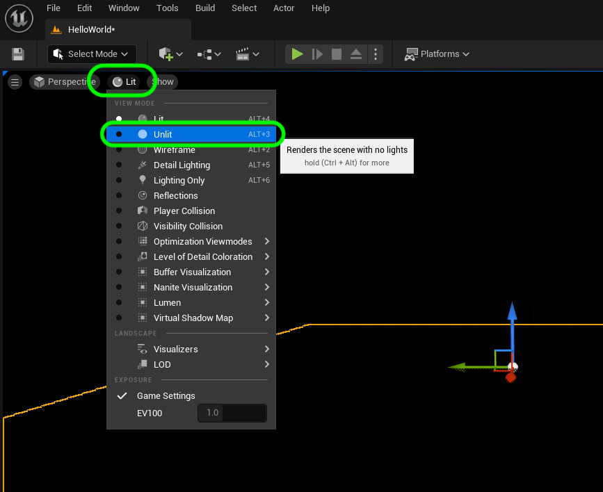

##### `Step 3.`\|`UE5HW`|:small_blue_diamond: :small_blue_diamond: :small_blue_diamond:

So now in the editor we can see the floor but the lighting looks very flat
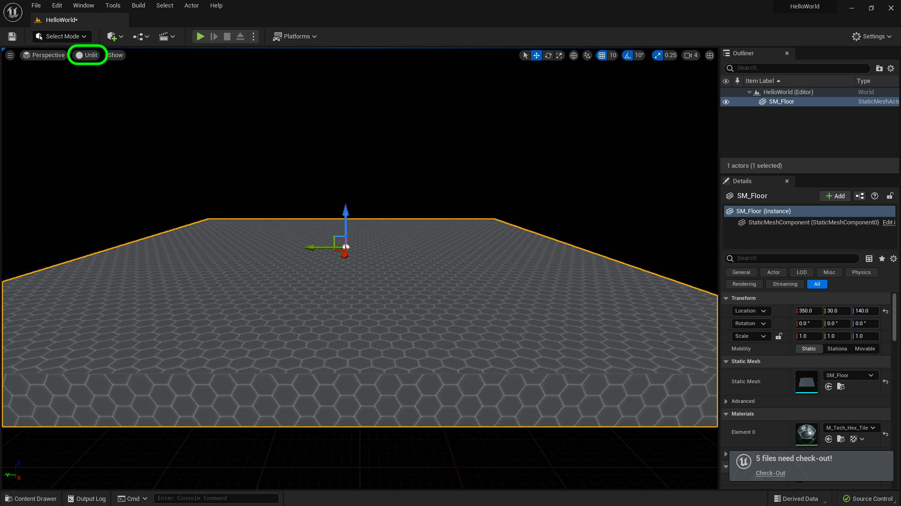

##### `Step 4.`\|`UE5HW`|:small_blue_diamond: :small_blue_diamond: :small_blue_diamond: :small_blue_diamond:

Now press the green **Play** button and it will be black again.  This **unlit** mode only works in the editor and not in game mode.

https://user-images.githubusercontent.com/5504953/172620693-5a0f5f9e-9879-4601-8b57-373e0dbaaf18.mp4

##### `Step 5.`\|`UE5HW`| :small_orange_diamond:

Now we need to add a light.  This will be an outdoor scene so lets start with the **Sun**.  This is in game terms a light with no fall off so it runs for infinity. In **Unreal** we have a special panel that makes this very quick to do.  Go to **Window | Env Light Mixer** to bring up our light mixer.  Add a **Create Atmospheric Light**.  This will add a directional light to the level.

>The Directional Light simulates light that is being emitted from a source that is infinitely far away. This means that all shadows cast by this light will be parallel, making this the ideal choice for simulating sunlight - [UE5 Manual](https://docs.unrealengine.com/5.2/en-US/directional-lights-in-unreal-engine/)

To find the lights click on the **Place Actors** pull down menu at the top left under the **Tools** menu and select **Light | Directional Light**.

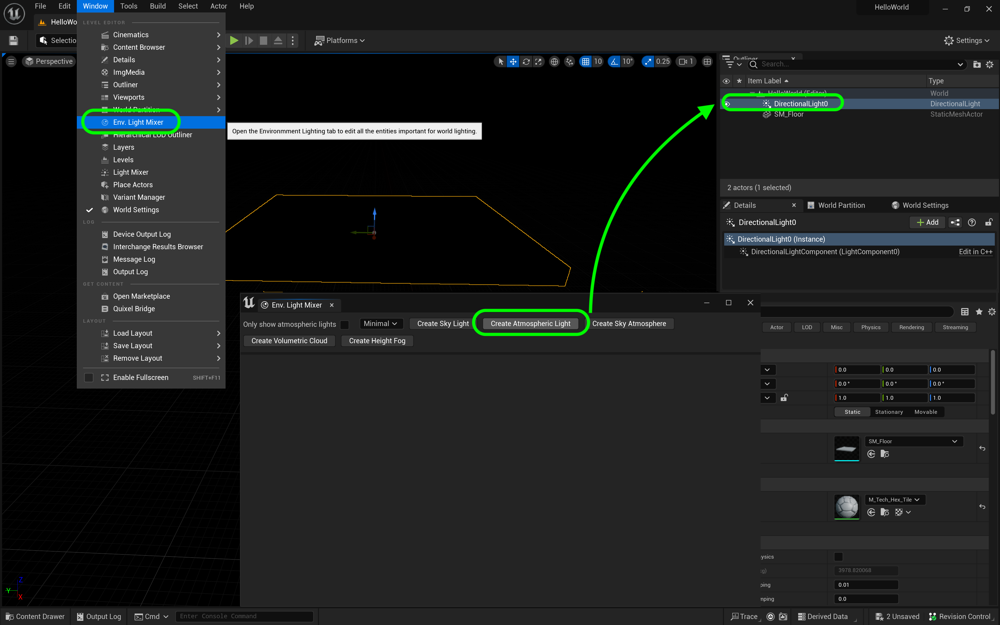

##### `Step 6.`\|`UE5HW`| :small_orange_diamond: :small_blue_diamond:

Now you can see that there is light.  It might not be positioned properly but we will fix that next.  Now when you hit play you can see the level!  Try it yourself...

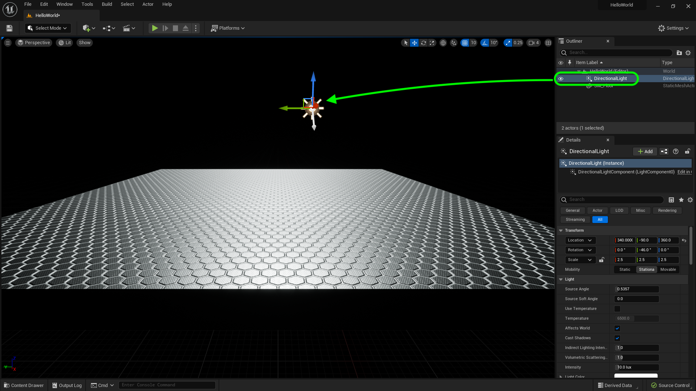

##### `Step 7.`\|`UE5HW`| :small_orange_diamond: :small_blue_diamond: :small_blue_diamond:

Now there is a special rotational widget that can be used for rotating the light to get different times of day (different angles the sun is position at).  You press the <kbd>Cntrl L</kbd> key to bring up the controller then let go of the <kbd>L</kbd> key while still holding <kbd>Cntrl</kbd>.  You can then move the mouse around and have the sun point at any angle.  I picked one that worked best for me. I then released the <kbd>Cntrl</kbd> key to lock in the position.

https://user-images.githubusercontent.com/5504953/172624138-fdd5d5eb-28ad-4adc-9ada-79f4e447f9e5.mp4

##### `Step 8.`\|`UE5HW`| :small_orange_diamond: :small_blue_diamond: :small_blue_diamond: :small_blue_diamond:

Now we are in a black world - lets create a sky.  Press the **Place Actors** drop down menu and select **Visual Effects | Sky Atmosphere**.

>The Sky Atmosphere component in Unreal Engine is a physically-based sky and atmosphere-rendering technique. It's flexible enough to create an Earth-like atmosphere with time-of-day featuring sunrise and sunset, or to create extraterrestrial atmospheres of an exotic nature. - [UE5 Manual](https://docs.unrealengine.com/5.0/en-US/sky-atmosphere-component-in-unreal-engine/).

Feel free to read the instructions and tweak any values.

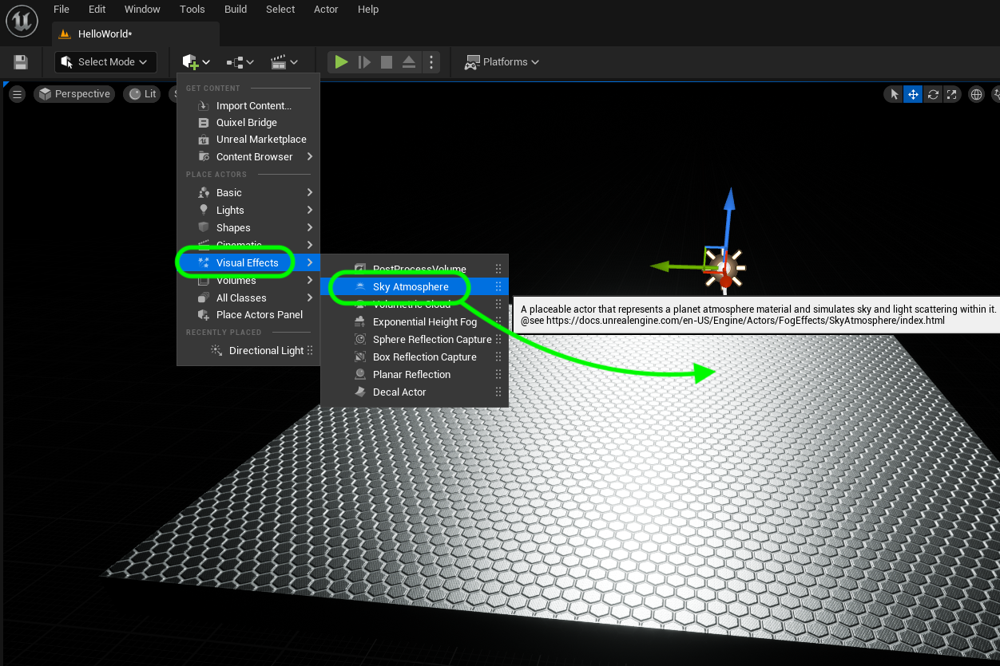

##### `Step 9.`\|`UE5HW`| :small_orange_diamond: :small_blue_diamond: :small_blue_diamond: :small_blue_diamond: :small_blue_diamond:

If it is not working make sure that in your **Directional Light** that 

If you do not see the sky above the black ground plane you can click on the **Directional Light** in the **Outliner** and make sure that **Atmosphere Sun Light** is set to `true`.

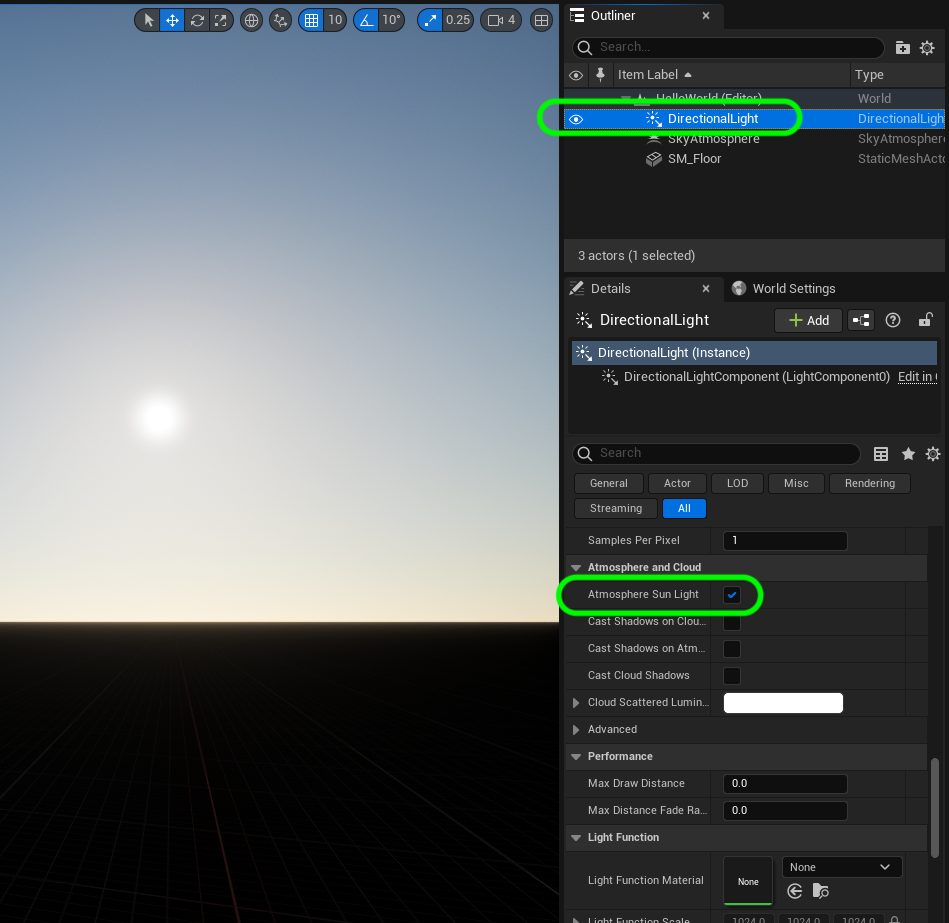

##### `Step 10.`\|`UE5HW`| :large_blue_diamond:

Now when you move the **Directional Light** around using <kbd>Cntrl L</kbd> you will see that the color and effect of the sun on the atmposphere changes and you can get sunrise and sunset looks to the lighting in your level.

https://user-images.githubusercontent.com/5504953/172628932-27a4fd2c-9db8-4ccd-8a5e-058882a0f7e5.mp4

##### `Step 11.`\|`UE5HW`| :large_blue_diamond: :small_blue_diamond: 

In previous versions of Unreal the clouds in the sky was a texture on the skydome, was two dimensional and suffered from the pinching issues of texture mapping a sphere.  Also it had no effect on the light.

In **UE5** we have a more realistic solution with 3-D volumetric clouds.  Select the **Place Actors | VIsual Effects | Volumetric Cloud**

[More Information UE5 Manual](https://docs.unrealengine.com/5.0/en-US/volumetric-cloud-component-properties-in-unreal-engine/).

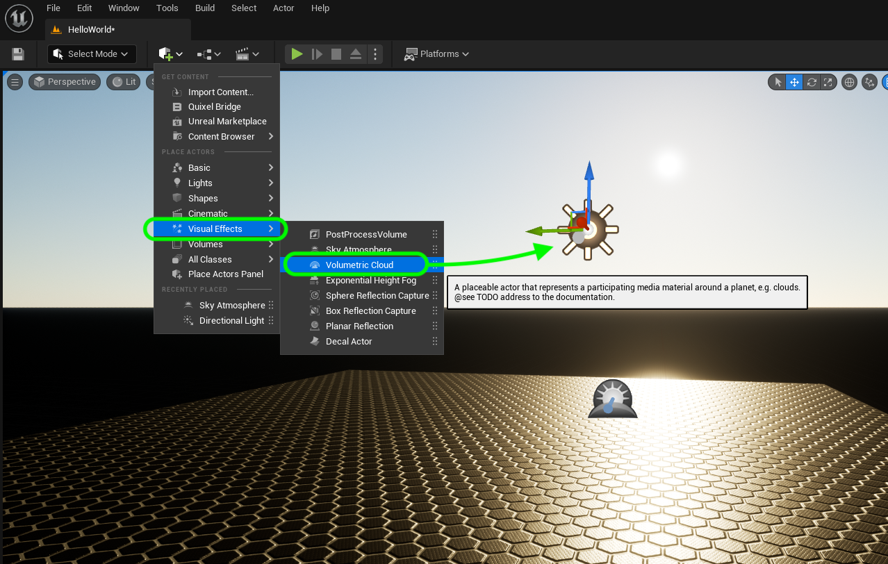

##### `Step 12.`\|`UE5HW`| :large_blue_diamond: :small_blue_diamond: :small_blue_diamond: 

There is not much to configure here, it is a bit more work to hand craft the clouds to behave in the way you would like.  But feel free to adjust the settings to your taste.

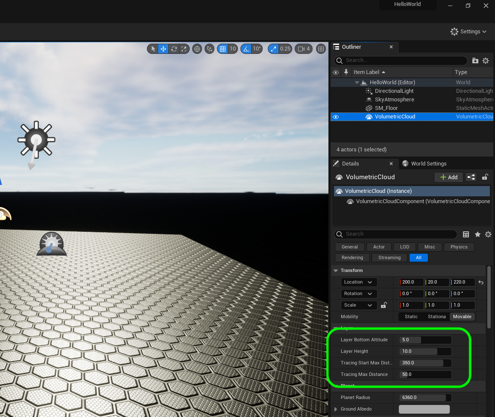

##### `Step 13.`\|`UE5HW`| :large_blue_diamond: :small_blue_diamond: :small_blue_diamond:  :small_blue_diamond: 

One of the coolest things about 3-D clouds is that it can affect the **Directional Light** and the clouds can cast shadows.  Click on the **Directional Light** and set the **Atmoshpere and Cloud | Casdt Cloud Shadows** to `true`.

https://user-images.githubusercontent.com/5504953/172861626-ffad3d92-ff55-48dd-801d-10125881e425.mp4

##### `Step 14.`\|`UE5HW`| :large_blue_diamond: :small_blue_diamond: :small_blue_diamond: :small_blue_diamond:  :small_blue_diamond: 

The third element that works together with the atmosphere and clouds in the [Skylight](https://docs.unrealengine.com/5.0/en-US/sky-lights-in-unreal-engine/).

>The Sky Light captures the distant parts of your level and applies that to the scene as a light. That means the sky's appearance and its lighting/reflections will match, even if your sky is coming from atmosphere, or layered clouds on top of a skybox, or distant mountains. You can also manually specify a cubemap to use. - [UE5 Manual](Skylight](https://docs.unrealengine.com/5.0/en-US/sky-lights-in-unreal-engine/)

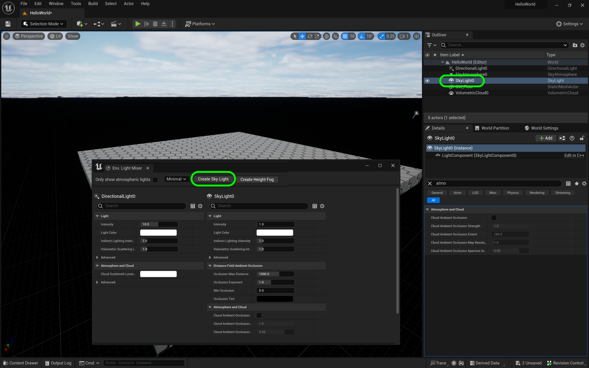

##### `Step 15.`\|`UE5HW`| :large_blue_diamond: :small_orange_diamond: 

The one thing that is missing is visibility in the air.  Normally there is a bit of haze, particles or fog that restricts your viewing distance. The final element that will help bring this scene together is [Exponential Height Fog](https://docs.unrealengine.com/5.0/en-US/exponential-height-fog-in-unreal-engine/).

>Exponential Height Fog creates more density in low places of a map and less density in high places. The transition is smooth, so you never get a hard cutoff as you increase altitude. Exponential Height Fog also provides two fog colors—one for the hemisphere facing the dominant directional light (or straight up if none exists), and another color for the opposite hemisphere. - [UE5 Manual](https://docs.unrealengine.com/5.0/en-US/exponential-height-fog-in-unreal-engine/).

Select **Place Actor | Special Effect | Exponential Height Fog** and drag it into the level.

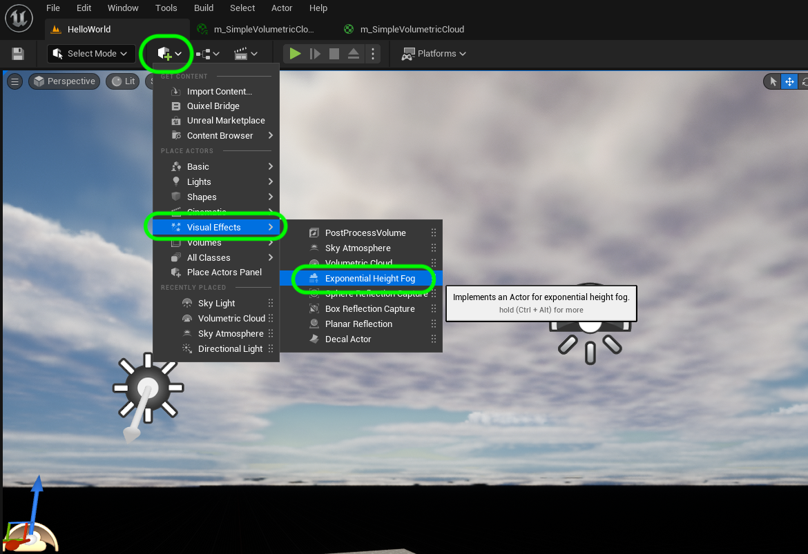

##### `Step 16.`\|`UE5HW`| :large_blue_diamond: :small_orange_diamond:   :small_blue_diamond: 

Now the resulting scene is fine for now.  We can move on to making the ground plane a bit larger.

https://user-images.githubusercontent.com/5504953/172865657-70ab7535-8d0b-44ab-b67e-b802ae4bef7c.mp4

##### `Step 17.`\|`UE5HW`| :large_blue_diamond: :small_orange_diamond: :small_blue_diamond: :small_blue_diamond:

Lets make the staging area a bit bigger for our letters.  Lets duplicate the floor and expand the ground surface.  Lets do this accurately wihtout fuss.  Open up the **Content Drawer** (<kbd>Cntrl Space</kbd>) and highlight **Content | StaticMeshes | SM_Floor**.  UE5 units default to 1cm per unit. You will see the size is `1000 cm` by `1000 cm` by `50 cm`.  1000 centimers is **32 feet** (or 10 meters) and 50 centimeters is **1.64 feet** (or .5 meters). Lets make the surface to hold our Hello World letters 20 meters by 20 meters (4 floor pieces).

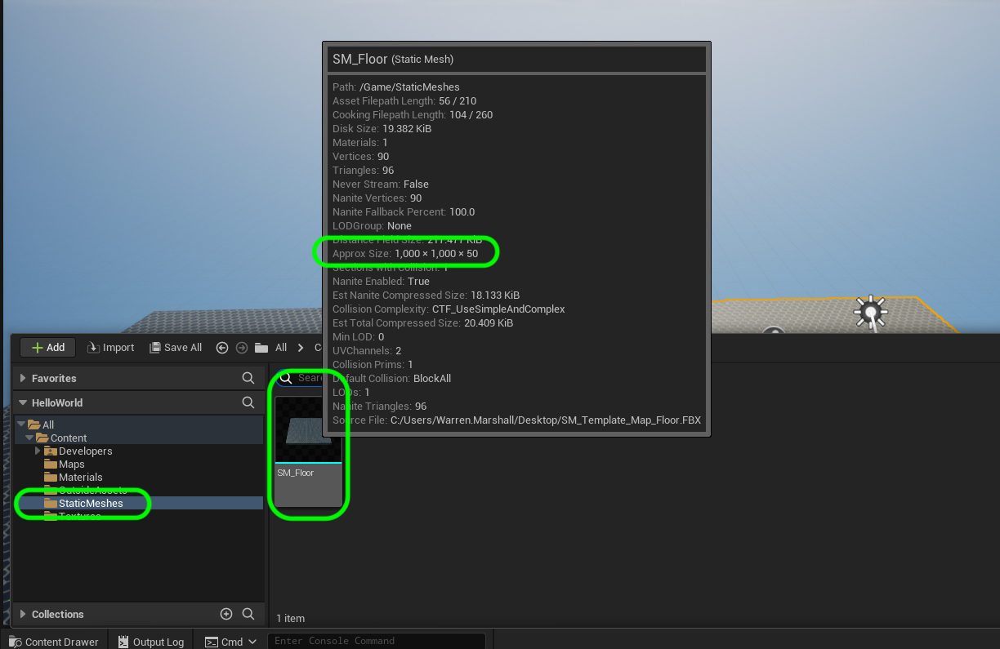

##### `Step 18.`\|`UE5HW`| :large_blue_diamond: :small_orange_diamond: :small_blue_diamond: :small_blue_diamond: :small_blue_diamond:

To do this we would like to get them to snap together.  Just like snap to grid in photoshop we can set the transform editor to snap by any using length we want (it defaults to snapping to 10 cm).  It is located right next to the grid icon.

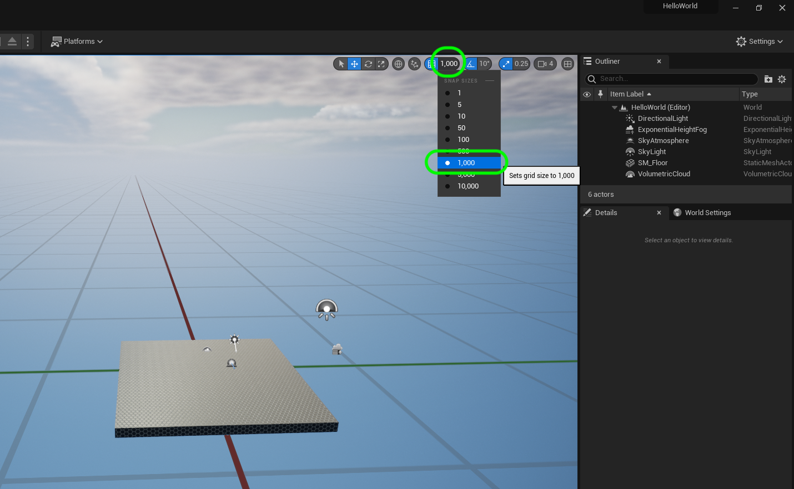

##### `Step 19.`\|`UE5HW`| :large_blue_diamond: :small_orange_diamond: :small_blue_diamond: :small_blue_diamond: :small_blue_diamond: :small_blue_diamond:

We can copy and paste using the windows shortcuts like <kbd>cntrl c</kbd> and </kbd>cntrl v</kbd>.  But they have a cool shortcut where you press <kbd>alt</kbd> while dragging on one of the translation widget arros when the object is selected in the outliner.

Repeat this three times to create a large surface with 4 seamlessly tied together floor pieces.

https://user-images.githubusercontent.com/5504953/172875319-445ad9fe-4dbe-409b-8531-46f32aaa7ed6.mp4

##### `Step 20.`\|`UE5HW`| :large_blue_diamond: :large_blue_diamond:

OK, lets save all of our changes and commit to source control.  Go to **File | Save All** and save all outstanding work in the engine.

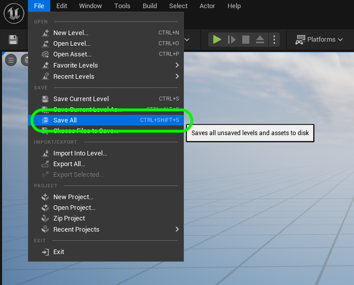

##### `Step 21.`\|`UE5HW`| :large_blue_diamond: :large_blue_diamond: :small_blue_diamond:

Now we need to submit these changes to the server. Click on the bottom right <kbd>Source Control</kbd> button and select **Submit Content**.  Add a message for the work done and then press **Submit**.  Now you should receive a pop up in the bottom right sating a changelist was created inidcating a succesful submission to the server.

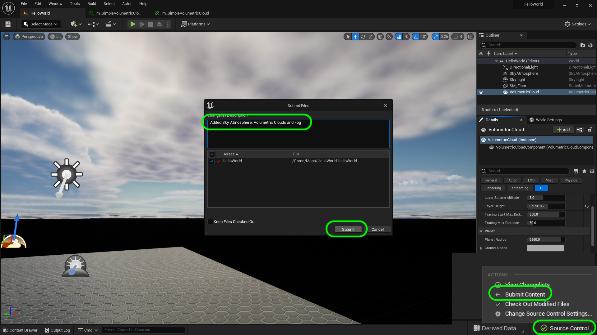

___

| [previous](../running-p4/README.md#user-content-running-perforce-in-unreal)| [home](../README.md#user-content-ue4-hello-world) | [next](../building-h/README.md#user-content-building-the-letter-h)|
|---|---|---|
