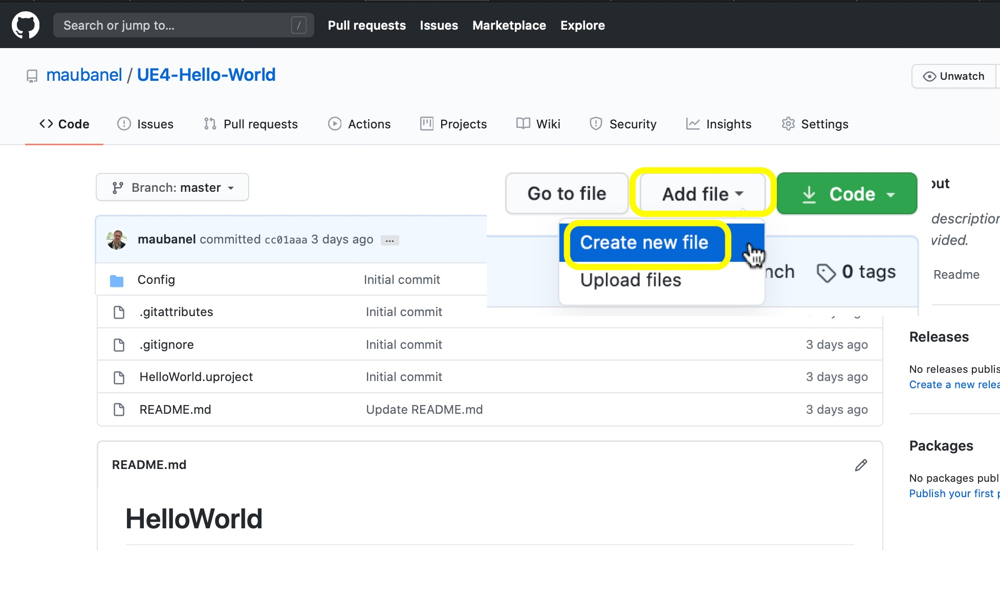
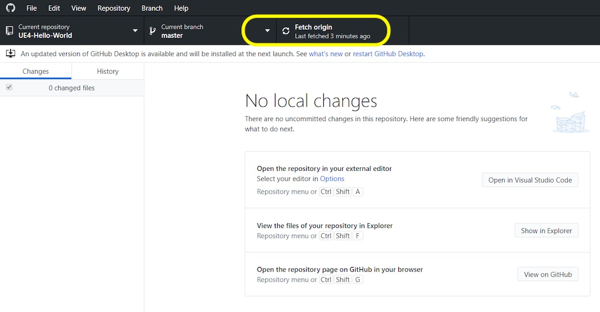
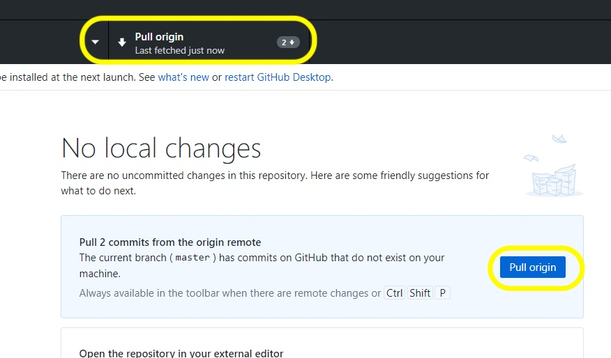
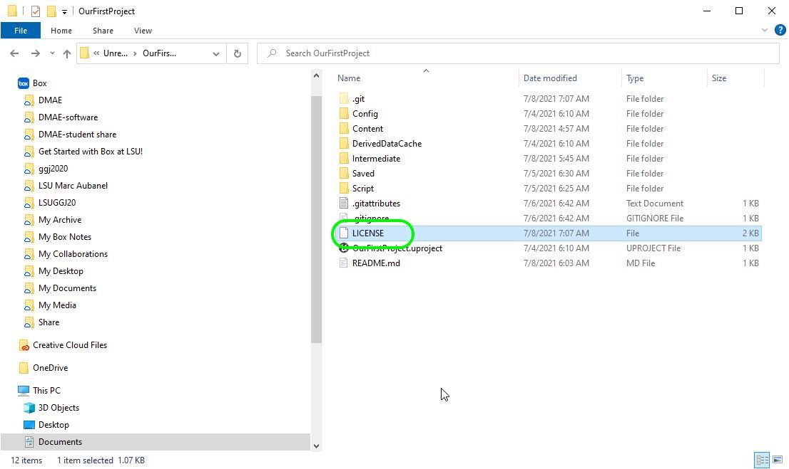
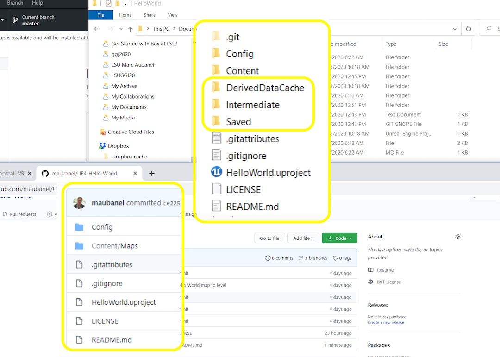

### Remaining GitHub Related Files

[previous](../readme/README.md#user-content-readmemd-file) • [home](../README.md#user-content-ue4-hello-world) • [next](../ignore-license/README.md#user-content-gitignore--license-files)

Chapter introduction here.

 

---

##### `Step 1.`\|`SUU&G`|:small_blue_diamond:

Go back to the project folder and open the `.gitignore` file in your favorite text editor (I am opening mine in **Visual Studio Code**.  This file contains 4 folders **Binaries**, **DerivedDataCache**, **Intermediate** and **Saved**.  These files are local to your computer and operating system.  No files inside these folders will be saved on GitHub.  Don't worry these can all be regenrated by the engine itself so they are unique to your machine and don't need to be saved.  They are there to speed up loading the project so you don't have to regenerate files every time you run the engine.

The `*.` files mean that any files with those extensions will be ignored and not updated  So for example `*.xcodeproj` means that any files on the mac that are generated by **XCode** will not be included in the repository.

Unreal added this file but it is important to note that the MOST **IMPORTANT** element is that we need the `.gitignore` file to be in the **SAME** directory as the `.uproject` file. All paths are relative to this in the .gitignore file.

##### `Step 2.`\|`FHIU`|:small_blue_diamond: :small_blue_diamond: 

Open the `.gitattributes` file.  It sets every file and folder that is in **Content/** the root folder of ALL the content you will be adding to the project.  This means that it will not download and upload every single revision of a single file and just keep the latest on your local machine.  All the data is still backed up on the server.

So rather than number files like `BoatTexture01.png`, `BoatTexture01.png` & `BoatTexture03.png`. We would leave it as `BoatTexture.png`.  This way GitHub **Only** downloads the version you are currently using but still backs up all previous versions.  This makes **cloning** (starting a new copy of the repository) and **pushing / pulling** much faster.

##### `Step 3.`\|`SUU&G`|:small_blue_diamond: :small_blue_diamond: :small_blue_diamond:

Go back to **github.com** and lets add a **License** file to the project.  Make sure you are at the root folder that contains the **OurFirstProject.uprojet** file. I release all the exercises I have created under the open source [MIT](https://opensource.org/licenses/MIT) license. This allows you to use any of these assets in any project you would like, personal or commercial.  All you have to do is credit the work.  Press the **Add file | Create new file** button.

##### `Step 4.`\|`SUU&G`|:small_blue_diamond: :small_blue_diamond: :small_blue_diamond: :small_blue_diamond:

Call the file `LICENSE` (all caps).  Press the **Choose a license template** button.

##### `Step 5.`\|`SUU&G`| :small_orange_diamond:

I selected the MIT license and would appreciate it reciprocally. This would allow me to use some of your assets to improve these exercises for future particpants.  But you are welcome to put any license of your choice.  If you want to maintain full copytight you can just put `copyright Jane Doe 2020` and that will give you full copyright over yoru work.

Please note that this is just for assets you created and not ones supplied by Unreal or by downlaoding from the internet.  When you are done press the <kbd>Review and submit</kbd> button.

##### `Step 6.`\|`SUU&G`| :small_orange_diamond: :small_blue_diamond:

Again, normally we would type a commit message but the placeholder one will do.  Lets press the **Commit** button to check in the change.

##### `Step 7.`\|`SUU&G`| :small_orange_diamond: :small_blue_diamond: :small_blue_diamond:

Create a pull request and merge the change.  This will add this new file to your repository on the **server**. Then go back to your main GitHub repository page and press the <kbd>Merge pull request</kbd> button.  Then press the <kbd>Confirm merge</kbd> button.This will add this change to your server but not to your local computer.

##### `Step 8.`\|`SUU&G`| :small_orange_diamond: :small_blue_diamond: :small_blue_diamond: :small_blue_diamond:

Now lets go back to **GitHub Dekstop**.  Notice that there is no notice that the server has changes you don't have.  If you are working in a team, some other team member might have pushed a change to the server.  All you see is a message \"Last fetched 3 minutes ago\".  You need to press the <kbd>Fetch origin</kbd> button and it will look to see if there are updates available to integrate into the project on your computer.

##### `Step 9.`\|`SUU&G`| :small_orange_diamond: :small_blue_diamond: :small_blue_diamond: :small_blue_diamond: :small_blue_diamond:

Now it reaches out to the server and notices there are changes.  Click the <kbd>Pull origin</kbd> button to get the latest from the server.

##### `Step 10.`\|`SUU&G`| :large_blue_diamond:

Now go to the project in your **Finder** and look to see the **LICENSE** file you created on **GitHub**.  When you pulled from the server it added it locally.  This is how we work in teams.  We can pull work from other team members to integrate their changes.

##### `Step 11.`\|`SUU&G`| :large_blue_diamond: :small_blue_diamond: 

Now compare what we have on **GitHub** versus what we have on our hard drive.  Notice that the three folders that are **NOT** on **Github** were in the **.gitignore** file and are **DerivedDataCache**, **Intermediate** and **Saved**.

| `ue4.generated.folders`\|`Intermediate & Saved Folders`| 
| :--- |
| *Intermediate - Contains temporary files generated during building the engine or game. In game directories, Shaders are stored in the Intermediate directory.* - [Unreal Docs](https://docs.unrealengine.com/en-us/Engine/Basics/DirectoryStructure)|
|*Saved - Contains autosaves, configuration (.ini) files, and log files. Additionally, the Engine > Saved directory contains crash logs, hardware information, and Swarm options and data.* - [Unreal Docs](https://docs.unrealengine.com/en-us/Engine/Basics/DirectoryStructure)|
|*Intermediate-Contains temporary files generated during building the engine or game. In game directories, Shaders are stored in the Intermediate directory.* - [Unreal Docs](https://docs.unrealengine.com/en-us/Engine/Basics/DirectoryStructure) |

---

| [previous](../readme/README.md#user-content-readmemd-file)| [home](../README.md#user-content-ue4-hello-world) | [next](../ignore-license/README.md#user-content-gitignore--license-files)|
|---|---|---|
