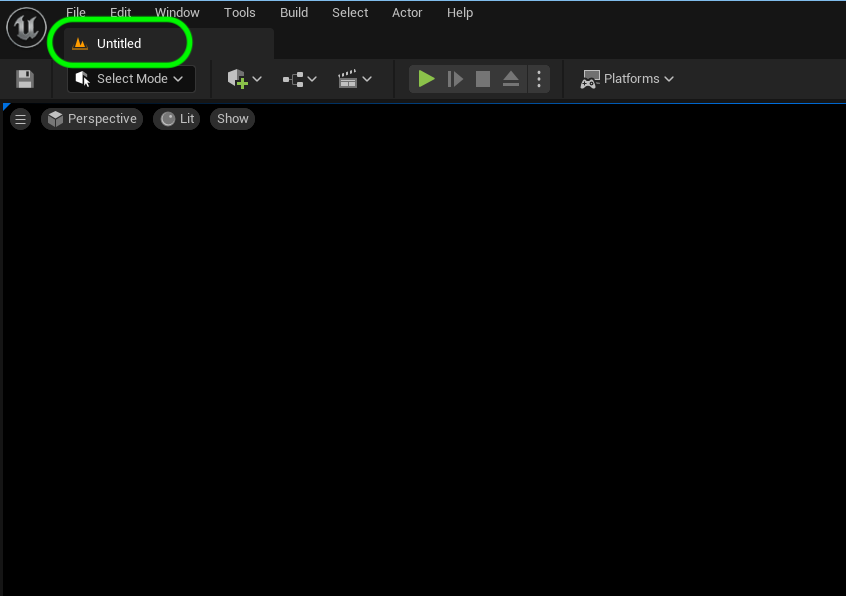

### Project Settings

[previous](../readme/README.md#user-content-readmemd-file) • [home](../README.md#user-content-ue4-hello-world) • [next](../setting-map/README.md#user-content-setting-up-the-map)

Lets now make a change to an existing file in Perforce.  Lets make this new level the one that boots up when we run the editor or the game.

 

---

##### `Step 1.`\|`SUU&G`|:small_blue_diamond:

Closwe **UE5** and reopen it.  Does it boot up to the new **Hello World** room?  Look at the tab and see what level is loaded.  It says default!

##### `Step 2.`\|`FHIU`|:small_blue_diamond: :small_blue_diamond: 

Lets fix it so that the game loads into the level we are working on.  Open up **Edit | Project Settings** and go to **Project | Maps & Modes**. Since this is a one level game and we will only be working on this level lets change the map we boot up to in the editor as well as the one we would start with if we packaged this for a game by changing both **Editor Startup Map** and **Game Default Map** to `HelloWorld`.

##### `Step 3.`\|`SUU&G`|:small_blue_diamond: :small_blue_diamond: :small_blue_diamond:

Now press the <kbd>Source Control</kbd> button at the bottom right and select **Submit Content**.  Then type in an appropriate message and finish by pressing the <kbd>Submit</kbd> button to post it to **Perforce**.

##### `Step 4.`\|`SUU&G`|:small_blue_diamond: :small_blue_diamond: :small_blue_diamond: :small_blue_diamond:

Call the file `LICENSE` (all caps).  Press the **Choose a license template** button.

##### `Step 5.`\|`SUU&G`| :small_orange_diamond:

I selected the MIT license and would appreciate it reciprocally. This would allow me to use some of your assets to improve these exercises for future particpants.  But you are welcome to put any license of your choice.  If you want to maintain full copytight you can just put `copyright Jane Doe 2020` and that will give you full copyright over yoru work.

Please note that this is just for assets you created and not ones supplied by Unreal or by downlaoding from the internet.  When you are done press the <kbd>Review and submit</kbd> button.

##### `Step 6.`\|`SUU&G`| :small_orange_diamond: :small_blue_diamond:

Again, normally we would type a commit message but the placeholder one will do.  Lets press the **Commit** button to check in the change.

##### `Step 7.`\|`SUU&G`| :small_orange_diamond: :small_blue_diamond: :small_blue_diamond:

Create a pull request and merge the change.  This will add this new file to your repository on the **server**. Then go back to your main GitHub repository page and press the <kbd>Merge pull request</kbd> button.  Then press the <kbd>Confirm merge</kbd> button.This will add this change to your server but not to your local computer.

##### `Step 8.`\|`SUU&G`| :small_orange_diamond: :small_blue_diamond: :small_blue_diamond: :small_blue_diamond:

Now lets go back to **GitHub Dekstop**.  Notice that there is no notice that the server has changes you don't have.  If you are working in a team, some other team member might have pushed a change to the server.  All you see is a message \"Last fetched 3 minutes ago\".  You need to press the <kbd>Fetch origin</kbd> button and it will look to see if there are updates available to integrate into the project on your computer.

##### `Step 9.`\|`SUU&G`| :small_orange_diamond: :small_blue_diamond: :small_blue_diamond: :small_blue_diamond: :small_blue_diamond:

Now it reaches out to the server and notices there are changes.  Click the <kbd>Pull origin</kbd> button to get the latest from the server.

##### `Step 10.`\|`SUU&G`| :large_blue_diamond:

Now go to the project in your **Finder** and look to see the **LICENSE** file you created on **GitHub**.  When you pulled from the server it added it locally.  This is how we work in teams.  We can pull work from other team members to integrate their changes.

##### `Step 11.`\|`SUU&G`| :large_blue_diamond: :small_blue_diamond: 

Now compare what we have on **GitHub** versus what we have on our hard drive.  Notice that the three folders that are **NOT** on **Github** were in the **.gitignore** file and are **DerivedDataCache**, **Intermediate** and **Saved**.

| `ue4.generated.folders`\|`Intermediate & Saved Folders`| 
| :--- |
| *Intermediate - Contains temporary files generated during building the engine or game. In game directories, Shaders are stored in the Intermediate directory.* - [Unreal Docs](https://docs.unrealengine.com/en-us/Engine/Basics/DirectoryStructure)|
|*Saved - Contains autosaves, configuration (.ini) files, and log files. Additionally, the Engine > Saved directory contains crash logs, hardware information, and Swarm options and data.* - [Unreal Docs](https://docs.unrealengine.com/en-us/Engine/Basics/DirectoryStructure)|
|*Intermediate-Contains temporary files generated during building the engine or game. In game directories, Shaders are stored in the Intermediate directory.* - [Unreal Docs](https://docs.unrealengine.com/en-us/Engine/Basics/DirectoryStructure) |

| [previous](../readme/README.md#user-content-readmemd-file)| [home](../README.md#user-content-ue4-hello-world) | [next](../setting-map/README.md#user-content-setting-up-the-map)|
|---|---|---|
