### Installing Unreal & Perforce

[home](../README.md#user-content-ue4-hello-world) • [next](../running-p4/README.md#user-content-running-perforce-in-unreal)

This is a follow up to the introductory Unreal tutorial *Your First Hour in Unreal Engine 5* that will put more of the basics into practice. twist on the usual **Hello World** tutorial which is printing words to a console to introduce someone to a new language.  Since Unreal Engine 5 combines logic, 3-D graphics and a sophisticated editor - this is a multi-disciplinary exercise.  This just introduces creating and importing a 3-D assets, creating a material and material instance and creating logic for a revolving camera. This will give you a start so that you can create your own unique version like the one below.

 

---

| `required.software`\|`Hello World`| 
| :--- |
| The required software that needs to be downloaded is included below. You will also need photo editing software to create an 8K texture - I am using Photoshop for this example |

---

##### `Step 1.`\|`FHIU`|:small_blue_diamond:

We will manage all of our games and downloads from a tool that **Epic** provides.  This is used both for playing and making games! Download the **[Epic Games Launcher](https://store.epicgames.com/en-US/download)** and install it on your target platform.  I strongly recommend for **Unreal 5** to be using a decent PC (not a mac) with a good separate **AMD** or **NVidia** video card.

##### `Step 2.`\|`FHIU`|:small_blue_diamond: :small_blue_diamond: 

Create a free **Epic Game Account**.  If they request licensing, select the **[Standard License](https://www.unrealengine.com/en-US/license)**.  Now run the **Epic Games Launcher** and select the **Settings** option at the bottom left of the interface. I turned off **Run When My Computer Starts** and turn on **Hide Game Library**.  I also turn off all **Notifications** as I don't really need to be bothered by these.  You can set these up to your liking.

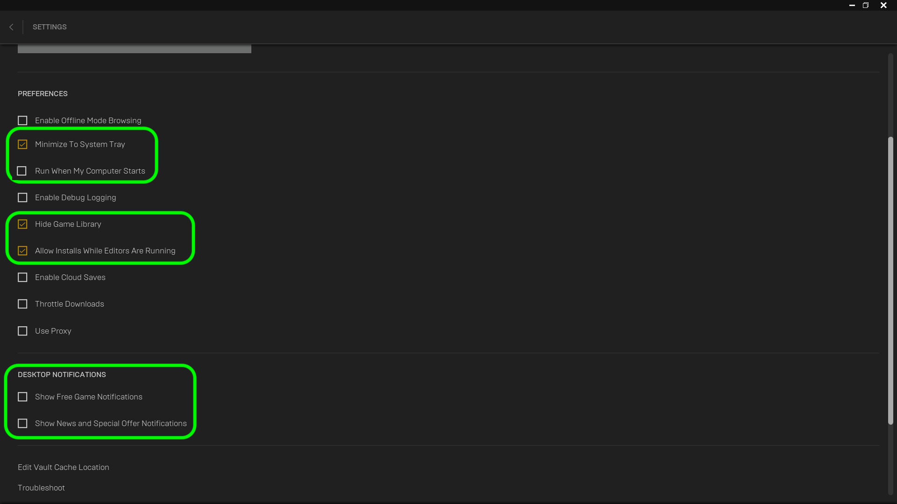

##### `Step 3.`\|`FHIU`|:small_blue_diamond: :small_blue_diamond: :small_blue_diamond:

If you have an external or second drive you work with it might be worth moving the cache to this drive.  While still in the **Settings** menu press the **Edit Vaule Cache Location**.  You can then redirect the cache away from your boot drive.

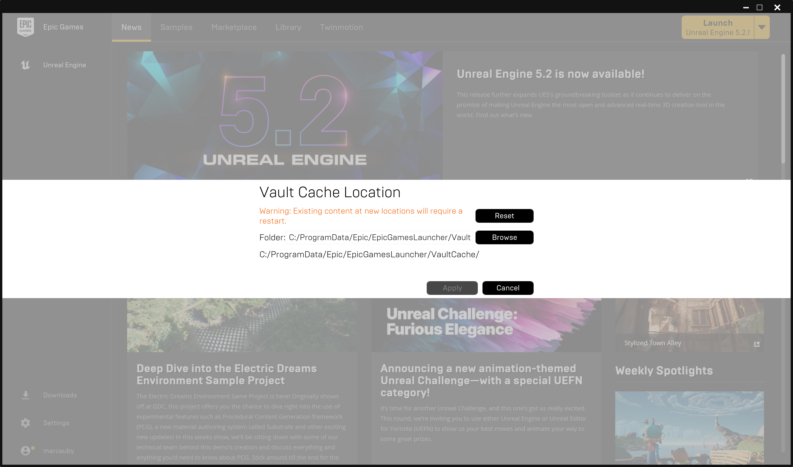

##### `Step 4.`\|`FHIU`|:small_blue_diamond: :small_blue_diamond: :small_blue_diamond: :small_blue_diamond:

Now you can  leave the **Settings** tab and press the **Unreal Engine** selection on the left hand side and the **Library** tab at the top.  Press the <kbd>+</kbd> button and install version `5.0.x` (x is the latest number, the third digit should not matter). Press the <kbd>Install</kbd> button.

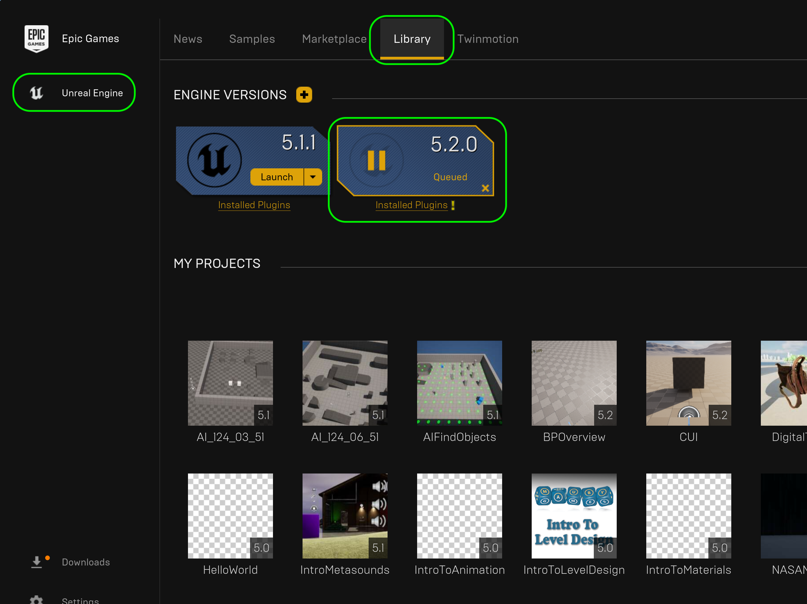

##### `Step 5.`\|`FHIU`| :small_orange_diamond:

Select a directory of where you will install the software.  Now please be aware this takes up a **LOT** of hard drive space so you might want to remove all unecessary files to have as much hard drive as possible.  Expect to need upwards of 50 gigs.

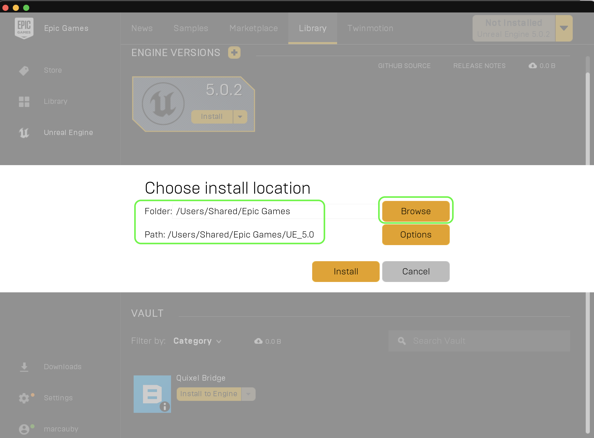

##### `Step 6.`\|`FHIU`| :small_orange_diamond: :small_blue_diamond:

You will also need to select which components to install.  I saved room on my config by removing pressing **Options**. I did not need to install the targets for **Android**, **HoloLens2**, **IOS**, **Linux** or **TVOS**.  Press the <kbd>Apply</kbd> button then <kbd>Install</kbd>.  Now go take a break as this will take over 30 nimutes in most cases.

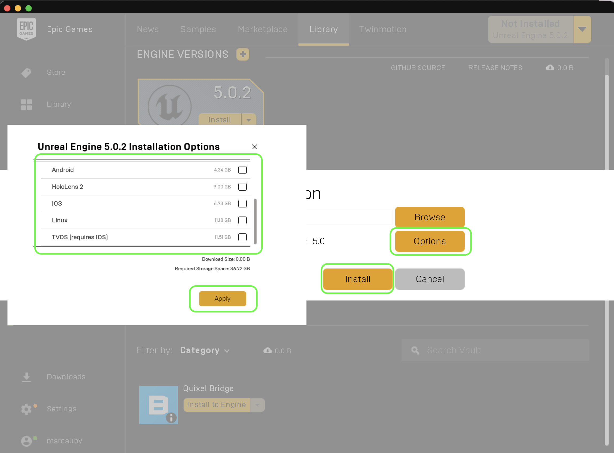

##### `Step 7.`\|`FHIU`| :small_orange_diamond: :small_blue_diamond: :small_blue_diamond:

The version control that we will be using is **Perforce**.  If you have access to a P4 server (you can install one on your own) download **[Perforce Helix P4V Tools](https://www.perforce.com/downloads/helix-visual-client-p4v)**  now. If you are an LSU student you can find more detailed installation instructions at [Installing P4V](https://github.com/maubanel/p4v-unreal/blob/main/installing/README.md#user-content-installing-p4v). You will need to go there to find out the name of the server.  Return here when you have completed this one page.

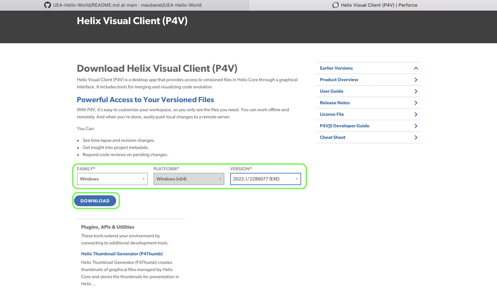

Loginto Perforce using the **Server** `ssl:helixcore.cct.lsu.edu:1818`.  The **User** is your lsu login.

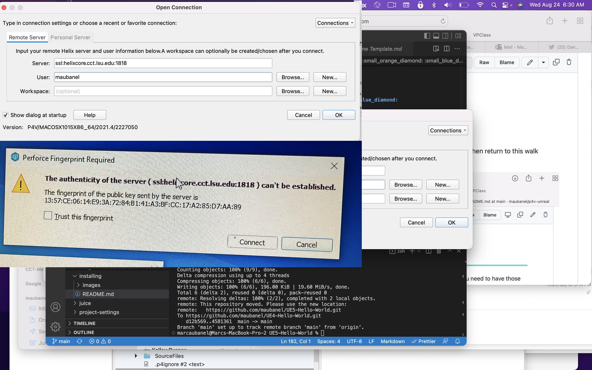

##### `Step 8.`\|`FHIU`| :small_orange_diamond: :small_blue_diamond: :small_blue_diamond: :small_blue_diamond:

If you are using **Perforce** complete the single **[P4 Workspace GitHub Page](https://github.com/maubanel/p4v-unreal/blob/main/workspaces/README.md#user-content-workspaces-in-p4v)** for creating a workspace directory then return to this walk through.

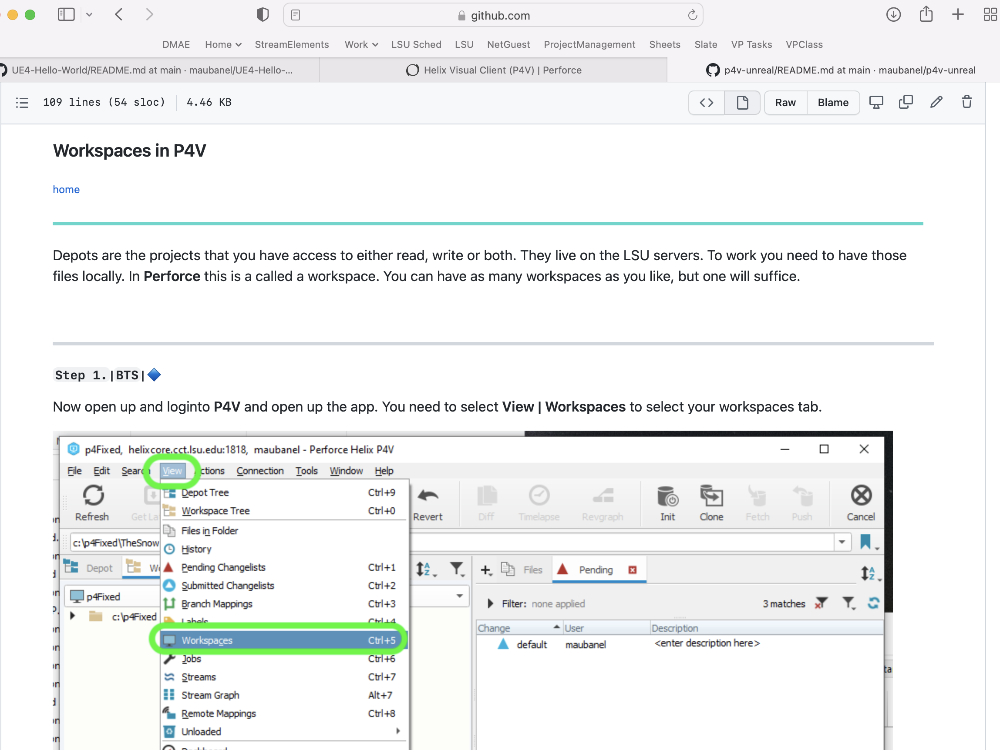

##### `Step 9.`\|`FHIU`| :small_orange_diamond: :small_blue_diamond: :small_blue_diamond: :small_blue_diamond: :small_blue_diamond:

Now if you have installed **Perforce** and have access to the repository you should have the **2022-ART-424--02-UE5/LSUUSERNAME**.  

##### `Step 10.`\|`UE5HW`| :large_blue_diamond:

Now you will have your **Hello** world folder in the project you either downloaded above or with **Perforce**.  

It is good practice to run **UE5** while you have **P4V** loaded.  So it is good practice to double click the project within **P4V** to launch it.  

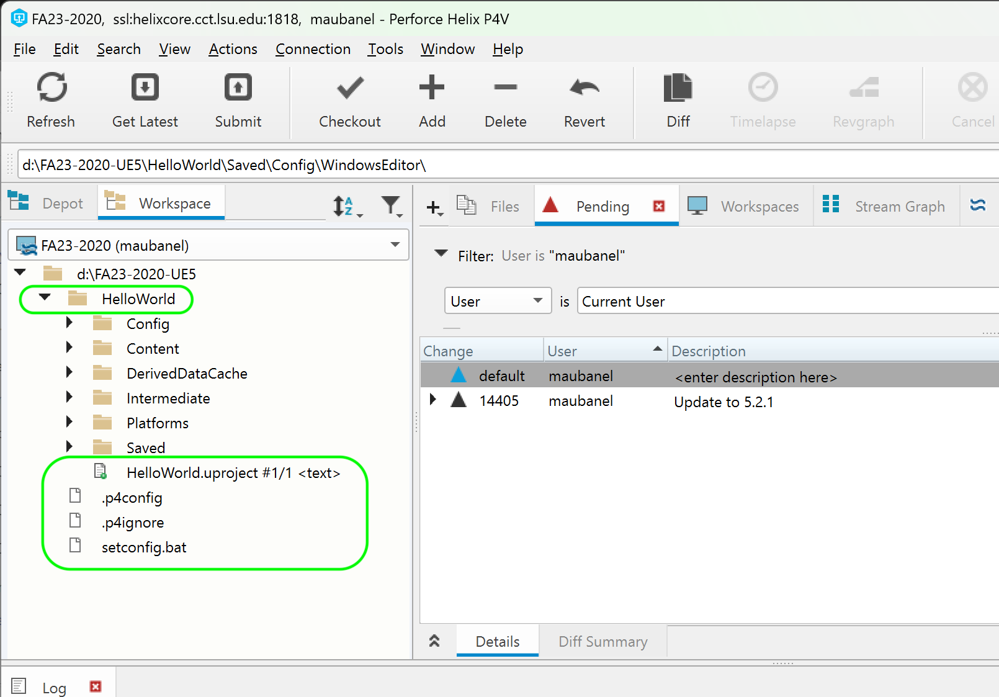

##### `Step 11.`\|`UE5HW`| :large_blue_diamond: :small_blue_diamond: 

Now this should load the **UE5** project and you should see the UE5 screen.  If you do you can move to the next step in the [walk through]() and skip the following steps.

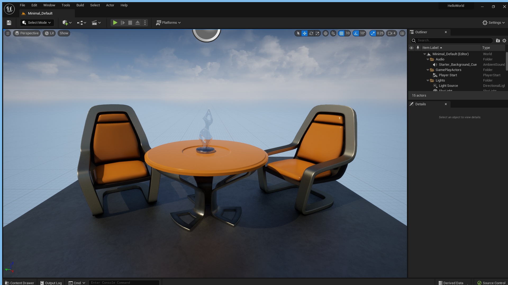

##### `Step 12.`\|`UE5HW`| :large_blue_diamond: :small_blue_diamond: :small_blue_diamond: 

Sometimes Unreal doesn't register the `.uproject` with windows so only complete the following steps if it will not open the project directly as above. In **P4V** right mouse click on the `.uproject` file and select <kbd>Show In | Show in Explorer</kbd>.

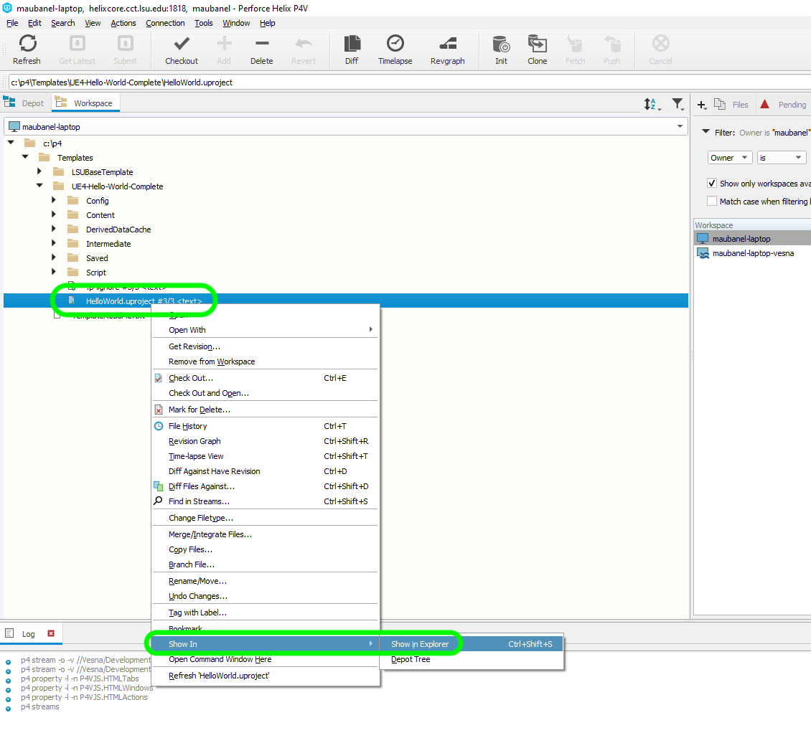

##### `Step 13.`\|`UE5HW`| :large_blue_diamond: :small_blue_diamond: :small_blue_diamond:  :small_blue_diamond: 

Right click on `.uproject` and select **Open With...**. Click on the `More Apps` link and we will locate it manually.

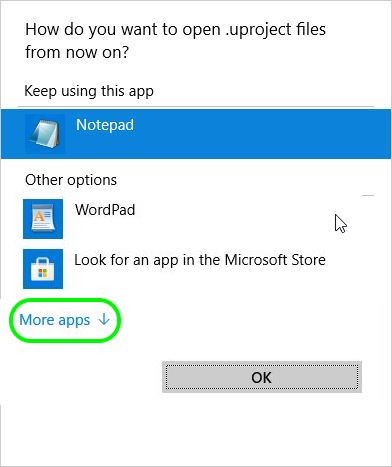

##### `Step 14.`\|`UE5HW`| :large_blue_diamond: :small_blue_diamond: :small_blue_diamond: :small_blue_diamond:  :small_blue_diamond: 

Scroll to the bottom and select the `Look for another app on this PC` link.

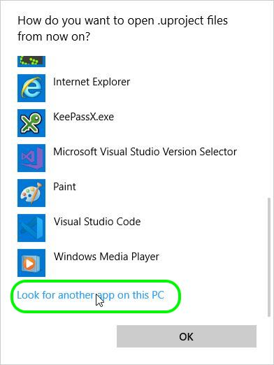

##### `Step 15.`\|`UE5HW`| :large_blue_diamond: :small_orange_diamond:

Now locate the folder where you installed this version of Unreal.  By default it will be in `Program Files | Epic Games | UE_5.0 | Engine | Binaries | Win64 | ` and look for the `UE4Editor.exe` and select the <kbd>Open</kbd> button.  This links the Unreal Editor to the`.uproject` file type.  This way when you double click any `.uproject` file it should load it in editor like you want!

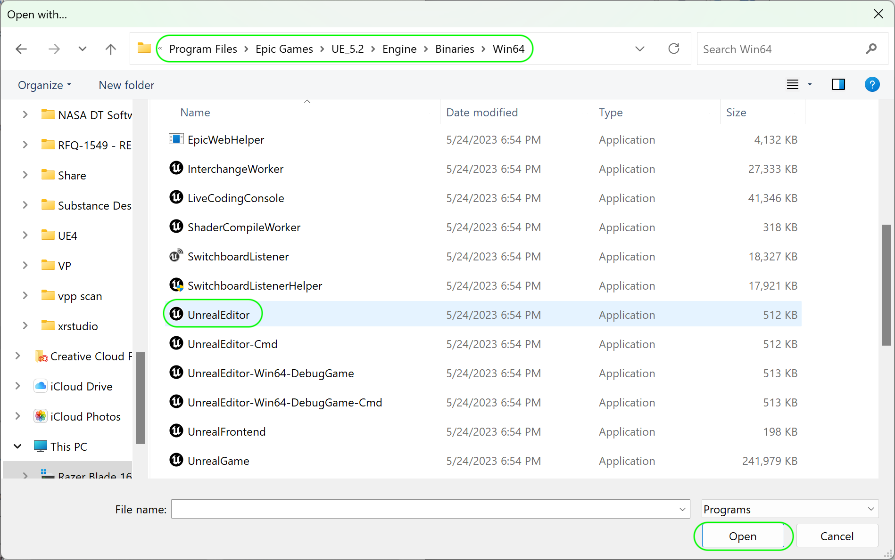

##### `Step 16.`\|`UE5HW`| :large_blue_diamond: :small_orange_diamond:   :small_blue_diamond: 

Now you should be able to <kbd>RMB</kbd> and select the <kbd>Properties</kbd> button. If you see that it opens with Unreal engine it will work from now on with any new project moving forward! Now you can go back to **[Step 10](#user-content-step-10suug-large_blue_diamond)** to run the project from **P4V**.

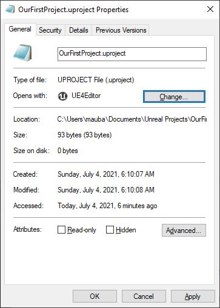

##### `Step 17.`\|`UE5HW`| :large_blue_diamond: :small_orange_diamond: :small_blue_diamond: :small_blue_diamond:

Now we need to make sure our **P4 Ignore** file will be recognized by **Perforce**.  Enter `cmd` in your windows menu to run **Command Prompt**.  Type `p4 set` then enter.  You will see if you have a P4IGNORE setting set? If you see `P4IGNORE=.p4ignore (set)` then you can move on to [Step 12](#step-12ue5ld-large_blue_diamond-small_blue_diamond-small_blue_diamond) otherwise fix this in the next step.

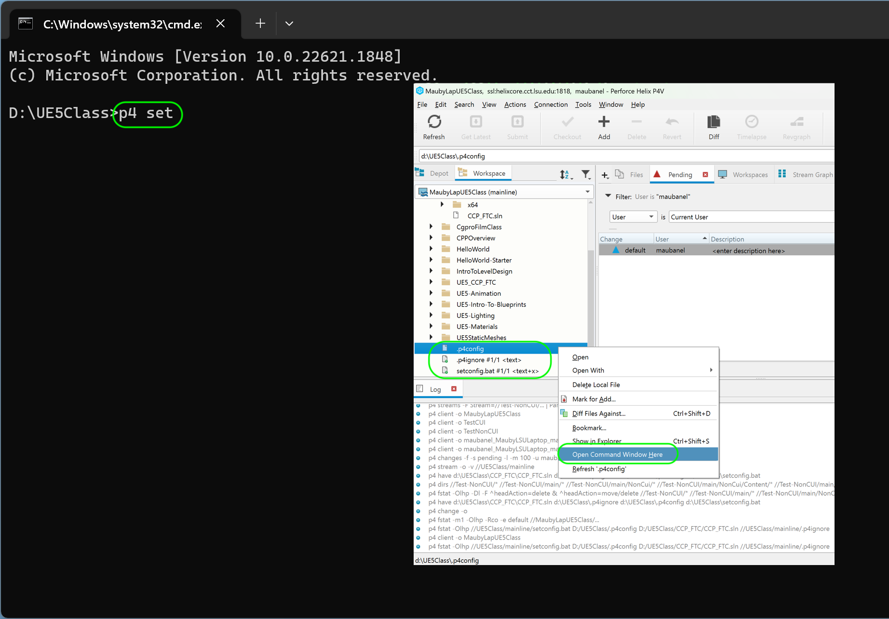

##### `Step 18.`\|`UE5HW`| :large_blue_diamond: :small_orange_diamond: :small_blue_diamond: :small_blue_diamond: :small_blue_diamond:

In command prompt type `p4 set P4IGNORE=.p4ignore`.  Make sure there are no spaces between or after the `=` sign.  Then type in and enter a `p4 set` again and you should see that it is now showing: `P4IGNORE=.p4ignore (set)`.  Now you are ready to move to the next step.

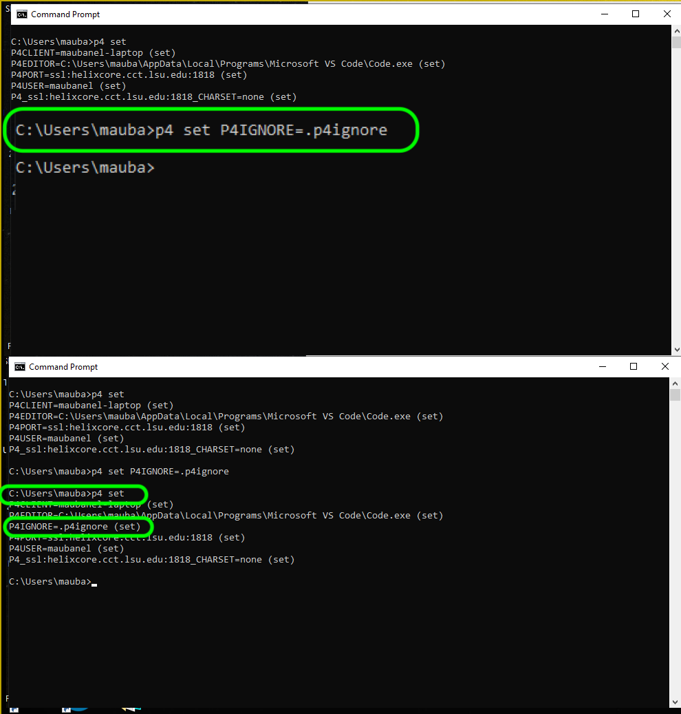

| [home](../README.md#user-content-ue4-hello-world) | [next](../running-p4/README.md#user-content-running-perforce-in-unreal)|
|---|---|
