### Making it Juicy

[previous](../first-hour/README.md#user-content-first-hour-in-ue4) • [home](../README.md#user-content-ue4-hello-world) • [next](../readme/README.md#user-content-readmemd-file)

Now let's really try and enhance the scene and make it look as COOL as possible!

 

---

##### `Step 1.`\|`UE5HW`|:small_blue_diamond:

So craft out the most creative version of Hello World and populate it on your island.

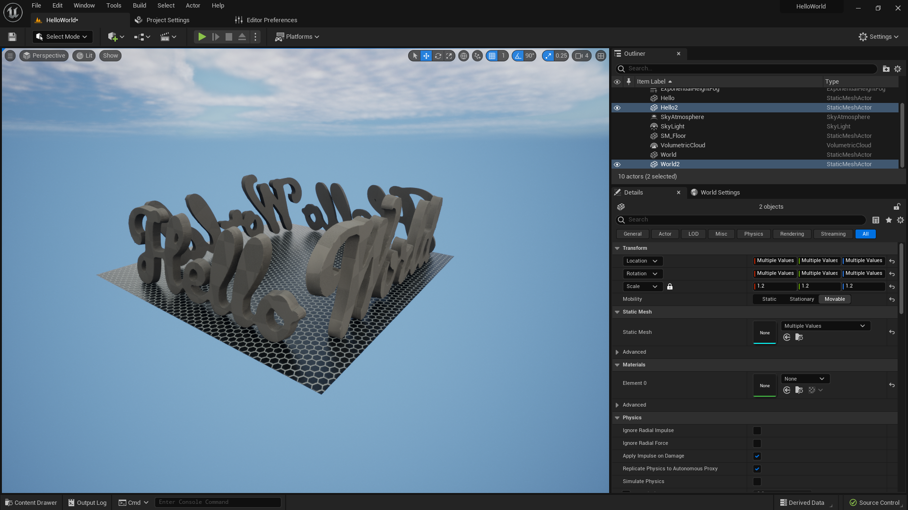

##### `Step 2.`\|`UE5HW`|:small_blue_diamond: :small_blue_diamond: 

Now we can customize the materials of the surfaces how we like.  If you open up the **Materials** folder you can find some that are not being used.  I can try out green and drag it on the ground plane!

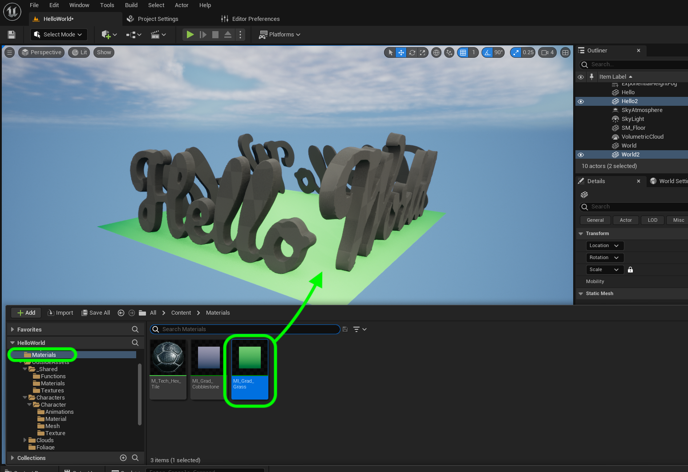

##### `Step 3.`\|`UE5HW`|:small_blue_diamond: :small_blue_diamond: :small_blue_diamond:

Now we can also get free access as student to quixel bridge.  Go to **Get Content | Quixel Bridge** and sign in and accept their terms of service (if you would like to that is).  Then you want to look at their **Surfaces**.  I looked around and found one I like.

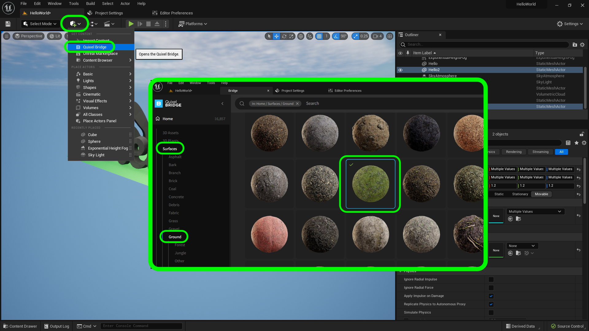

##### `Step 4.`\|`UE5HW`|:small_blue_diamond: :small_blue_diamond: :small_blue_diamond: :small_blue_diamond:

Once you have found a material you like pick the quality (medium should do for us here) and then press the <kbd>Download</kbd> button.  Then you can press the <kbd>Add</kbd> button to add it to your project.

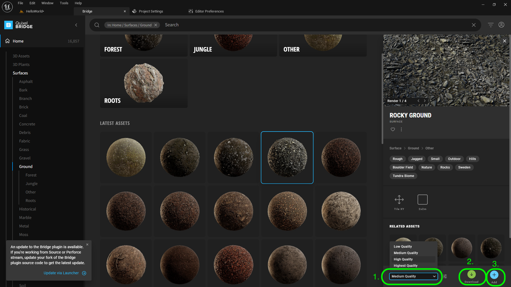

##### `Step 5.`\|`UE5HW`| :small_orange_diamond:

Go back to your **Content Drawer** (<kbd>Cntrl Space</kbd>) and there should now be a **Megascans | Surfaces** folder with the new material you downloaded.  Grab the new material and drag it to your ground plane. 

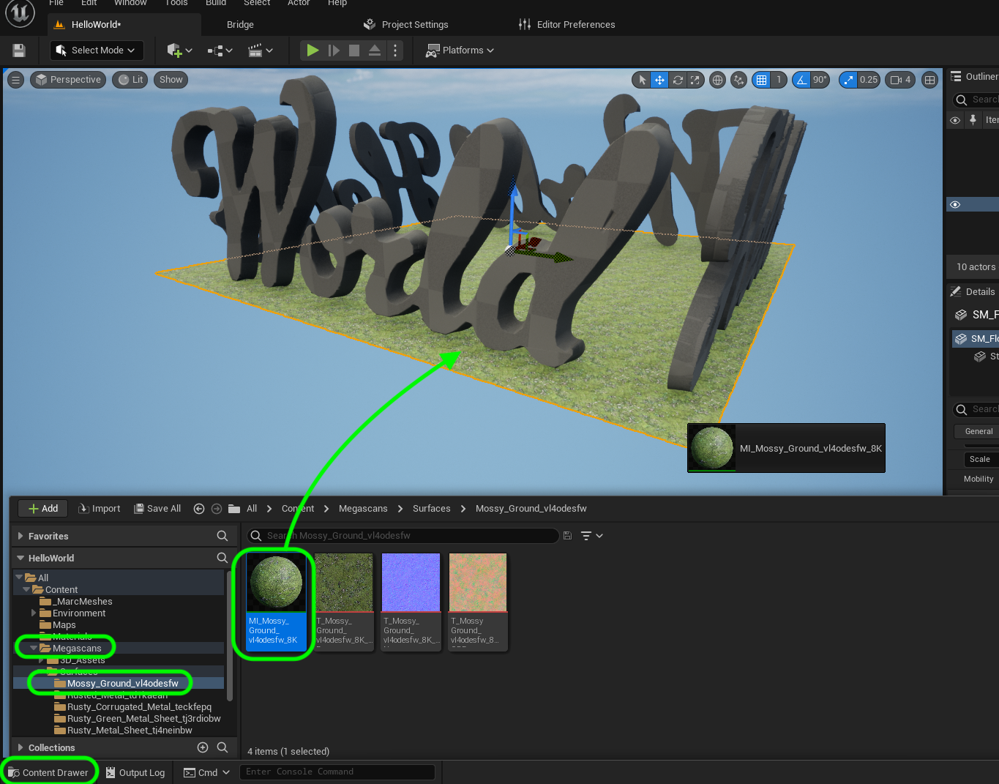

##### `Step 6.`\|`UE5HW`| :small_orange_diamond: :small_blue_diamond:

Repeat this for the letters you have created.  I picked a material from Quixel for the word World and applied it.

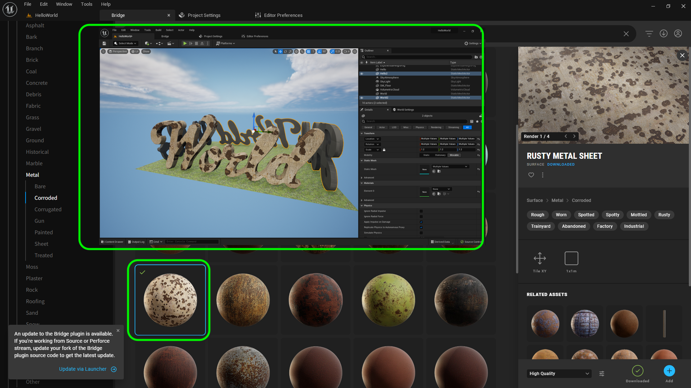

##### `Step 7.`\|`UE5HW`| :small_orange_diamond: :small_blue_diamond: :small_blue_diamond:

When I created the model I did not scale the UV's correctly so the tiling is off.  The small metal rusty bits are enourmous.  So I selected the **Hello** model and double left clicked the **Material** to open up the editor.  I thin selected **Titling Offset** and adjusted the **Tiling X** and **Tiling Y** then played with the offset to get the texture seated the way I want. 

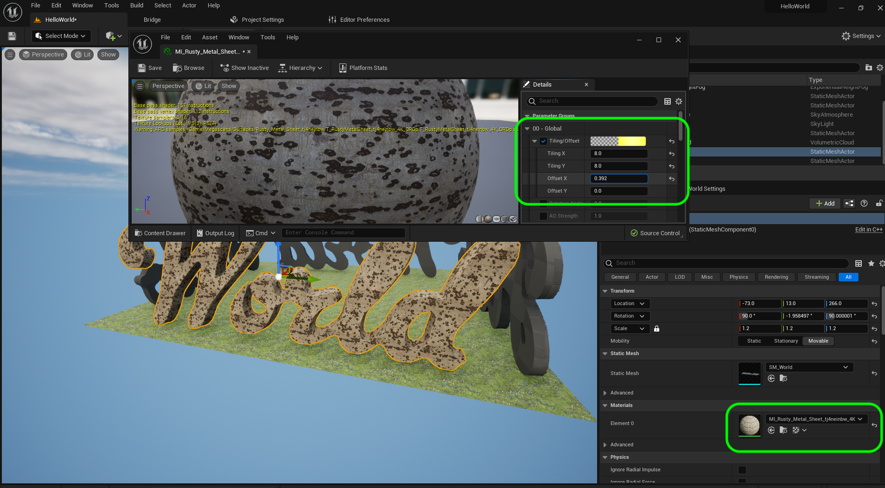

##### `Step 8.`\|`UE5HW`| :small_orange_diamond: :small_blue_diamond: :small_blue_diamond: :small_blue_diamond:

I can zoom in and make sure I am happy with the tiling scale and offset.

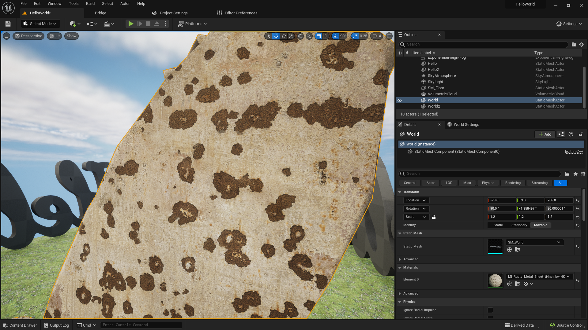

##### `Step 9.`\|`UE5HW`| :small_orange_diamond: :small_blue_diamond: :small_blue_diamond: :small_blue_diamond: :small_blue_diamond:

I repeated this and found cool textures for all the letters / words.

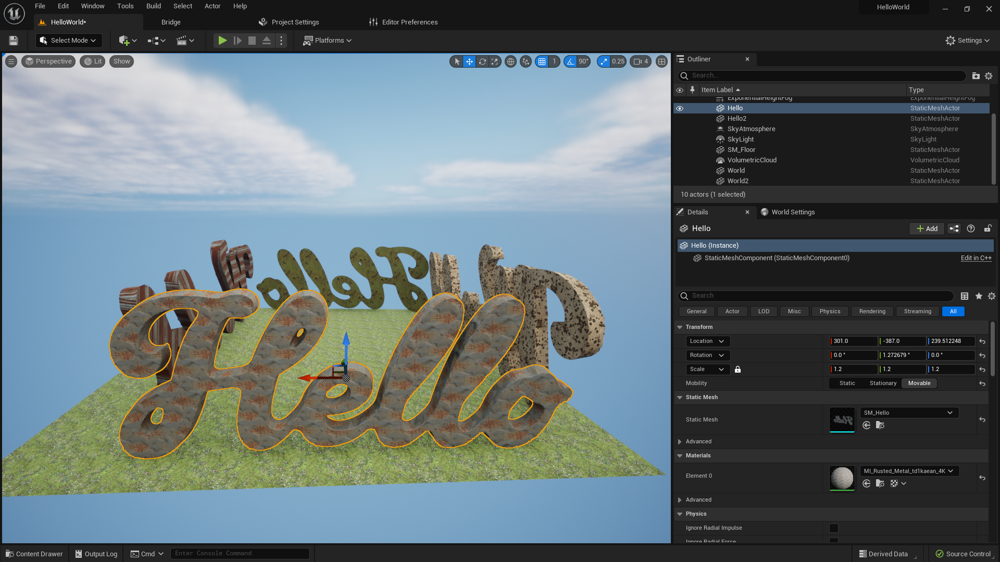

##### `Step 10.`\|`UE5HW`| :large_blue_diamond:

We can also download entire models on **Quixel**.  Go back to **Quixel** and look at their catalog of 3-D models.  Pick one you like.  Now for quality we want **Nanites** which is a significant feature of UE5.  Then <kbd>Download</kbd> and <kbd>Add</kbd> the model to your project.  It will show up in your **Content Drawer** in the **Magscans | 3D_Assets** folder.

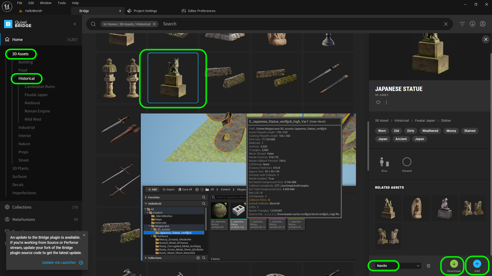

##### `Step 11.`\|`UE5HW`| :large_blue_diamond: :small_blue_diamond: 

Now drag the new static mesh into the level and scale it.  I like the statue at this size.

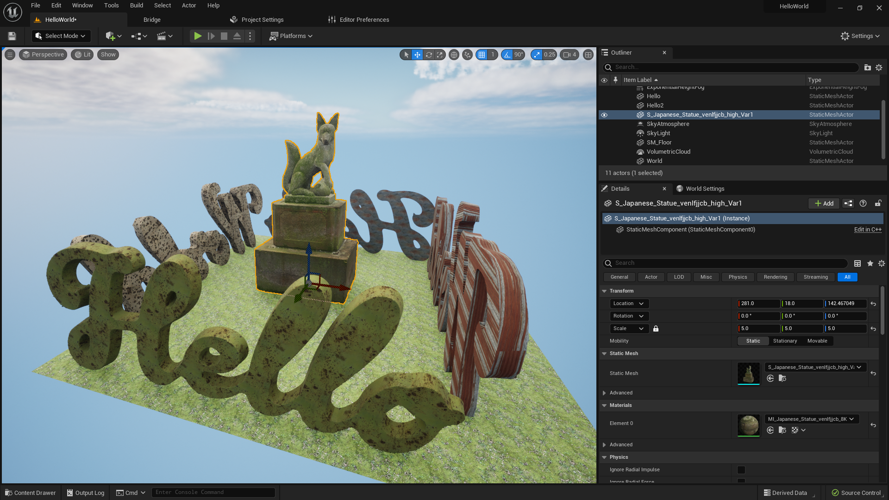

##### `Step 12.`\|`UE5HW`| :large_blue_diamond: :small_blue_diamond: :small_blue_diamond: 

Now I have included some animations from Epic.  Go to the **Outside Assets | Characters | Character| Animations** folder and drag some animations into the scene.  They will not animate initially.  I snapped them to the ground using the <kbd>End</kbd> key.

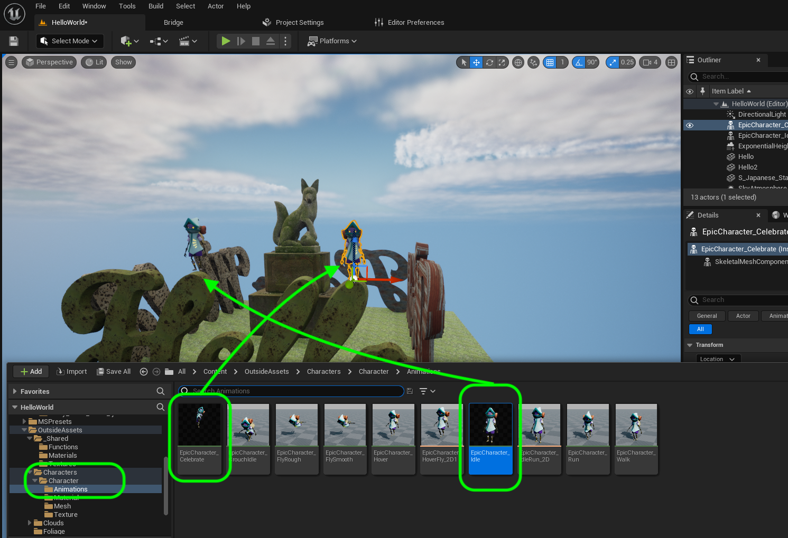

##### `Step 13.`\|`UE5HW`| :large_blue_diamond: :small_blue_diamond: :small_blue_diamond:  :small_blue_diamond: 

Press the play button to see the level.

https://user-images.githubusercontent.com/5504953/174844508-bd366580-9853-4a5f-9114-3ef820988454.mp4

##### `Step 14.`\|`UE5HW`| :large_blue_diamond: :small_blue_diamond: :small_blue_diamond: :small_blue_diamond:  :small_blue_diamond: 

If **Quixels** doesn't have what you want you can also check out the marketplace.  Press the <kbd>Get Content</kbd> button and select **Unreal Marketplace**.  This will then brin gup the marketplace where you can find assets for a fee as well as free.

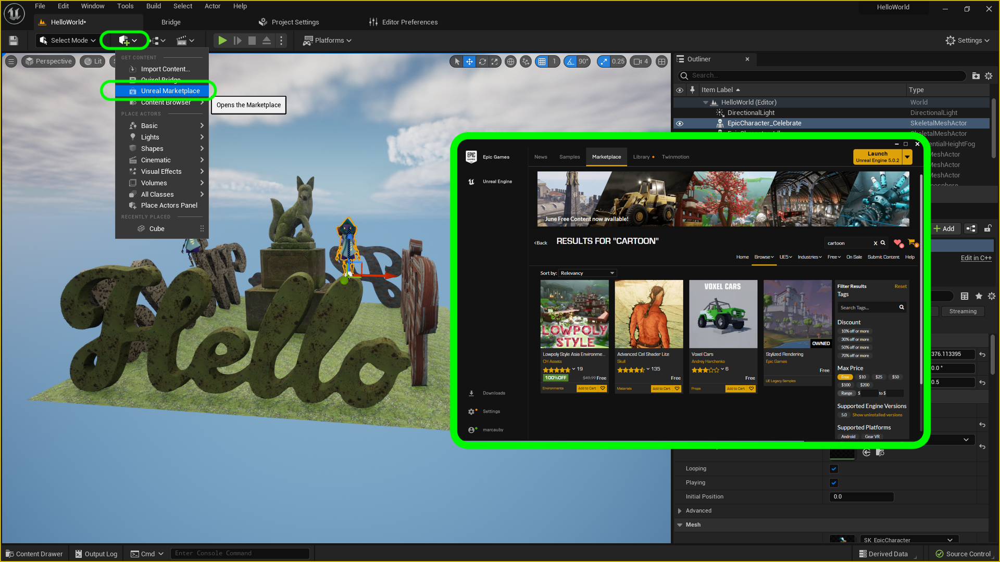

##### `Step 15.`\|`UE5HW`| :large_blue_diamond: :small_orange_diamond: 

You can search all of the free assets available.  I am picking **Stylized Rendering** a UE4 sample project that is free.  There will be two options with assets.  One is **Create Project** and the other is **Add to Project**.  In this case we will create a new project then migrate the assets to our working directory.  This is important as these asset packs can be gigabytes and chew up large hard disk space.  This way when you are done migrating you can delete this project.

If it needs to **Add to Project** then create a new empty Unreal project and add it to this scratch project.  You can then migrate and export from it just like the above.

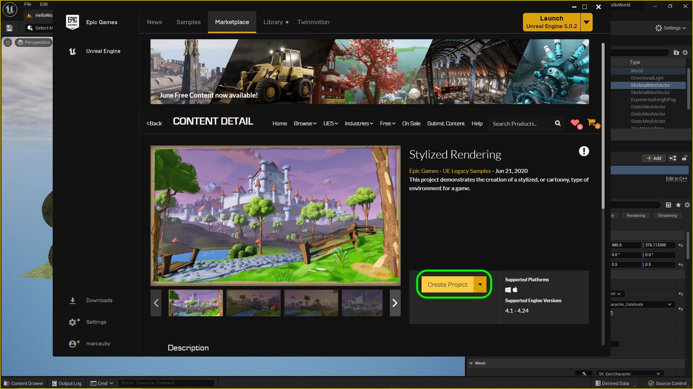

##### `Step 16.`\|`UE5HW`| :large_blue_diamond: :small_orange_diamond:   :small_blue_diamond: 

I load the game and browse the game.  Oooh, I like the tree.  I click on the green portion of the tree and right click and select **Browse to Asset**.

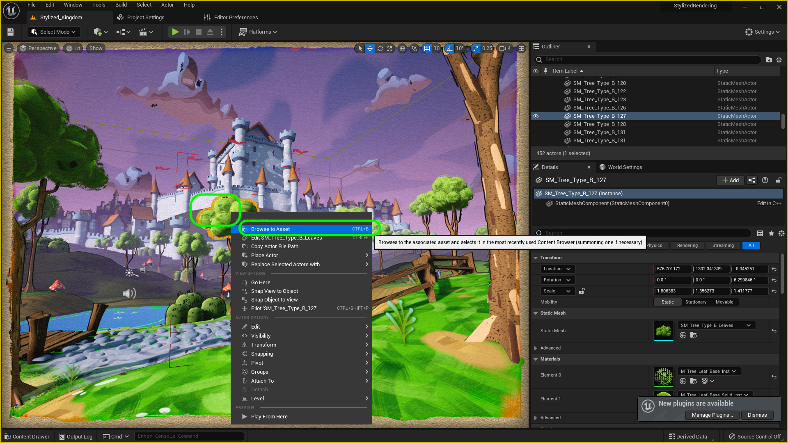

##### `Step 17.`\|`UE5HW`| :large_blue_diamond: :small_orange_diamond: :small_blue_diamond: :small_blue_diamond:

Now the tree comes in a trunk and a top.  I selected both items and right clicked and selected **Asset Actions | Migrate...**. This brings up a menu that lists all the files needed for these static meshes (including materials and textures).  Press the <kbd>OK</kbd> button to accept.

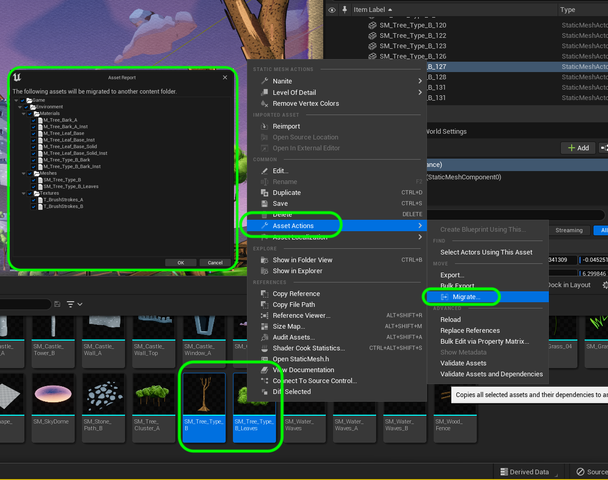

##### `Step 18.`\|`UE5HW`| :large_blue_diamond: :small_orange_diamond: :small_blue_diamond: :small_blue_diamond: :small_blue_diamond:

Now when migrating content you have to select your **Hello World** project and then select the **Content** folder. You **ALWAYS** want to migrate into the **Content** folder.

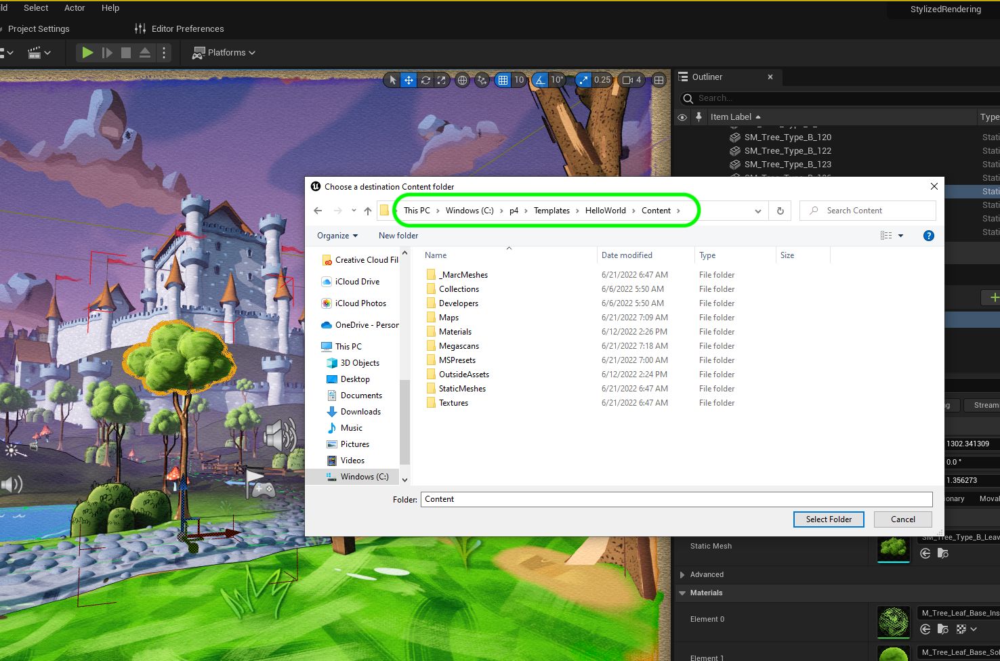

##### `Step 19.`\|`UE5HW`| :large_blue_diamond: :small_orange_diamond: :small_blue_diamond: :small_blue_diamond: :small_blue_diamond: :small_blue_diamond:

##### `Step 20.`\|`UE5HW`| :large_blue_diamond: :large_blue_diamond:

##### `Step 21.`\|`UE5HW`| :large_blue_diamond: :large_blue_diamond: :small_blue_diamond:

___

| [previous](../first-hour/README.md#user-content-first-hour-in-ue4)| [home](../README.md#user-content-ue4-hello-world) | [next](../readme/README.md#user-content-readmemd-file)|
|---|---|---|
