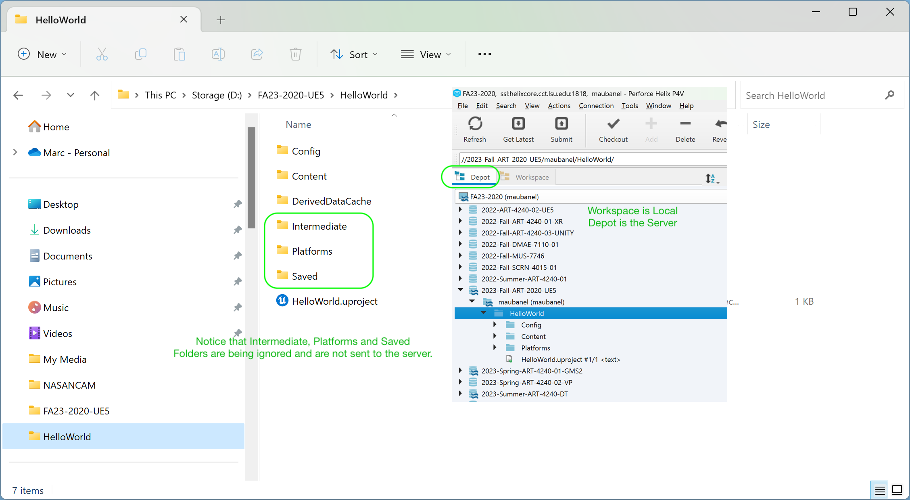

### Project Settings

[previous](../adding-p4/README.md#user-content-adding-file-to-perforce) • [home](../README.md#user-content-ue4-hello-world) • [next](../setting-map/README.md#user-content-setting-up-the-map)

Lets now make a change to an existing file in Perforce.  Lets make this new level the one that boots up when we run the editor or the game.

 

---

##### `Step 1.`\|`UE5HW`|:small_blue_diamond:

Close **UE5** and reopen it.  Does it boot up to the new **Hello World** room?  Look at the tab and see what level is loaded.  It says default! Unreal will not load the room your want to start in unless you set it.

##### `Step 2.`\|`FHIU`|:small_blue_diamond: :small_blue_diamond: 

Lets fix it so that the game loads into the level we are working on.  Open up **Edit | Project Settings** and go to **Project | Maps & Modes**. Since this is a one level game and we will only be working on this level lets change the map we boot up to in the editor as well as the one we would start with if we packaged this for a game by changing both **Editor Startup Map** and **Game Default Map** to `HelloWorld`.

##### `Step 3.`\|`UE5HW`|:small_blue_diamond: :small_blue_diamond: :small_blue_diamond:

Now press the <kbd>Source Control</kbd> button at the bottom right and select **Submit Content**.  Then type in an appropriate message and finish by pressing the <kbd>Submit</kbd> button to post it to **Perforce**.

##### `Step 4.`\|`UE5HW`|:small_blue_diamond: :small_blue_diamond: :small_blue_diamond: :small_blue_diamond:

If it succeeded you will see that it submitted a changelist.  Your number will be different than mine.

##### `Step 5.`\|`UE5HW`| :small_orange_diamond:

 Now close **UE5** and reopen it.  You should see that we are now booting up to the **Hello World** room (albeit looks the same all black).

##### `Step 6.`\|`UE5HW`| :small_orange_diamond: :small_blue_diamond:

Now if we look at **P4V** we have two tabs on the left.  The first is **Depot** and the second is **Workspace**.  What is in your workspace is local, and what is in the **Depot** is on the server (and backed up).  Every time you press **Submit** you are sending what is in your **Workspace** to the **Server/Depot**.  

Notice that the depot does not contain the **Intermediate** and **Saved** folders.  These are created locally on each of our machines and are not shared.  That way we can configure our local settings as well like and the game is customized to our GPU (NVidia, AMD etc...). 

| `ue4.generated.folders`\|`Intermediate & Saved Folders`| 
| :--- |
| *Intermediate - Contains temporary files generated during building the engine or game. In game directories, Shaders are stored in the Intermediate directory.* - [Unreal Docs](https://docs.unrealengine.com/en-us/Engine/Basics/DirectoryStructure)|
|*Saved - Contains autosaves, configuration (.ini) files, and log files. Additionally, the Engine > Saved directory contains crash logs, hardware information, and Swarm options and data.* - [Unreal Docs](https://docs.unrealengine.com/en-us/Engine/Basics/DirectoryStructure)|
|*Intermediate-Contains temporary files generated during building the engine or game. In game directories, Shaders are stored in the Intermediate directory.* - [Unreal Docs](https://docs.unrealengine.com/en-us/Engine/Basics/DirectoryStructure) |

| [previous](../adding-p4/README.md#user-content-adding-file-to-perforce)| [home](../README.md#user-content-ue4-hello-world) | [next](../setting-map/README.md#user-content-setting-up-the-map)|
|---|---|---|
