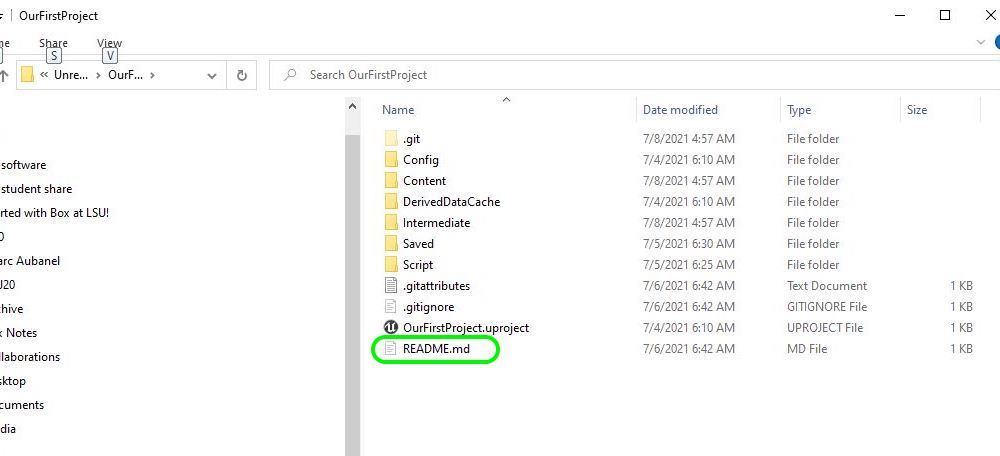
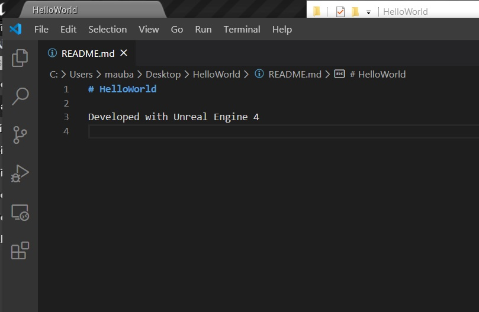
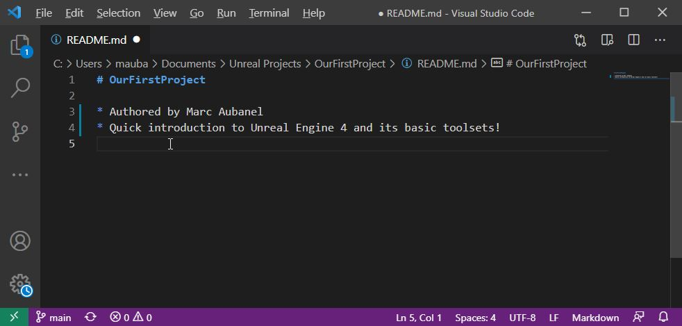
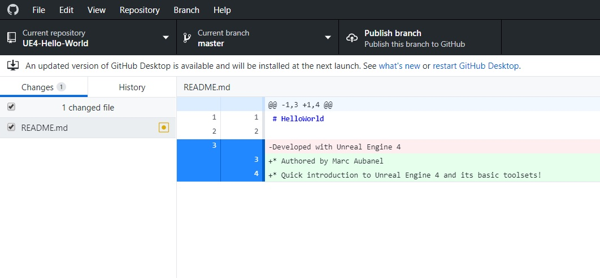
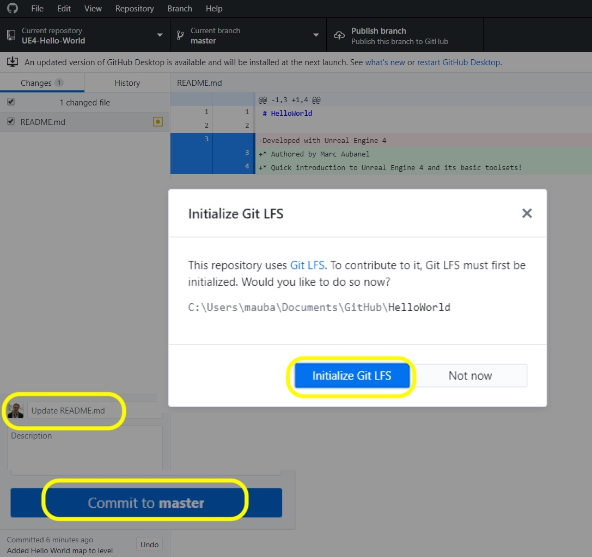
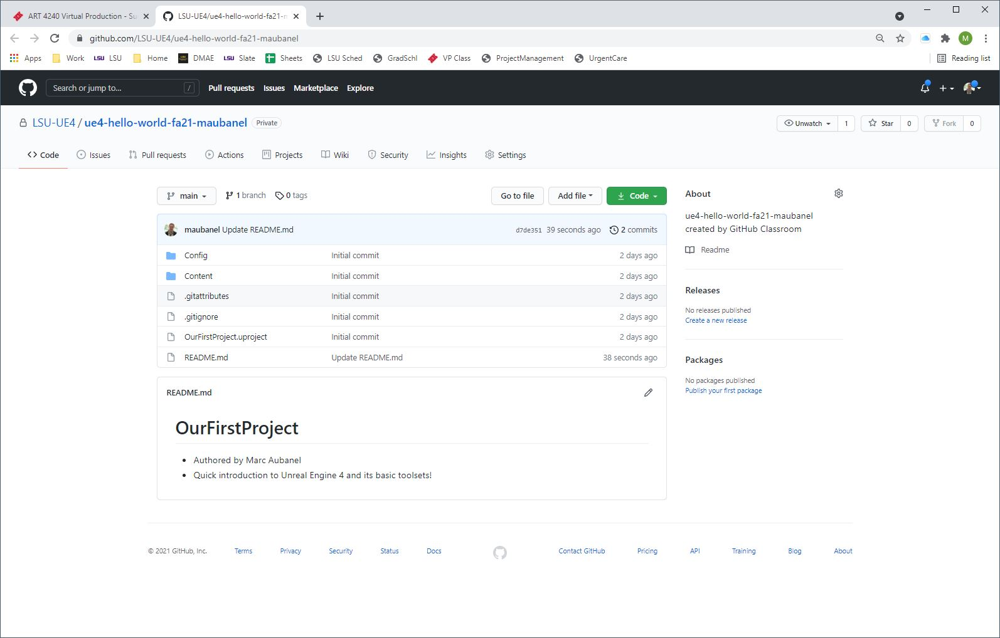
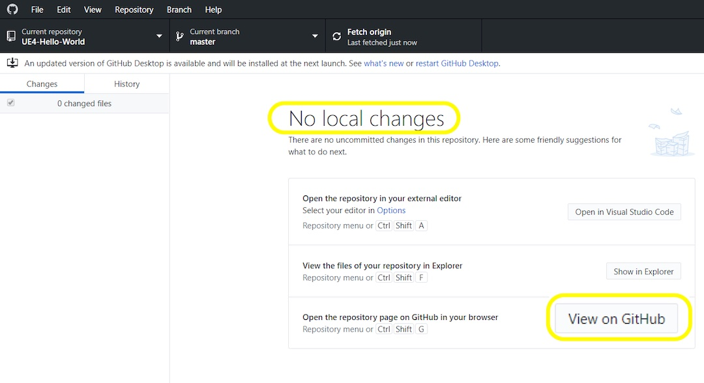
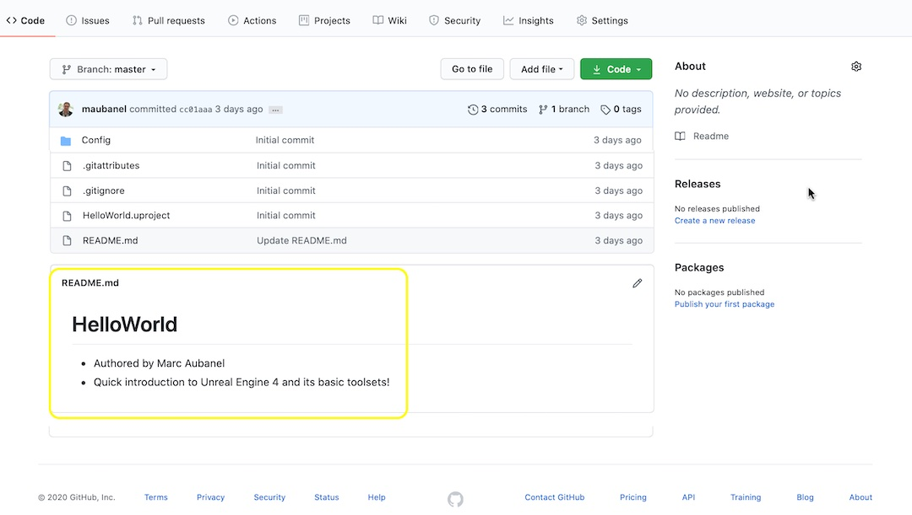

### README.md File

[previous](../setting-up/README.md#user-content-setting-up-unreal--github) • [home](../ignore-license/README.md#user-content-gitignore--license-files) • [next](#)

Lets create a change on to a single file then update it on **GitHub** with that change.  We will look at editing a single file, commiting it, pushing it to the server then **CHECKING** that it worked.

 

---

##### `Step 1.`\|`SUU&G`|:small_blue_diamond:

Every **GitHub** repository has a file called **README.md**.  This is a [Markdown](https://www.markdownguide.org) file which is a simple markup language (like HTML but even simpler).  It is used in many web apps and in all Git repositories.  Look in your project folder and you will see that **Unreal** created a starter file for you.

##### `Step 2.`\|`FHIU`|:small_blue_diamond: :small_blue_diamond: 

Open up the **README.md** file in your favorite text editor.  I use **Visual Studio** or **Visual Studio Code** which are both freely available.  You can see that it includes on line 1 `# HelloWorld`. A single pound sign (#) makes that line the equivalent in **HTML** of `<h1>Hello World</h1>`. This if you don't know HTML is a heading (larger font).  Under it is a paragraph with a single line `Developed with Unreal Engine 4`.

##### `Step 3.`\|`SUU&G`|:small_blue_diamond: :small_blue_diamond: :small_blue_diamond:

Let's add our name with a `*` start and space in front.  This will make it an unordered list (bullet point) and add yourself as the author.  Then on the next bullet type in a description of the project, feel free to use mine: `Quick introduction to Unreal Engine 4 and its basic toolsets`. Save this change.
    

##### `Step 4.`\|`SUU&G`|:small_blue_diamond: :small_blue_diamond: :small_blue_diamond: :small_blue_diamond:

Now what **GitHub** does is keep track of all changes to the project.  Now since UE4 did an initial **commit** when you created the project the only item to change since then is the **README.md** file which we altered.  Now in the interface we can see all the changes and we can click on the file and see what changed.

Notice the yellow square next to the file name.  This means the file has changed.  It shows in red on the right what we deleted and in green what was added.

##### `Step 5.`\|`SUU&G`| :small_orange_diamond:

Now GitHub gives you a default commit message, in this case saying it updated **HelloWorld**.  Normally we would be working in Unreal and doing this step in Unreal.  Since we are editing a non game file, we will perform the staging (`git add`) and commiting (`git commit`) in **GitHub Desktop**.  

Normally we would write a change comment in the commit - but we did just update the one file, a trivial change.  The default message is specific enough. So we can leave it as is and press the <btn>Commit to Master</btn> button.

##### `Step 6.`\|`SUU&G`| :small_orange_diamond: :small_blue_diamond:

We have just commited updates the database on our local computer.  This is great, but it is not backed up to the server yet.  If we lose our computer we lose our project.  We can push all these changes to the server.  Press the<btn>Push Origin</btn> button and this will then take all the changes you commited and send them to the server. This will also have to be done when working in ***Unreal** as it does not have the ability to **push**in **editor**.

##### `Step 7.`\|`SUU&G`| :small_orange_diamond: :small_blue_diamond: :small_blue_diamond:

If it pushed the change to the server you should get some text that says **No local changes**.  This means you are all up to date.  Now to double check that you actually did update the server with the change press the **View on GitHub** button to see it online. You might have to refresh your **GitHub** web page.

##### `Step 8.`\|`SUU&G`| :small_orange_diamond: :small_blue_diamond: :small_blue_diamond: :small_blue_diamond:

Now this takes us online and one thing is clear.  The **README.md** file is rendered as **HTML** at the bottom of the screen and it contains our changes!  The `#` and `*` are replaced with a heading and bullets (unordered list). The powerful part is that the old version still exists as **Git** does not delete anything.  We could always go back and revert to the old version of any file at any point in time.  So not only do we have a backup but unlimed undos to go back in time and recover any old data that we may need.",

| [previous](../setting-up/README.md#user-content-setting-up-unreal--github)| [home](../ignore-license/README.md#user-content-gitignore--license-files) | [next](#)|
|---|---|---|
