### Remove Player Control

[previous](../building-h/README.md#user-content-build-the-letter-h) • [home](../README.md#user-content-ue4-hello-world) • [next](../readme/README.md#user-content-readmemd-file)

Unreal autoamtically loads up a player in most templates.  That is why we place a **player start** because the largest preponderances of games use a controllable character.  What about puzzle games, where the user is just clicking a user interface and not controlling a character (like a crossword puzzle)?  Lets look at how we can set-up a camera, have it rotate around the letter(s) and default to it when starting the game.

 

---

##### `Step 1.`\|`SUU&G`|:small_blue_diamond:

Instead of having the camera on the player pawn that spawns, lets have a predefined camera.  Go to **Modes** and type `Camera` and drag a **Camera** into the scene.  

In Unreal you can take any existing actor and turn it into a **Blueprint** that you can reuse or add extra logitc that doesn't exist in the current actor.  This can be done in the **Details** panel.

Now we want to make a blueprint to add logic to it so that it rotates around its center.  Click on the <kbd>Blueprint / Add Script</kbd> button and call it `BP_CameraActor`. In the ***Creaet Blueprint from Selection** menu leave the defaults and press the <kbd>Select</kbd>button. Add it to the **Content | LearningKit Games | Blueprints | Game Framework** folder."

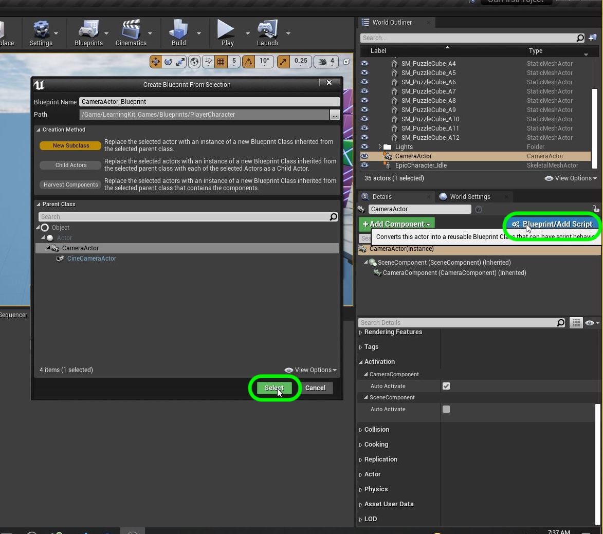
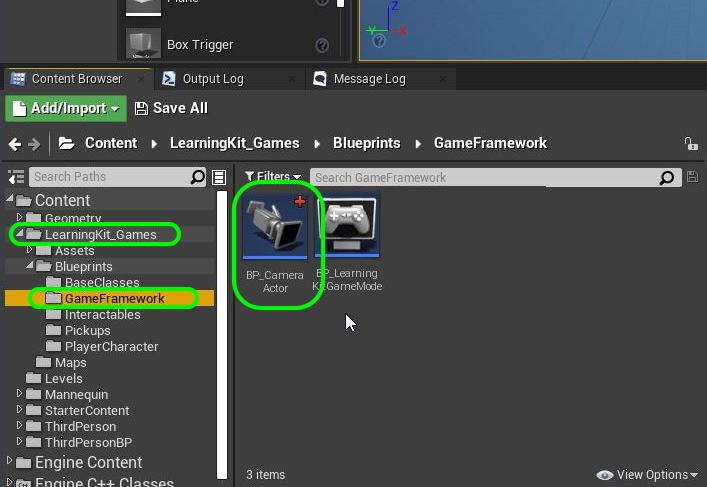

##### `Step 2.`\|`FHIU`|:small_blue_diamond: :small_blue_diamond: 

Open the newly created **Blueprint**.  In the **Components** tab, press the **+ Add Component** button and search for `Billboard`.  Add this component to the scene.  This will act as the target that the camera looks at but will not be rendered in the level.  It will stay at the local **0, 0, 0** coordinate so this will be the rotation point for the camera to rotate around the level.

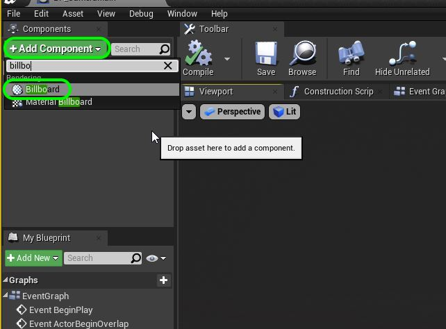

##### `Step 3.`\|`SUU&G`|:small_blue_diamond: :small_blue_diamond: :small_blue_diamond:

Press **+ Add Component** again and add a `Rotating Movement` component.

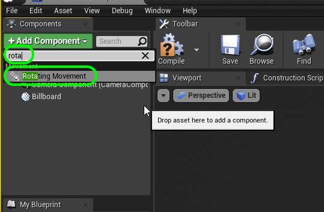

##### `Step 4.`\|`SUU&G`|:small_blue_diamond: :small_blue_diamond: :small_blue_diamond: :small_blue_diamond:

The camera needs to be around 3/4 of the length of the ground surface away from the billboard.  The billboard will be in the middle of the floor and the camera will look at it and rotate around it.  This will take some trial and error but for now select the **Camera Component** and move it away with the **Red** arrow from the **Billboard**.

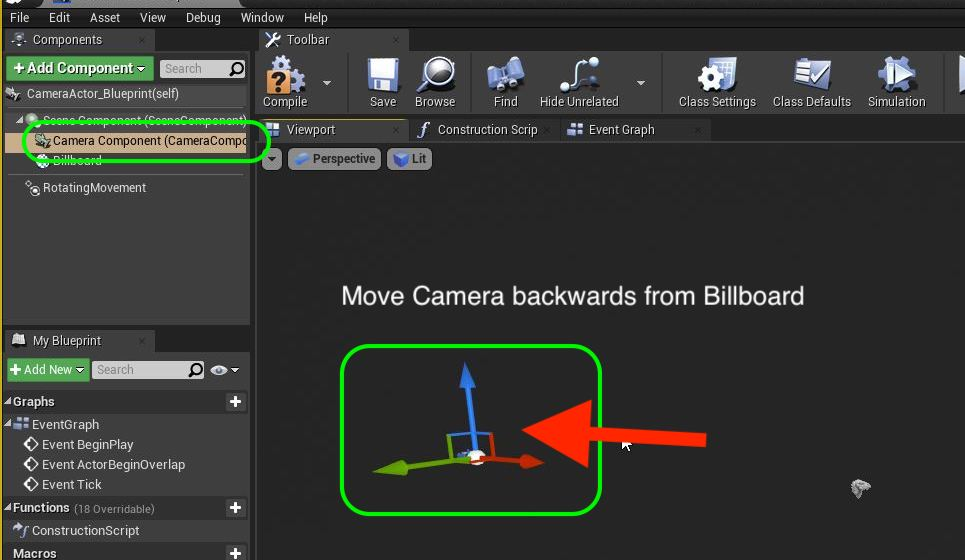

##### `Step 5.`\|`SUU&G`| :small_orange_diamond:

Drag the **BP_Camera_Actor** to the scene.  Make sure the billboard component is at **Location** at the point where you want to rotate.  Make sure the **Camera Component** is far enough away.  Go back to the blueprint and adjust the distance.  Use the camera preview to see the framing of the camera. I have it here so that the object is position and rotated with the pivot point in the right place.

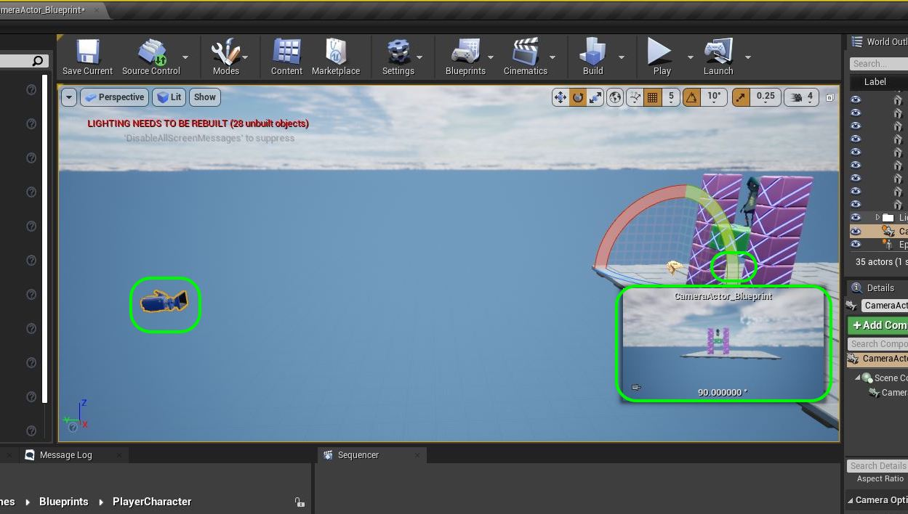

##### `Step 6.`\|`SUU&G`| :small_orange_diamond: :small_blue_diamond:

Now we do not want to spawn the third person character.  This can be found in the **Game Mode** blueprint. We do not want to change the existing one as it works with the existing levels in our game.  Go to the **LearningKit_Games | Blueprints | GameFramework** folder and press the <kbd>Add/Import</kbd> button and select <kbd>Blueprint Class</kbd>. Now select the <kbd>Game Mode Base</kbd> class for this blueprint.  Call this blueprint `BP_HelloWorldGameMode`.

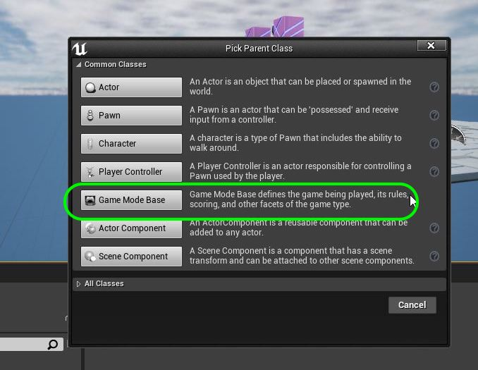

##### `Step 7.`\|`SUU&G`| :small_orange_diamond: :small_blue_diamond: :small_blue_diamond:

Open up the game mode blueprint and change the **Default Pawn** to `none`.

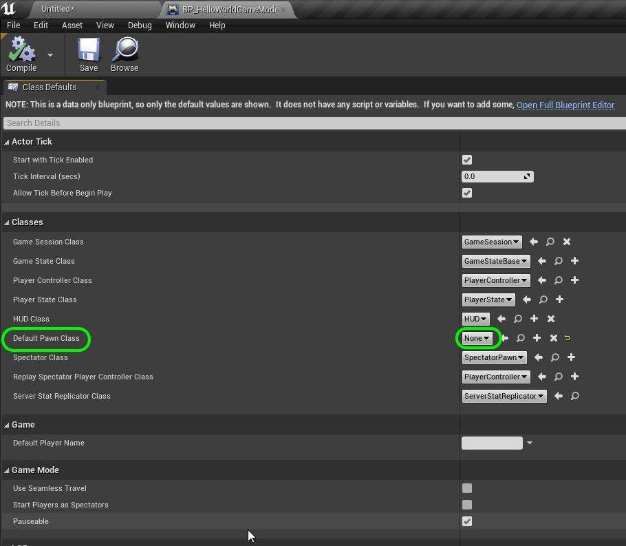

##### `Step 8.`\|`SUU&G`| :small_orange_diamond: :small_blue_diamond: :small_blue_diamond: :small_blue_diamond:

There are two places we can select the level blueprint.  In the **Project Settings | Maps & Modes** we can set it for the entire project.  We will leave this alone as it works with their test level in the framework we imported.  

We can have a unique gamemode for a specific level.  This is done by going to the **World Settings** tab (if it is not there go to **Settings | World Settings**) and selecting this new game mode as the one we will use for this single level.

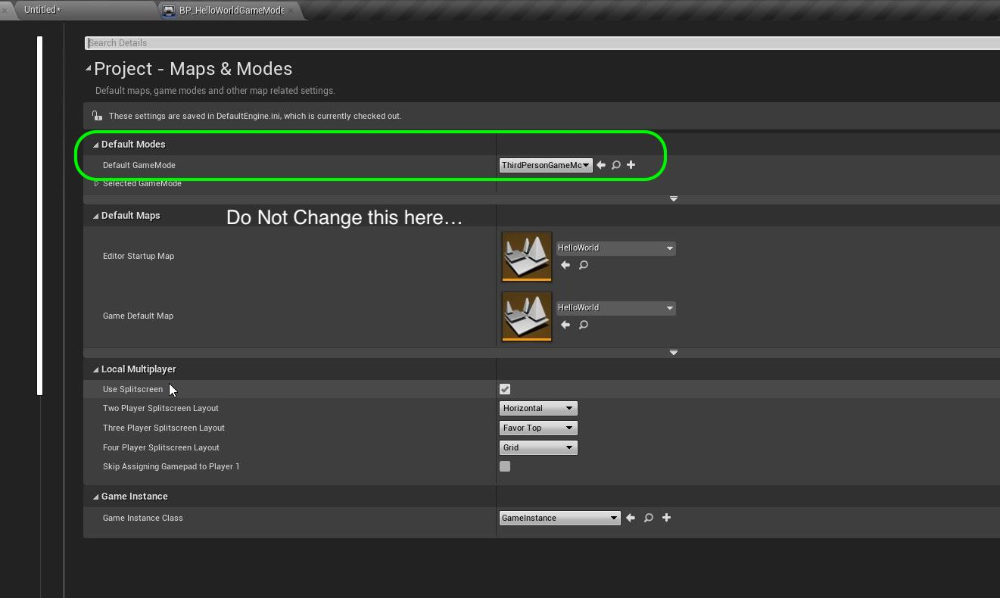

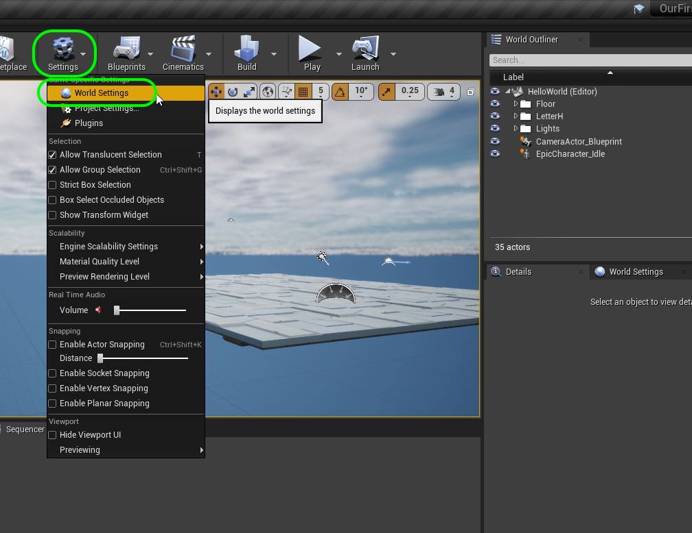

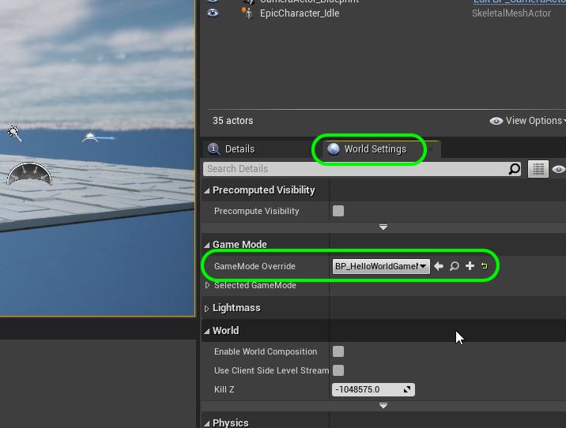

##### `Step 9.`\|`SUU&G`| :small_orange_diamond: :small_blue_diamond: :small_blue_diamond: :small_blue_diamond: :small_blue_diamond:

Press the **Play** button and we no longer see the third person pawn.  We DO NOT see the camera rotate around the object.  Woops the camera is static.  What is happening?  The game is still using the spectator pawn camera will not use this camera unless you tell it to. Notice it spawns a second camera that in my case points at nothing.  It must be bound to the **Default Pawn** as the camera moves when I press **WASD** on the keyboard.  

This is default behavior in Unreal. It expects the user the be controlling a character and since we do not have one, it creates one for us using the default pawn so you can fly around the scene.  Notice that in the **World Outliner** that you see the other **Camera Actor**.  You will also still see the **BP_CameraActor** and if you click on it will see that the frame is changing so it is rotating.

Lets fix this and use our desired camera.

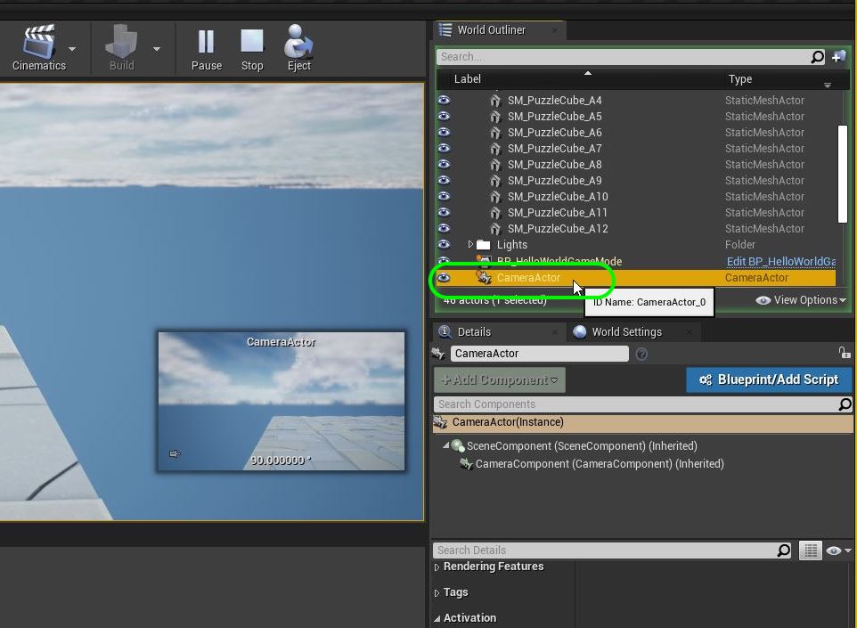

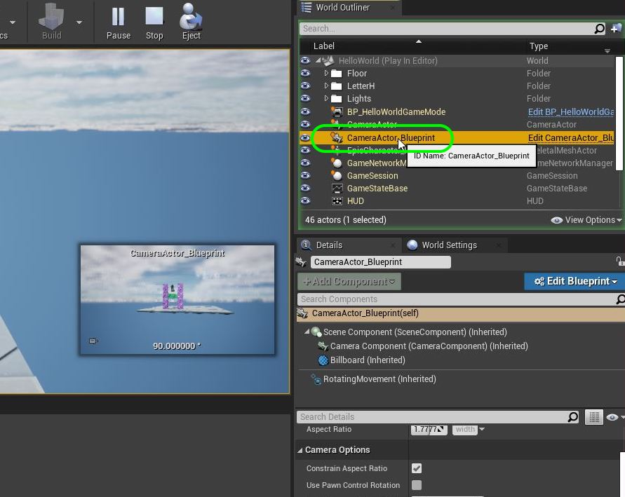

##### `Step 10.`\|`SUU&G`| :large_blue_diamond:

Every level comes with its own blueprint where you can put level specific scripts.  When you save a map/level the game automatically creates a level blueprint.  This is where we will tell the game to use our new camera.  You can load it by pressing the <kbd>Blueprints</kbd> button and select **Open Level Blueprint**.

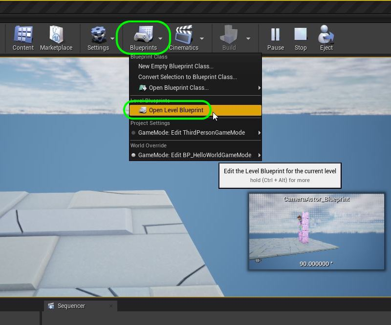

##### `Step 11.`\|`SUU&G`| :large_blue_diamond: :small_blue_diamond: 

##### `Step 12.`\|`SUU&G`| :large_blue_diamond: :small_blue_diamond: :small_blue_diamond: 

##### `Step 13.`\|`SUU&G`| :large_blue_diamond: :small_blue_diamond: :small_blue_diamond:  :small_blue_diamond: 

##### `Step 14.`\|`SUU&G`| :large_blue_diamond: :small_blue_diamond: :small_blue_diamond: :small_blue_diamond:  :small_blue_diamond: 

##### `Step 15.`\|`SUU&G`| :large_blue_diamond: :small_orange_diamond: 

##### `Step 16.`\|`SUU&G`| :large_blue_diamond: :small_orange_diamond:   :small_blue_diamond: 

##### `Step 17.`\|`SUU&G`| :large_blue_diamond: :small_orange_diamond: :small_blue_diamond: :small_blue_diamond:

##### `Step 18.`\|`SUU&G`| :large_blue_diamond: :small_orange_diamond: :small_blue_diamond: :small_blue_diamond: :small_blue_diamond:

##### `Step 19.`\|`SUU&G`| :large_blue_diamond: :small_orange_diamond: :small_blue_diamond: :small_blue_diamond: :small_blue_diamond: :small_blue_diamond:

##### `Step 20.`\|`SUU&G`| :large_blue_diamond: :large_blue_diamond:

##### `Step 21.`\|`SUU&G`| :large_blue_diamond: :large_blue_diamond: :small_blue_diamond:

___

| [previous](../building-h/README.md#user-content-build-the-letter-h)| [home](../README.md#user-content-ue4-hello-world) | [next](../readme/README.md#user-content-readmemd-file)|
|---|---|---|
