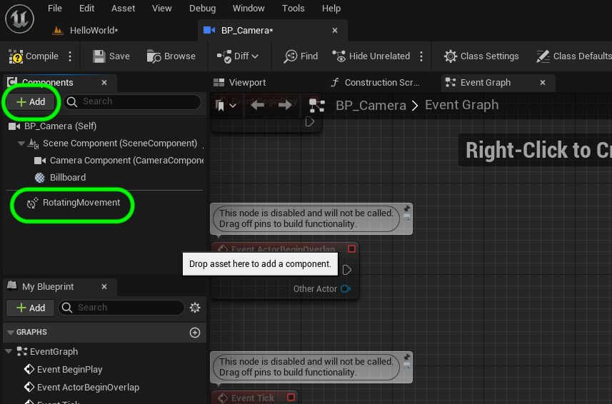
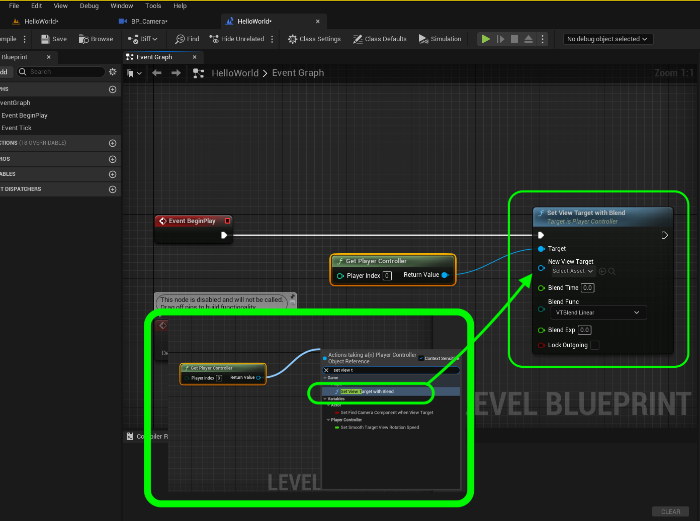
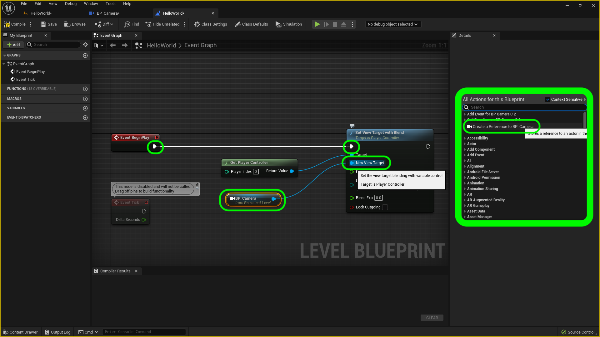

### Adding A Camera

[previous](../juice/README.md#user-content-making-it-juicy) • [home](../README.md#user-content-ue4-hello-world)

Now to control it in game we need to add a camera to the scene.  We will have the camera rotate around our creation to create a sort of turntable effect.

Now when you click on the camera in the **World Outliner**

 

---

##### `Step 1.`\|`UE5HW`|:small_blue_diamond:

Go to **Place Actors** and type `Camera` and drag a **All Classes | Camera Actor** into the scene.  Now when you select the actor in the **Outliner** you will see a picture in picture with the camera view.

##### `Step 2.`\|`FHIU`|:small_blue_diamond: :small_blue_diamond: 

In Unreal you can take any existing actor and turn it into a **Blueprint** that you can reuse or add extra logitc that doesn't exist in the current actor.  This can be done in the **Details** panel.

Now we want to make a blueprint to add logic to it so that it rotates around its center.  Click on the <kbd>Add Script</kbd> button and call it `BP_Camera` and place it in the root of the **Content** folder. In the ***Create Blueprint from Selection** menu leave the defaults and press the <kbd>Select</kbd>button.

##### `Step 3.`\|`UE5HW`|:small_blue_diamond: :small_blue_diamond: :small_blue_diamond:

Now you should see a new **Blueprint** based on the camera actor in the root **Content** folder called **BP_Camera**.

##### `Step 4.`\|`UE5HW`|:small_blue_diamond: :small_blue_diamond: :small_blue_diamond: :small_blue_diamond:

Open the newly created **Blueprint**.  Sometimes it will open in a reduced view and if it does you need to click on the link for **Open Full Blueprint Editor**.

In the **Components** tab, press the **+ Add** button and search for `Billboard`.  Add this component to the scene.  This will act as the target that the camera looks at but will not be rendered in the level.  It will stay at the local **0, 0, 0** coordinate so this will be the rotation point for the camera to rotate around the level.

##### `Step 5.`\|`UE5HW`| :small_orange_diamond:

Press **+ Add** again to add a `Rotating Movement` component.

##### `Step 6.`\|`UE5HW`| :small_orange_diamond: :small_blue_diamond:

The camera needs to be around 3/4 of the length of the ground surface away from the billboard.  The billboard will be in the middle of the floor and the camera will look at it and rotate around it.  This will take some trial and error but for now select the **Camera Component** and move it away with the **Red** arrow from the **Billboard**.

https://user-images.githubusercontent.com/5504953/174885850-cfaeb794-904b-4ba1-955e-0e7772283fa5.mp4

##### `Step 7.`\|`UE5HW`| :small_orange_diamond: :small_blue_diamond: :small_blue_diamond:

Make sure the billboard component is at a **Location** where you want to rotate around the letters.  Centering it works for me.   Make sure the **Camera Component** is far enough away to see the letters fully.  Go back to the blueprint and adjust the distance as required.  Use the camera preview to see the framing of the camera. I have it here so that the object is position and rotated with the pivot point in the right place.

##### `Step 8.`\|`UE5HW`| :small_orange_diamond: :small_blue_diamond: :small_blue_diamond: :small_blue_diamond:

We need to attach the camera to a player.  So we need to add a **Game Mode**. 

There are two places we can select the level blueprint.  In the **Project Settings | Maps & Modes** we can set it for the entire project.  We will leave this alone as it works with their test level in the framework we imported.  

We can have a unique gamemode for a specific level. Lets do it this way. Go to the **World Settings** tab (if it is not there go to **Window | World Settings**) and selecting a **Game Mode Override** of `GameModeBase`. 

##### `Step 9.`\|`UE5HW`| :small_orange_diamond: :small_blue_diamond: :small_blue_diamond: :small_blue_diamond: :small_blue_diamond:

Press the **Play** button and we no longer see the third person pawn.  We DO NOT see the camera rotate around the object.  Woops the camera is static.  What is happening?  The game is still using the spectator pawn camera will not use this camera unless you tell it to. Notice it spawns a second camera that in my case points at nothing.  It must be bound to the **Default Pawn** as the camera moves when I press **WASD** on the keyboard.  

This is default behavior in Unreal. It expects the user the be controlling a character and since we do not have one, it creates one for us using the default pawn so you can fly around the scene.  Notice that in the **World Outliner** that you see the other **Camera Actor**.  You will also still see the **BP_CameraActor** and if you click on it will see that the frame is different than the one the game is showing.  

Lets fix this and use our desired camera as teh **Default** camera when we hit play.

##### `Step 10.`\|`UE5HW`| :large_blue_diamond:

Every level comes with its own blueprint where you can put level specific scripts.  When you save a map/level the game automatically creates a level blueprint.  This is where we will tell the game to use our new camera.  You can load it by pressing the <kbd>Blueprints</kbd> button and select **Open Level Blueprint**.

##### `Step 11.`\|`UE5HW`| :large_blue_diamond: :small_blue_diamond: 

Now you can see that the blueprint has the same name as the map.  Make sure you are in the **Event Graph**, this is where all your game logic will go.  Notice the **Begin Play Event**.  This event will run **once** when you start the game.  So our script needs to make our new camera the game camera instead of the spectator pawn.  Right click on the graph and search for a **GetPlayerController** node and add it to the graph.

##### `Step 12.`\|`UE5HW`| :large_blue_diamond: :small_blue_diamond: :small_blue_diamond: 

Pull off of the **Return Value** pin and add a **Set View Target with Blend** node.

##### `Step 13.`\|`UE5HW`| :large_blue_diamond: :small_blue_diamond: :small_blue_diamond:  :small_blue_diamond: 

Go to the game window and select the **BP_Camera** actor in the scene.

##### `Step 14.`\|`UE5HW`| :large_blue_diamond: :small_blue_diamond: :small_blue_diamond: :small_blue_diamond:  :small_blue_diamond: 

Go back to the **Blueprint** and right click on the graph.  Select **Create a Reference to BP_Camera**.  Connect the **Execution** pin from the **Begin Play** node and send it to the **Set View Target With Blend** execution pin.  

Connect the output of the camera node to the **New View Target** pin in the **Set View Target with Blend** node.

##### `Step 15.`\|`UE5HW`| :large_blue_diamond: :small_orange_diamond: 

Compile the blueprint then go to the game and press run.  The camera should now rotate around the billboard showing off your work.  It is a bit fast though. I would also like it to turn in the other direction so that it spells Hello World from left to right.

https://user-images.githubusercontent.com/5504953/174898029-2cde2d92-1c5c-4b4c-ad09-25f52b088055.mp4

##### `Step 16.`\|`UE5HW`| :large_blue_diamond: :small_orange_diamond:   :small_blue_diamond: 

Lets adjust the speed and position of the camera.  Open the **BP_Camera_Actor** blueprint.  Select the **Rotating Movement** component. Change the  **Rotation Rate | Z** value from `180` degrees per second to `-20`. The negative value will make the camera move in the other direction.

Notice that there is an actor we didn't place that is showing up in the rotation.  Look at the end of the video below.

https://user-images.githubusercontent.com/5504953/174899628-fcc140f0-ed47-4da2-9b2c-1b7dbc3e5928.mp4

##### `Step 17.`\|`UE5HW`| :large_blue_diamond: :small_orange_diamond: :small_blue_diamond: :small_blue_diamond:

The default game mode base is spawning a default pawn that is creating this actor in the scene we do not want.  Select the **Content** folder and press the <kbd>+ Add</kbd> and select **Blueprint** then select `Game Mode Base`. Name the file `BP_GameModeBase`.

##### `Step 18.`\|`UE5HW`| :large_blue_diamond: :small_orange_diamond: :small_blue_diamond: :small_blue_diamond: :small_blue_diamond:

Open up the new **BP_GameModeBase** and change the **Game Session Class** and the **Default Pawn Class** and select `none`. Press the <kbd>Compile</kbd> button.

Go back to **World Settings** and change **GameMode Override** and select `BP_GameModeBase`.

##### `Step 19.`\|`UE5HW`| :large_blue_diamond: :small_orange_diamond: :small_blue_diamond: :small_blue_diamond: :small_blue_diamond: :small_blue_diamond:

Press play and now we should have the rotation working without the extra unwanted actor in the scene.

https://user-images.githubusercontent.com/5504953/174901849-34ea905d-acc2-4e66-8043-c2b2b05056bc.mp4

##### `Step 20.`\|`UE5HW`| :large_blue_diamond: :large_blue_diamond:

Select the **File | Save All** then press the <kbd>Source Control</kbd> button and select **Source Control...**. Enter a **Changelist Description** and then press <kbd>Submit Content</kbd>. Update the **Changelist Description** message and with the latest changes. Make sure all the files are correct and press the <kbd>Submit</kbd> button. A confirmation will pop up on the bottom right with a message about a changelist was submitted with a commit number.

https://user-images.githubusercontent.com/5504953/174902712-729d14df-40b5-41c4-9b11-460e4a67d16a.mp4

##### `Step 21.`\|`UE5HW`| :large_blue_diamond: :large_blue_diamond: :small_blue_diamond: 

Sometimes not all files get submitted to Unreal especially for files that don't show up in the editor.  It is good practice one you submit in **Unreal** and quit the game to right click on the top most project folder and select **Reconcile Offline Work...**.

This will either give a message saying ther is nothing to reconcile or bring up a tab.  Make sure that these are **NOT** files in the **Intermediate** and **Saved** folders as these should be ignored from the `.p4ignore`.

If the files are in **Content** or **Configuration** then press the <kbd>Reconcile</kbd> button.  Then submit the changes with a message and press the <kbd>Submit</kbd> button.

| `hello.world`\|`THE END`| 
| :--- |
| **That's All Folks!** Thanks for sticking around. That's it for this lesson. |

| [previous](../juice/README.md#user-content-making-it-juicy)| [home](../README.md#user-content-ue4-hello-world) | 
|---|---|
