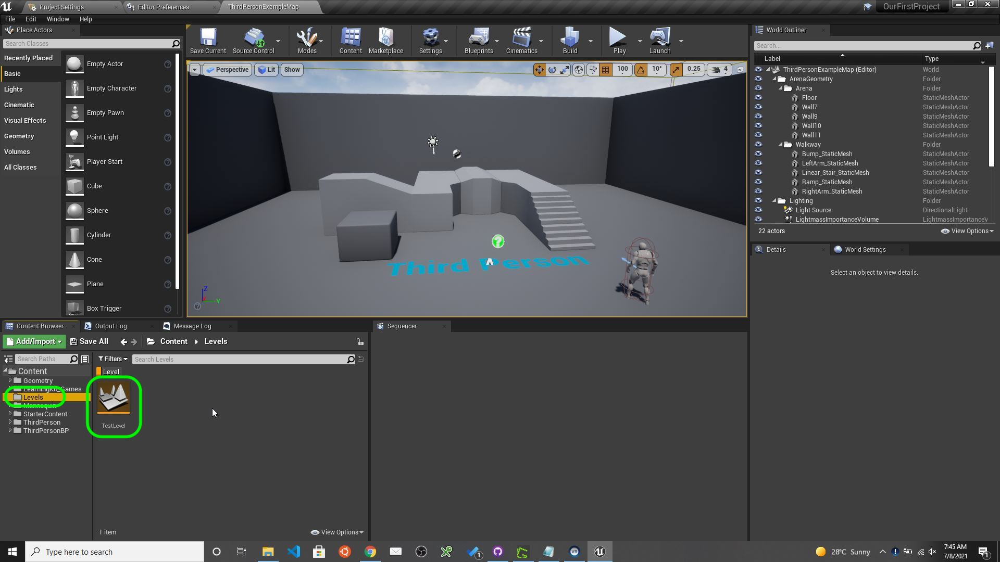
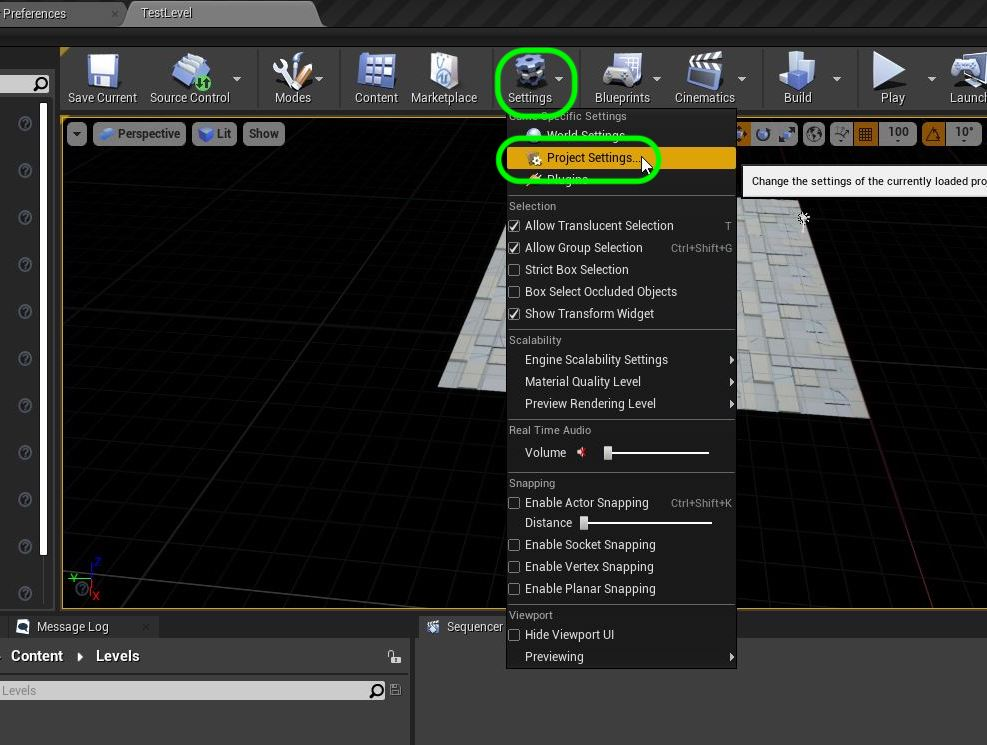
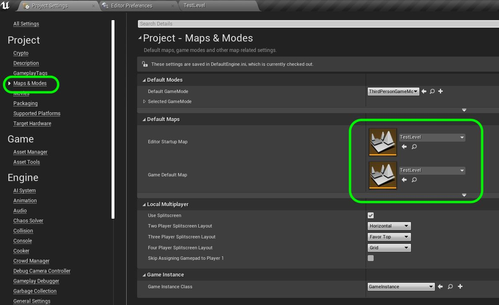
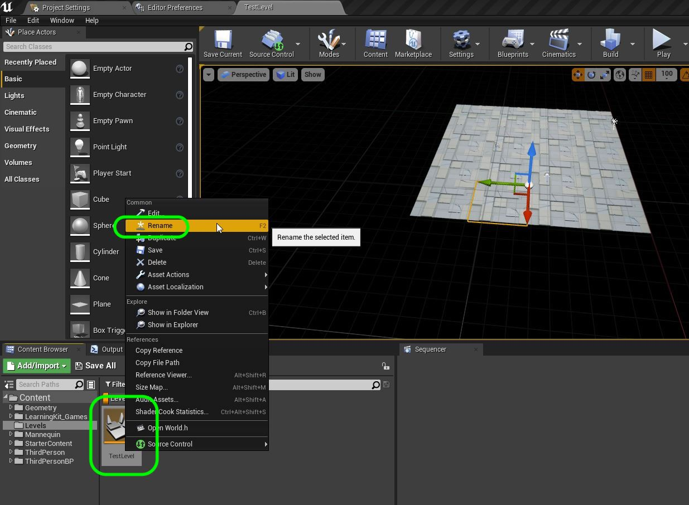
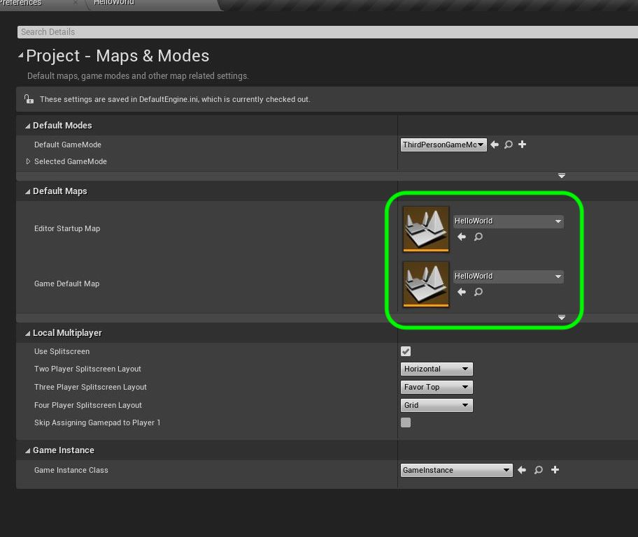
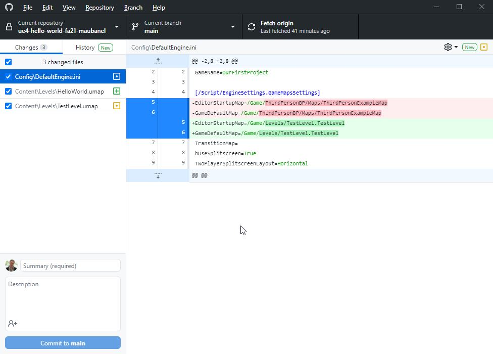
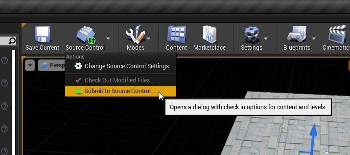
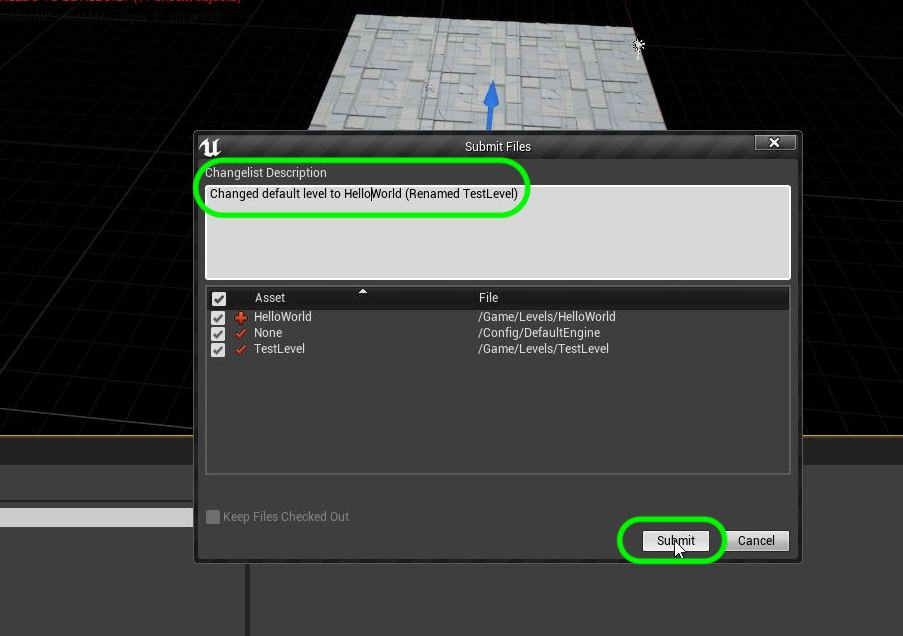
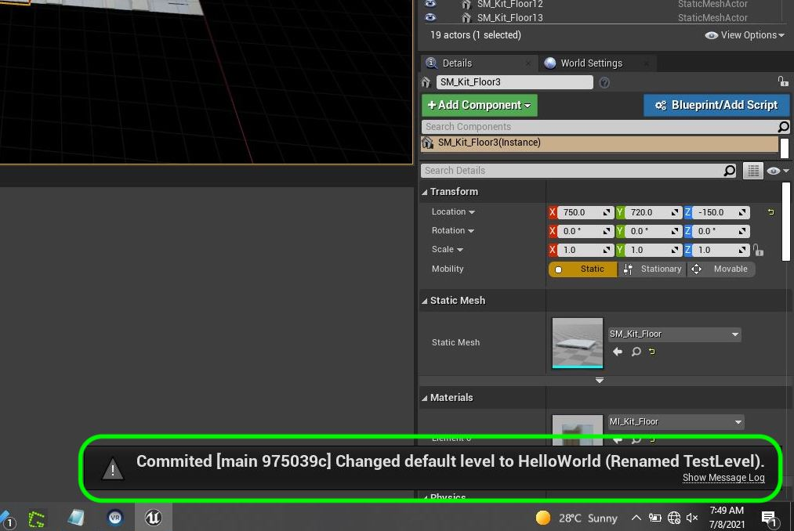

### Setting up the Map

[previous](../ignore-license/README.md#user-content-remaining-github-related-files) • [home](../README.md#user-content-ue4-hello-world) • [next](../readme/README.md#user-content-readmemd-file)

Chapter introduction here.

 

---

##### `Step 1.`\|`SUU&G`|:small_blue_diamond:

OK, lets open Unreal again.  Got to the **Levels** folder and open up **TestLevel**.

##### `Step 2.`\|`FHIU`|:small_blue_diamond: :small_blue_diamond: 

Now we currently don't load to this map when we run **Unreal**.  Lets set this level as the default level to load.  Press the <kbd>Settings</kbd> button and select **Project Settings**.

##### `Step 3.`\|`SUU&G`|:small_blue_diamond: :small_blue_diamond: :small_blue_diamond:

Go to **Maps & Modes** and change both the **Editor Startup Map** and **Game Default Default Map** to `Test Level`.  Since this is a single level we will be building we can set both to the same.  Normally you would have your first level in the **Game Default** then the level you are currently working on in the **Editor Startup**,

##### `Step 4.`\|`SUU&G`|:small_blue_diamond: :small_blue_diamond: :small_blue_diamond: :small_blue_diamond:

In this exercise you will be spelling out **Hello World**.  So right click on the **TestLevel** in **Content** browser.  Name it `HelloWorld`.

##### `Step 5.`\|`SUU&G`| :small_orange_diamond:

Now it is critical that you rename all files and folder **INSIDE** of **UE4**.  Never use the operating system to rename.  If you go back to **Project Settings** you will see that the new level is **Hello World**.  UE4 keeps track of the names so you can rename any object and it will rename all instances of them. Press **File | Save Current** to save your work.

##### `Step 6.`\|`SUU&G`| :small_orange_diamond: :small_blue_diamond:

Now if you saved your work you can see in **GitHub Desktop** what has changed in the game.  Now we will **NOT** use this app to `add` and `commit` these changes.

##### `Step 7.`\|`SUU&G`| :small_orange_diamond: :small_blue_diamond: :small_blue_diamond:

Go back to **Unreal** and press the <kbd>Source Control</kbd> button and select **Submit to Source Control**. 

##### `Step 8.`\|`SUU&G`| :small_orange_diamond: :small_blue_diamond: :small_blue_diamond: :small_blue_diamond:

Now you should always include a message in your commits so you know what was done.  **Unreal** forces you to before you can submit the change.  It is a good idea to descrbie what was done a succinctly as possible.

You will see in the bottom right corner a pop up that says the changes have been commited to the **main** branch.

##### `Step 9.`\|`SUU&G`| :small_orange_diamond: :small_blue_diamond: :small_blue_diamond: :small_blue_diamond: :small_blue_diamond:

##### `Step 10.`\|`SUU&G`| :large_blue_diamond:

##### `Step 11.`\|`SUU&G`| :large_blue_diamond: :small_blue_diamond: 

##### `Step 12.`\|`SUU&G`| :large_blue_diamond: :small_blue_diamond: :small_blue_diamond: 

##### `Step 13.`\|`SUU&G`| :large_blue_diamond: :small_blue_diamond: :small_blue_diamond:  :small_blue_diamond: 

##### `Step 14.`\|`SUU&G`| :large_blue_diamond: :small_blue_diamond: :small_blue_diamond: :small_blue_diamond:  :small_blue_diamond: 

##### `Step 15.`\|`SUU&G`| :large_blue_diamond: :small_orange_diamond: 

##### `Step 16.`\|`SUU&G`| :large_blue_diamond: :small_orange_diamond:   :small_blue_diamond: 

##### `Step 17.`\|`SUU&G`| :large_blue_diamond: :small_orange_diamond: :small_blue_diamond: :small_blue_diamond:

##### `Step 18.`\|`SUU&G`| :large_blue_diamond: :small_orange_diamond: :small_blue_diamond: :small_blue_diamond: :small_blue_diamond:

##### `Step 19.`\|`SUU&G`| :large_blue_diamond: :small_orange_diamond: :small_blue_diamond: :small_blue_diamond: :small_blue_diamond: :small_blue_diamond:

##### `Step 20.`\|`SUU&G`| :large_blue_diamond: :large_blue_diamond:

##### `Step 21.`\|`SUU&G`| :large_blue_diamond: :large_blue_diamond: :small_blue_diamond:

___

| [previous](../ignore-license/README.md#user-content-remaining-github-related-files)| [home](../README.md#user-content-ue4-hello-world) | [next](../readme/README.md#user-content-readmemd-file)|
|---|---|---|
