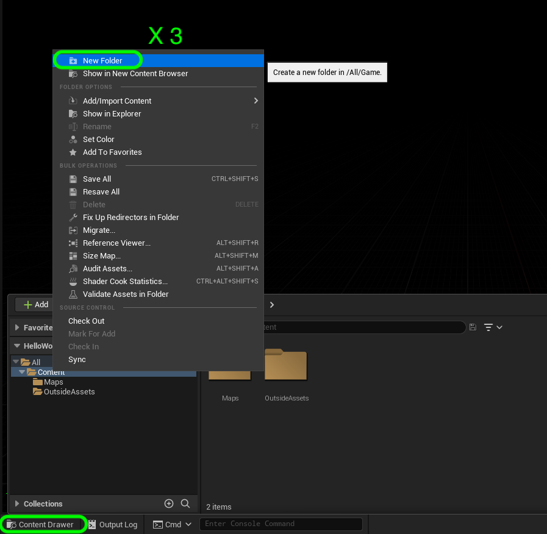
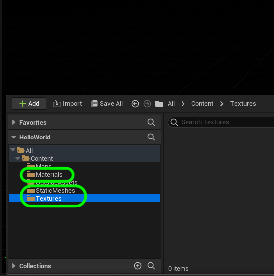
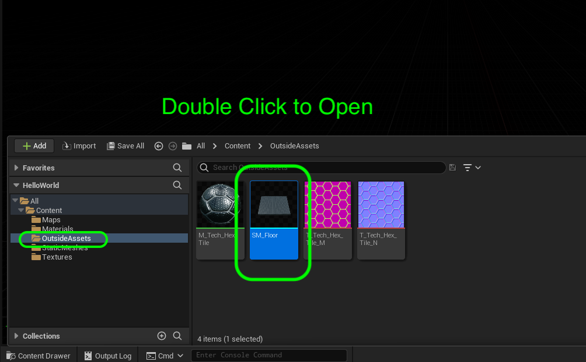
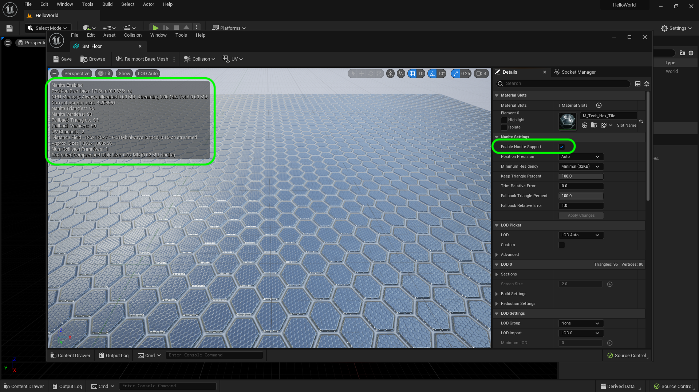
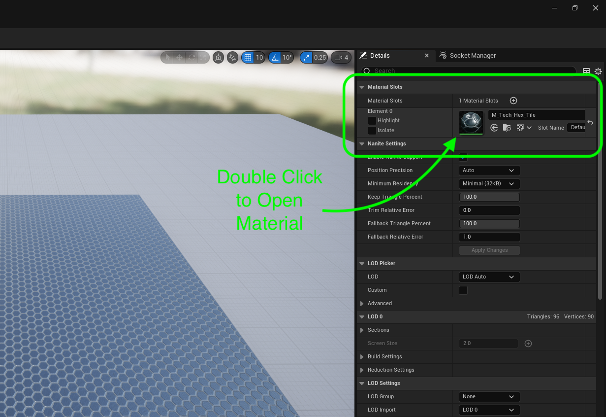

### Setting up the Map

[previous](../ignore-license/README.md#user-content-remaining-github-related-files) • [home](../README.md#user-content-ue4-hello-world) • [next](../setting-sky/README.md#user-content-finish-setting-up-sky)

Now lets add our **Actor** to our new **Hello World** level.  We will look at a static mesh, textures and a material.  We will also add a light to a scene so we can see the objects.

 

---

##### `Step 1.`\|`UE5HW`|:small_blue_diamond:

OK, lets open **UE5** again through **P4V**.   Open the **Content Drawer** (<kbd>Cntrl Space</kbd>) and right click on the **Content** folder.  Select **New Folder** and do this three times for three new folders.

##### `Step 2.`\|`FHIU`|:small_blue_diamond: :small_blue_diamond: 

Name the folders `Materials`, `Static Meshes` and `Textures`.

##### `Step 3.`\|`UE5HW`|:small_blue_diamond: :small_blue_diamond: :small_blue_diamond:

Go to the **Open Assets** folder and look for a file called `SM_Floor`.  This is a static mesh of a floor we will be using. Double click it to open it in the static mesh editors.

##### `Step 4.`\|`UE5HW`|:small_blue_diamond: :small_blue_diamond: :small_blue_diamond: :small_blue_diamond:

A static mesh is a type of actor that displays a 3-D model for objects without skeletons. On the top left you can see some statistics and you will notice that I have turned on **Nanites** on this model.  We will talk about this more in the modeling walk through.

##### `Step 5.`\|`UE5HW`| :small_orange_diamond:

A static mesh is made up of triangles under the surface.  Take a look at the video below.

##### `Step 6.`\|`UE5HW`| :small_orange_diamond: :small_blue_diamond:

So we can view our model's topology of triangles.  First lets turn off the background geometry.  Go to **Window | Preview Scene Settings** and then turn off **Environment | Show Environment** and **Environment | Show Floor**.  Then click on **Lit** and select **Wireframe**.  Now you can see that the top is a four by four row of quads (16 quads) or 32 triangles.  Every quad is made up of 2 triangles.

https://user-images.githubusercontent.com/5504953/172293160-02c237d9-4b90-4579-a240-e60255a946f8.mp4

##### `Step 7.`\|`UE5HW`| :small_orange_diamond: :small_blue_diamond: :small_blue_diamond:

So the triangles determine the general form of the 3-D model.  We also have a **Material** which determines how the model reacts with light (reflective, matte, shiny, color etc).  Each model has a material to make it look like the surface(s) you are trying to create.

##### `Step 8.`\|`UE5HW`| :small_orange_diamond: :small_blue_diamond: :small_blue_diamond: :small_blue_diamond:

##### `Step 9.`\|`UE5HW`| :small_orange_diamond: :small_blue_diamond: :small_blue_diamond: :small_blue_diamond: :small_blue_diamond:

##### `Step 10.`\|`UE5HW`| :large_blue_diamond:

##### `Step 11.`\|`UE5HW`| :large_blue_diamond: :small_blue_diamond: 

##### `Step 12.`\|`UE5HW`| :large_blue_diamond: :small_blue_diamond: :small_blue_diamond: 

##### `Step 13.`\|`UE5HW`| :large_blue_diamond: :small_blue_diamond: :small_blue_diamond:  :small_blue_diamond: 

##### `Step 14.`\|`UE5HW`| :large_blue_diamond: :small_blue_diamond: :small_blue_diamond: :small_blue_diamond:  :small_blue_diamond: 

##### `Step 15.`\|`UE5HW`| :large_blue_diamond: :small_orange_diamond: 

##### `Step 16.`\|`UE5HW`| :large_blue_diamond: :small_orange_diamond:   :small_blue_diamond: 

##### `Step 17.`\|`UE5HW`| :large_blue_diamond: :small_orange_diamond: :small_blue_diamond: :small_blue_diamond:

##### `Step 18.`\|`UE5HW`| :large_blue_diamond: :small_orange_diamond: :small_blue_diamond: :small_blue_diamond: :small_blue_diamond:

##### `Step 19.`\|`UE5HW`| :large_blue_diamond: :small_orange_diamond: :small_blue_diamond: :small_blue_diamond: :small_blue_diamond: :small_blue_diamond:

##### `Step 20.`\|`UE5HW`| :large_blue_diamond: :large_blue_diamond:

##### `Step 21.`\|`UE5HW`| :large_blue_diamond: :large_blue_diamond: :small_blue_diamond:

___

| [previous](../ignore-license/README.md#user-content-remaining-github-related-files)| [home](../README.md#user-content-ue4-hello-world) | [next](../setting-sky/README.md#user-content-finish-setting-up-sky)|
|---|---|---|
