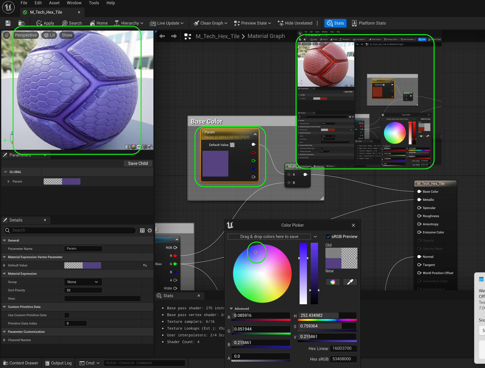

### Setting up the Map

[previous](../project-settings/README.md#user-content-project-settings) • [home](../README.md#user-content-ue4-hello-world) • [next](../floor-level/README.md#user-content-adding-floor-and-skyto-level)

Now lets add our **Actor** to our new **Hello World** level.  We will look at a static mesh, textures and a material.  We will also add a light to a scene so we can see the objects.

 

---

##### `Step 1.`\|`UE5HW`|:small_blue_diamond:

If **Unreal** is closed, open the **UE5** project again through **P4V**.   Open the **Content Drawer** (<kbd>Cntrl Space</kbd>) and right click on the **Content** folder.  Select **New Folder** and do this three times for three new folders.

##### `Step 2.`\|`FHIU`|:small_blue_diamond: :small_blue_diamond: 

Name the folders `Materials`, `Static Meshes` and `Textures`.

##### `Step 3.`\|`UE5HW`|:small_blue_diamond: :small_blue_diamond: :small_blue_diamond:

Go to the **Outside Assets** folder and look for a file called `SM_Floor`.  This is a static mesh of a floor we will be using. Double click it to open it in the static mesh editors.

##### `Step 4.`\|`UE5HW`|:small_blue_diamond: :small_blue_diamond: :small_blue_diamond: :small_blue_diamond:

A static mesh is a type of actor that displays a 3-D model for objects without skeletons. On the top left you can see some statistics and you will notice that I have turned on **Nanites** on this model.  We will talk about this more in the modeling walk through.

##### `Step 5.`\|`UE5HW`| :small_orange_diamond:

A static mesh is made up of triangles under the surface.  Take a look at the video below.

##### `Step 6.`\|`UE5HW`| :small_orange_diamond: :small_blue_diamond:

So we can view our model's topology of triangles.  First lets turn off the background geometry.  Go to **Window | Preview Scene Settings** and then turn off **Environment | Show Environment** and **Environment | Show Floor**.  Then click on **Lit** and select **Wireframe**.  Now you can see that the top is a four by four row of quads (16 quads) or 32 triangles.  Every quad is made up of 2 triangles.

https://user-images.githubusercontent.com/5504953/172293160-02c237d9-4b90-4579-a240-e60255a946f8.mp4

##### `Step 7.`\|`UE5HW`| :small_orange_diamond: :small_blue_diamond: :small_blue_diamond:

So the triangles determine the general form of the 3-D model.  We also have a **Material** which determines how the model reacts with light (reflective, matte, shiny, color etc).  Each model has a material to make it look like the surface(s) you are trying to create. In this case we have a science fiction like surface for our floor.  If you go the **Material** slots in the mesh and double click on the icon next to `M_Tech_Hex_tile` you will open the material.

##### `Step 8.`\|`UE5HW`| :small_orange_diamond: :small_blue_diamond: :small_blue_diamond: :small_blue_diamond:

This is a material editor that includes a node chart that adds surface detail to our 3-D topology.  The result is mapped to a sphere and you can see it in the top left corner. Understanding this at this point is not important, except that we do not see the triangles they are represented by pixels from the material.  

##### `Step 9.`\|`UE5HW`| :small_orange_diamond: :small_blue_diamond: :small_blue_diamond: :small_blue_diamond: :small_blue_diamond:

Now you will notice that all the nodes go to the **Result Node** in the node chart.  Lets look at the **Base Color** pin which is the color of the pixel that the material contains.  Lets look at this in more detail.

##### `Step 10.`\|`UE5HW`| :large_blue_diamond:

We have the **Texture Sample** node that contains a pink texture that goes to a **Multiply** node that then goes to the **Base Color** in the **Result Node**.

Notice that there are different output pins from the **Texture Sample** node.  An **RGB** pin which outputs only red, green and blue.  Seperate **R**, **G**, and **B** pins reprenting each color separately.  The is also an **A** pin representing the **Alpha** channel.  And finally there is a **RGBA** which represents all three color channels and an alpha.

Notice that the **R** pin is the only one used in the base color.  Select the **Texture Sample** in the Mask Texture. Lets double click the `T_Tech_Hex_Tile` file to open up the texture file used.

##### `Step 11.`\|`UE5HW`| :large_blue_diamond: :small_blue_diamond: 

Now in our **Texture** editor the texture looks wrong and is pink. Why is the model not pink then?

##### `Step 12.`\|`UE5HW`| :large_blue_diamond: :small_blue_diamond: :small_blue_diamond: 

In 3-D the texture can use different channels for different parts of the material. In this case the **Base Color** is only getting data from the **R** (red) channel.  So click on **G** and **B** to turn off those channels.  Now we have a grey and white texture that look a lot more like the render on the sphere. This material is packing its masks into a single texture with the **R** channel for the base color, and the **G** channel for metallic.

##### `Step 13.`\|`UE5HW`| :large_blue_diamond: :small_blue_diamond: :small_blue_diamond:  :small_blue_diamond: 

So what does the multiply node do?  If we don't multiply our color is more like the one in the texture and is fairly light (go back above and look at the texture).  When we multiply it by gray it is getting darker.  We can change the color gray by double cliking on it and adjust the hue in the **Color Picker**.  We can then change the hue and have a different looking floor. That is all this multiply node is doing. So not only can the texture represent different things to the material but we can change the properties in other nodes.  Cool!

##### `Step 14.`\|`UE5HW`| :large_blue_diamond: :small_blue_diamond: :small_blue_diamond: :small_blue_diamond:  :small_blue_diamond: 

 Now lets move these assets to the appropriate folders.  Open up the **Content Drawer** (<kbd>Cntrl Space</kbd>) and go to the **Outside Assets** folder and drag and drop `SM_Floor` into the **StaticMeshes** folder. You might get a request to **Check Out Selected** as we need to check out files to alter them (yes moving directories is altering the files). So you will have to check the file out.

##### `Step 15.`\|`UE5HW`| :large_blue_diamond: :small_orange_diamond: 

Now drag `T_Tech_Hex_Tile_M` and `T_Tech_Hex_Tile_N` to the **Textures** folder and check out both files to move them.

##### `Step 16.`\|`UE5HW`| :large_blue_diamond: :small_orange_diamond:   :small_blue_diamond: 

Then finally move the material `M_Tech_Hex` to the **Materials** folder and check out the file to move them.

##### `Step 17.`\|`UE5HW`| :large_blue_diamond: :small_orange_diamond: :small_blue_diamond: :small_blue_diamond:

Now after moving files it is best practice to finish the process.  Unreal doesn't move the file it also in the old folder has a redirector that says where the new file is.  This way any other actor refering to it can find it.  To adjust that location for all objects using it right click on the **Content** folder and select `Fix Up Redirectors in Folders`.

##### `Step 18.`\|`UE5HW`| :large_blue_diamond: :small_orange_diamond: :small_blue_diamond: :small_blue_diamond: :small_blue_diamond:

Now any time we finish a unit of work we want to save to source control.  Press the bottom right button <kbd>Source Control</kbd> and select `Submit`. Now enter a message in the **Changelist Description** box.  This way we know what was done if we need to go back and fix it later.  Then we press the <kbd>Submit</kbd> button.  If it was done correctly you will see a pop up saying it was submitted to a changelist (your number will be different).

| [previous](../project-settings/README.md#user-content-project-settings)| [home](../README.md#user-content-ue4-hello-world) | [next](../floor-level/README.md#user-content-adding-floor-and-sky-to-level)|
|---|---|---|
