### Finish Setting Up Sky

[previous](../setting-map/README.md#user-content-setting-up-the-map) • [home](../README.md#user-content-ue4-hello-world) • [next](../building-h/README.md#user-content-build-the-letter-h)

The sky just has an atmosphere and no clouds or ground plane (it is black).  Lets make this look a bit more complete as well as organize our **World Outliner**.  

 

---

##### `Step 1.`\|`SUU&G`|:small_blue_diamond:

Lets start by <kbd>Right Mouse Button</kbd> press on the top folder of **World Outliner** and select **Create Folder** and call it `Lighting`.

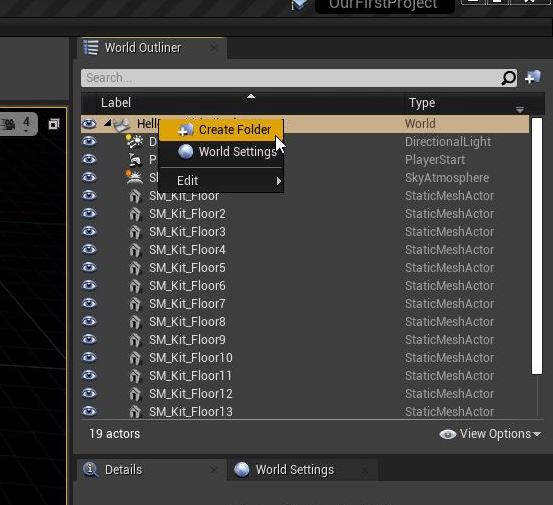

##### `Step 2.`\|`FHIU`|:small_blue_diamond: :small_blue_diamond: 
Drag the **directional light** and **sky atmosphere** into this newly created lighting folder.

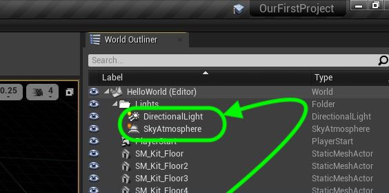

##### `Step 3.`\|`SUU&G`|:small_blue_diamond: :small_blue_diamond: :small_blue_diamond:

Create another folder called `Floor`.  Drag all your floor pieces into it.  You can also hide and show the content of the folders with the small arrow.  Now look at how much better organized your world outliner is.

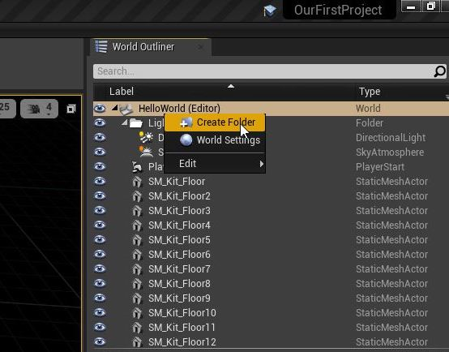

| `3d.concept`\|`Static Mesh`| 
| :--- |
| :floppy_disk: &nbsp;&nbsp; A [static mesh](https://docs.unrealengine.com/en-us/Engine/Content/Types/StaticMeshes) in Unreal is a 3-D piece of geometry made up of points, edges and polygons.  These meshes are \"static\" as the vertices themselves cannot be animated.  They can be moved, scaled and rotated in realtime. |

##### `Step 4.`\|`SUU&G`|:small_blue_diamond: :small_blue_diamond: :small_blue_diamond: :small_blue_diamond:

For our sky we will add a **static mesh** to the game. Now the sky material will be projected in the inside of this large **Static Mesh** with our level in the center of it.
From the **Place Actors | Basic** tab drag a **Sphere** into the level and call it `SkySphere`.

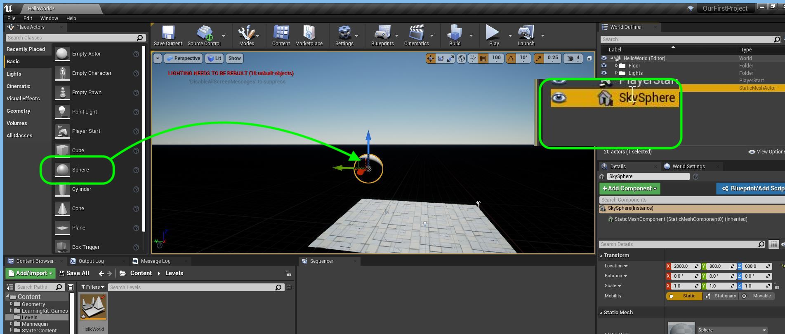

##### `Step 5.`\|`SUU&G`| :small_orange_diamond:

Now **Unreal** provides us with some basic materials to start working with.  It is not in our set of files though and lies in the engine code.  Press on **View Options** and turn on **Show Engine Content** by setting it to `true`.  The select the **Engine Content** folder in the **Content Browser** and type **M_Sky** as we are looking for `M_SkyTimeOfDay`.

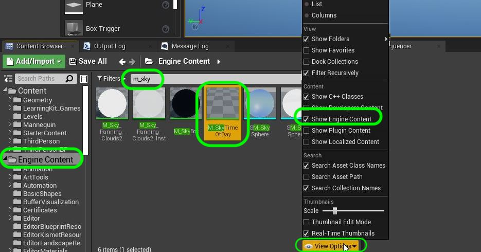

##### `Step 6.`\|`SUU&G`| :small_orange_diamond: :small_blue_diamond:

Now drag and drop `M_SkyTimeOfDay` onto the **Material** slot on the **Sky Sphere** mesh.

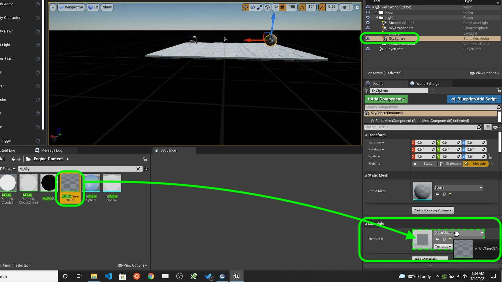

##### `Step 7.`\|`SUU&G`| :small_orange_diamond: :small_blue_diamond: :small_blue_diamond:

Now we need to adjust the scale, angle and position of the sky sphere.  Set the **Location | X** & **Location | Y** to `0`.  Set the **Location | Z**  to `-7300000`.  Set the **Rotation | X** to `90`. Set the **Scale | X** & **Scale | Z** to `1000000`. Set the **Scale | Y** to `150000`.

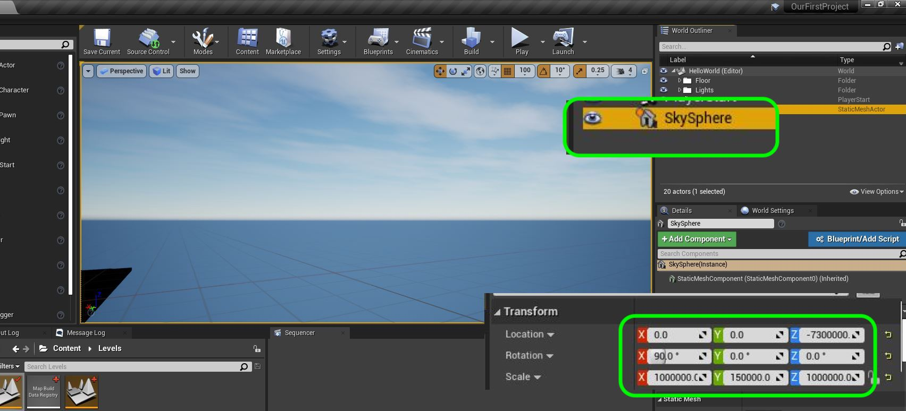

##### `Step 8.`\|`SUU&G`| :small_orange_diamond: :small_blue_diamond: :small_blue_diamond: :small_blue_diamond:

Now if your ground is now black you will need to press the <kbd>Build</kbd> button to rebuild the static lighting.  Also, move the **SkySphere** static mesh to the **Lights** folder.

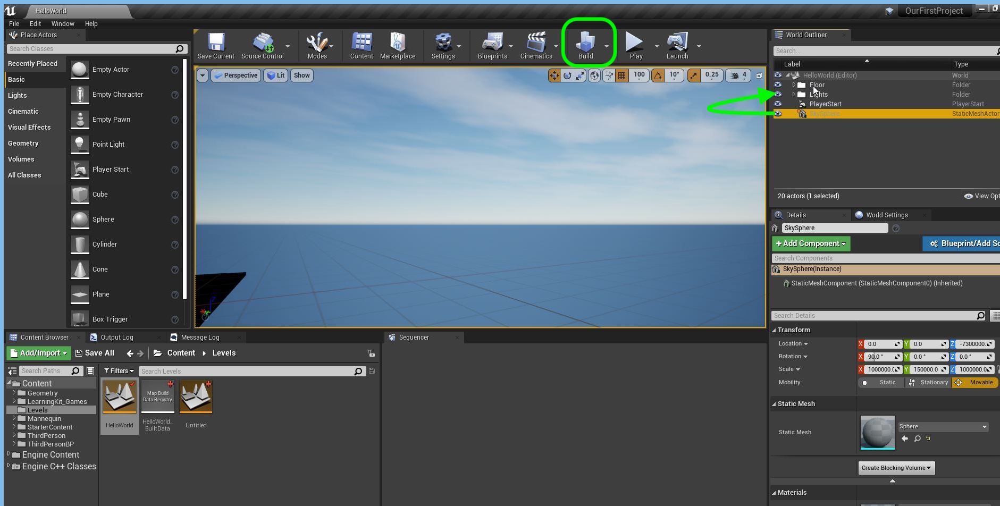

##### `Step 9.`\|`SUU&G`| :small_orange_diamond: :small_blue_diamond: :small_blue_diamond: :small_blue_diamond: :small_blue_diamond:

Now select our **SkySphere** in the **World Outlihner** and go to **Collision | Collision Presets** and change it to `No Collision`. We are always colliding with this object as we are inside of it.  We do not need to waste cycles on the computer as we will never reach this sphere.

We also need to go to **Lighting | Cast Shadow** and turn this off.  The sky will **NOT** be casting shadows as it is not meant to be a mesh (but infinite space).

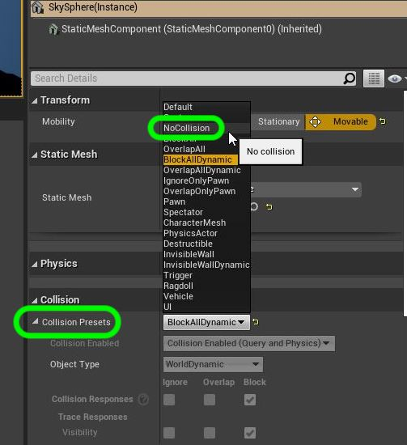

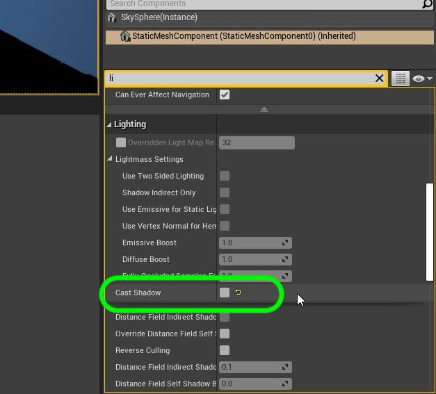

##### `Step 10.`\|`SUU&G`| :large_blue_diamond:

Now these clouds are just a texture on a sphere and not very realistic.  It cannot have any effects of the sun passing over it affecting the shadows in the scene.  **Unreal** has added a new 3-D set of clouds we can add.  Type in **Volumetric Clouds** in the **Pace Assets** tab and drag it into the scene.

##### `Step 11.`\|`SUU&G`| :large_blue_diamond: :small_blue_diamond: 

Now we can have it so that the clouds cast shadows when they cover the sun.  Go to **Directional Light** (our sun) in the **World Outliner** and change **Lighting | Cast Lightmass Settings | Cast Shadow** to `true`.

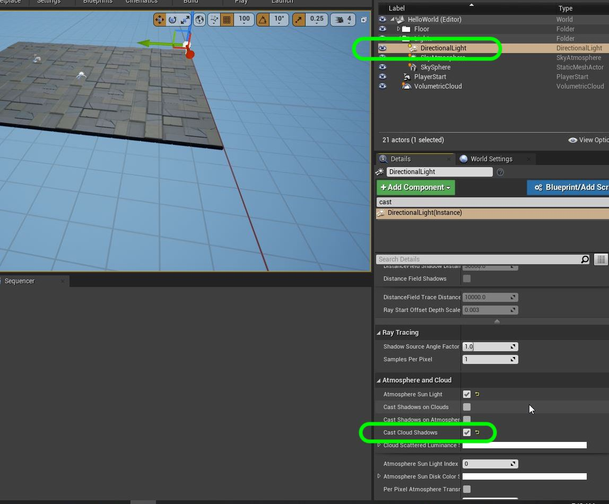

##### `Step 12.`\|`SUU&G`| :large_blue_diamond: :small_blue_diamond: :small_blue_diamond: 

If the directional light is the sun, in unreal this only lights up at that one angle.  The sun actually reflects and refracts off of various objects filling in shadow and detail.  This is done with the **Place Actors | Lights | SkyLight**.  Drag it into the game scene and put it in the **Lights** folder.

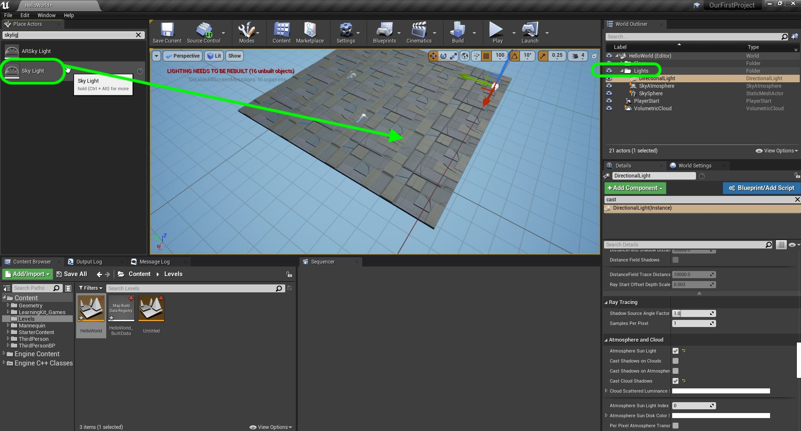

##### `Step 13.`\|`SUU&G`| :large_blue_diamond: :small_blue_diamond: :small_blue_diamond:  :small_blue_diamond: 

Now press the play butotn and look at those beautifully animated 3-D volumetrick clouds.  It should look really nice and we can begin building the letter **H** next.  But first lets go to **File | Save Current** and save all of our progree (you might even want to select **File | Save All**).  Now press the <kbd>Source Control</kbd> button and press **Submit to Source Control**. Add a comment describing what you did then **Submit** your change.  Open up **GitHub Desktop** and `push` to the server.

https://user-images.githubusercontent.com/5504953/125166646-76ffac80-e151-11eb-9f83-1b3bf72f83f9.mp4

| [previous](../building-h/README.md#user-content-build-the-letter-h)| [home](../README.md#user-content-ue4-hello-world) | [next](../readme/README.md#user-content-readmemd-file)|
|---|---|---|
