### Setting Up Unreal & Github

<sub>[previous](../first-hour/README.md#user-content-first-hour-in-ue4) • [home](../README.md#user-content-ue4-hello-world) • [next](#)</sub>


Before we can start we want to set up our development environment. This includes setting up **GitHub** as our version control so we can backup and maintain our project safely. Make sure you have lots of hard drive space as the engine and various downloads can take a lot of room. I recommend around 100 gigabytes free would be suitable.

<br>

---

| `important.concept`\|`Version Control`| 
| :--- |
| There are some potential problems developing with a complex engine:<br>
:small_blue_diamond: The engine can crash and you can lose your work<br>
:small_blue_diamond: You can forget the data on another computer<br>
:small_blue_diamond: Your hard drive can die and all the data can be lost<br>
All of these problems can be avoided if we use **version control** to back up our data.  This way we can recover lost work, *clone* the data on another computer and collaborate as a team.  It is a good idea to get used to using version control as all large projects use them. The good news is that you have the tools integrated right in Unreal. |

---

##### `Step 1.`\|`SUU&G`|:small_blue_diamond:

If you are on a mac git comes ready to go (it might need to install xcode when first running the command).  On a PC you will need to install [git](https://git-scm.com/downloads).  Double click and keep all the default suggestions.  Follow the directions on the website for installing it on PC.

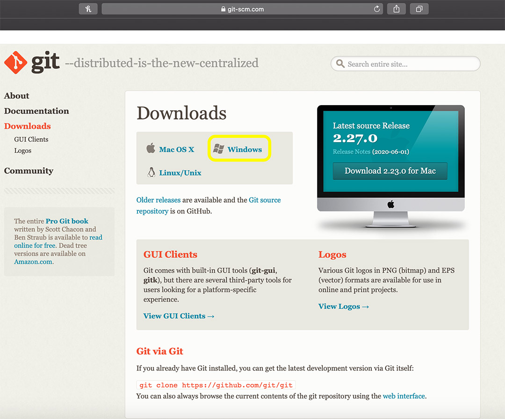


##### `Step 2.`\|`FHIU`|:small_blue_diamond: :small_blue_diamond: 

Now so you don't have to use command line prompts for git it is a good idea to install a GUI and the one I like best is [Github Desktop](https://desktop.github.com) as it integrates with GitHub perfectly.  Download and install the software.

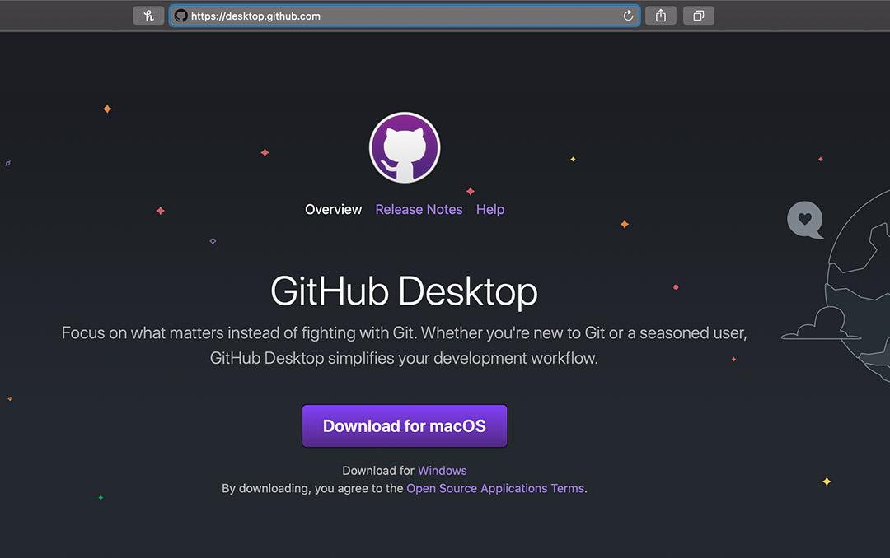


##### `Step 3.`\|`SUU&G`|:small_blue_diamond: :small_blue_diamond: :small_blue_diamond:

Now since game projects can get very large and graphics, and 3-D models can take a lot of space it is best to use the [Git LFSn (Large File System)](https://git-lfs.github.com) extension for games.  This way only assets that are currently being used are downloaded to your system speeding up your workflow and allowing you to hold larger files in GitHub. Install it on your computers per the directions on the website.

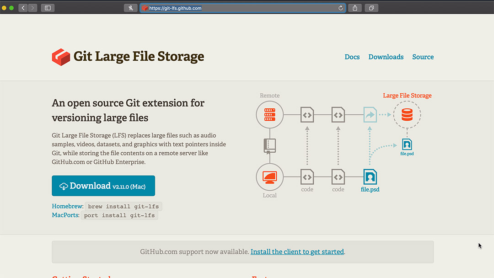


##### `Step 4.`\|`SUU&G`|:small_blue_diamond: :small_blue_diamond: :small_blue_diamond: :small_blue_diamond:

In the editor select the **Edit** menu item then from the drop down menu select **Editor Preferences**. Select **Loading & Saving** tab from the left hand side.  Go to *Source Control* and set **Prompt for Checkout on Asset Modification** to `true` and **Add New Files when Modified** to `true`.  Leave the other two settings at `false` and accept their default editor to deal with merge conflicts. 

https://user-images.githubusercontent.com/5504953/124603352-b3b06880-de1e-11eb-926e-a913b741c38b.mp4


##### `Step 5.`\|`SUU&G`| :small_orange_diamond:

Make sure you have a **GitHub** account and that you are logged into it.  Click on [GitHub Classroom Hello World Link](https://classroom.github.com/a/z7lsXBo4).  Accept the prompt if it asks you go join the class and you should get to a **Accept the Assignment – UE4-Hello-World-FA21**.  Press the <kbd>Accept this assignment</kbd> button.

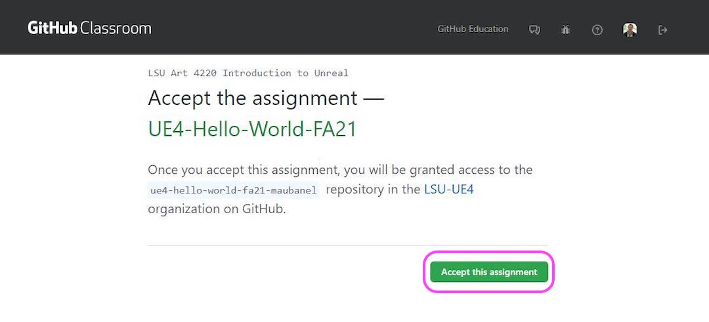


##### `Step 6.`\|`SUU&G`| :small_orange_diamond: :small_blue_diamond:

You will get a message saying the repository is geing setup.  Refresh/Reload your web browser as instructed.

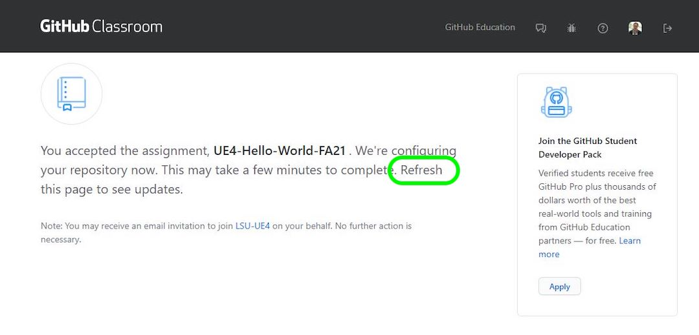


##### `Step 7.`\|`SUU&G`| :small_orange_diamond: :small_blue_diamond: :small_blue_diamond:

Eventually you will get a link for the repository.  Click on this link:

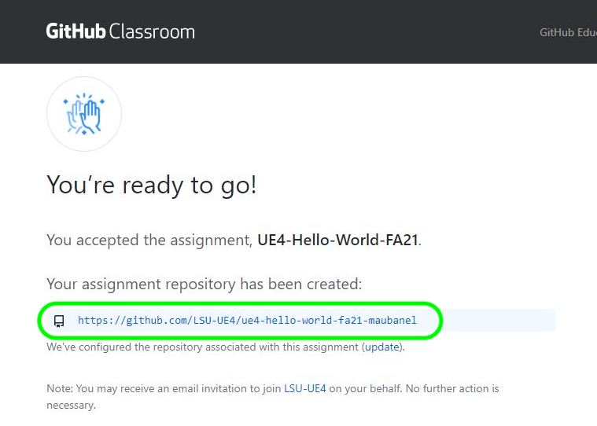


##### `Step 8.`\|`SUU&G`| :small_orange_diamond: :small_blue_diamond: :small_blue_diamond: :small_blue_diamond:

Now our server has no files on it. We will be using command line (**Terminal** on the mac Or **Git Bash** on the PC). You can see the commands below.  We are creating a **main** branch and making it our default branch (`-M` switch).  We are then taking the content we **Already Have** in our folder and pushing it to the server.

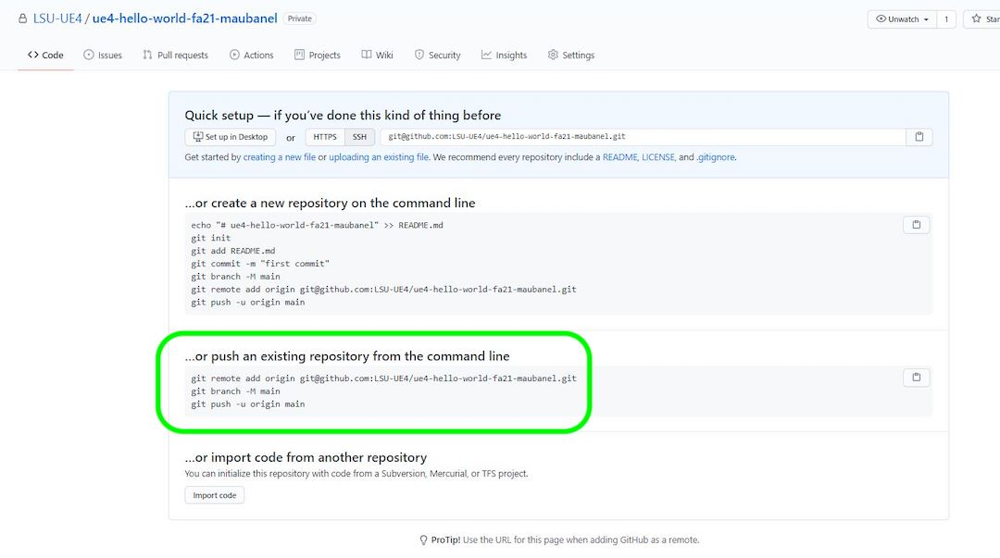


##### `Step 9.`\|`SUU&G`| :small_orange_diamond: :small_blue_diamond: :small_blue_diamond: :small_blue_diamond: :small_blue_diamond:

Lets start by copying the link to the clipboard so we can add it to Unreal, and use UE4 to **Initialze** the project.

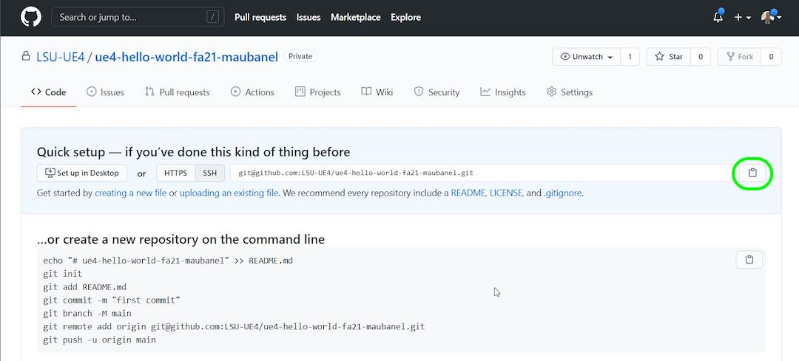


##### `Step 10.`\|`SUU&G`| :large_blue_diamond:

Go back to **Unreal Engine** and press the <kbd>Source Control</kbd> button and select the **Provider** `None` dropdown.


##### `Step 11.`\|`SUU&G`| :large_blue_diamond: :small_blue_diamond: 

In the menu select **Git (beta version)** as the source control you will be using. Paste the directory for your GitHub project into the **Url of the remote server 'origin'** in Unreal.  Then make sure you add a **.gitignore** file, a **README.md** file, a **.gitattributes for Git LFS** file and finally **Make the initial Git Commit** file.  Then press the **Intialize project with Git** button and on the next pop up press the **Accept Settings** button. You should see message pop up saying *Connection to source control was successful!*.

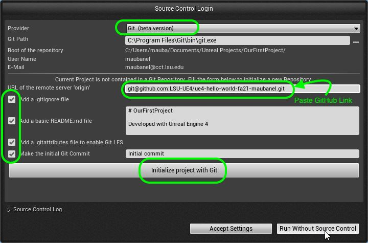


##### `Step 12.`\|`SUU&G`| :large_blue_diamond: :small_blue_diamond: :small_blue_diamond: 

Lets make sure it installed GitHub in our project.  First we need to turn on hidden folders. On the PC follow these [Windows 10 Turn on Hidden Folders](https://support.microsoft.com/en-us/help/4028316/windows-view-hidden-files-and-folders-in-windows-10) directions. On the Mac it is a bit more involved so go and [turn on hidden folders on Mac](https://ianlunn.co.uk/articles/quickly-showhide-hidden-files-mac-os-x-mavericks). You should now see a `.git` hidden folder in the root directory of the project, if you do – you succesfully created a GitHub repo and connected it to the server.


##### `Step 13.`\|`SUU&G`| :large_blue_diamond: :small_blue_diamond: :small_blue_diamond:  :small_blue_diamond: 

Now we are going to use the **Command Line** tools just once.  On a **PC**, right click and run [Git Bash](https://www.windowscentral.com/how-launch-bash-shell-right-click-context-menu-windows-10).  This should have been installed with **Git** when you installed it above.  On a mac, it is a little more involved as you will see by this [website description](https://www.groovypost.com/howto/open-command-window-terminal-window-specific-folder-windows-mac-linux/).  The trick is to navigate to your working Directory (typically `Documents | Unreal Projects | Our First Project`).

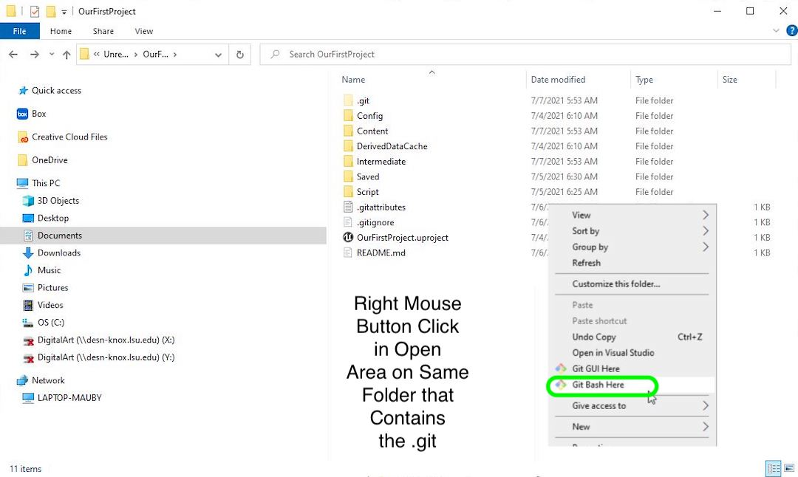


##### `Step 14.`\|`SUU&G`| :large_blue_diamond: :small_blue_diamond: :small_blue_diamond: :small_blue_diamond:  :small_blue_diamond: 

Type in:

```
git branch -M main
```
in either **Terminal** or **Git Bash**.  This will create a new **Default** branch called `Main`.

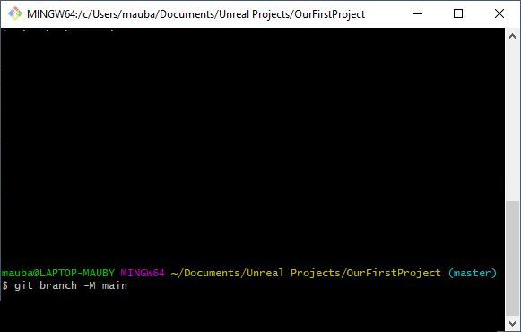


##### `Step 15.`\|`SUU&G`| :large_blue_diamond: :small_orange_diamond: 

Now lets switch to the **Main** branch by typing

```
git checkout main
```

Now lets take all the work we have done to date on our computer and **Push** it to the server.  This will ensure that all the files are safely stored on the server.

```
git push -u origin main
```

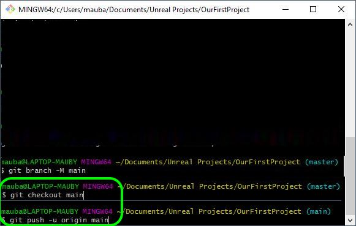


##### `Step 16.`\|`SUU&G`| :large_blue_diamond: :small_orange_diamond:   :small_blue_diamond: 

Go back to **GitHub** on the web and refesh the folder.  If you did the above correctly you should now see all the folders on **GitHub**:

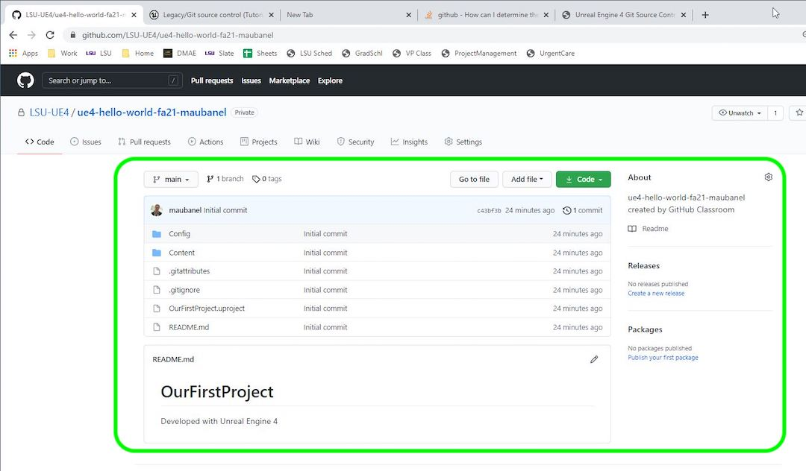


##### `Step 17.`\|`SUU&G`| :large_blue_diamond: :small_orange_diamond: :small_blue_diamond: :small_blue_diamond:

Now I tried doing the above step in **GitHub Desktop** but got some errors.  So now we need to link it to **GitHub Desktop** as we can use this moving forward to push data to the server.  Open up **GitHub Desktop** and select `File | Add local repository`.  Select the <kbd>Choose</kbd> button.


##### `Step 18.`\|`SUU&G`| :large_blue_diamond: :small_orange_diamond: :small_blue_diamond: :small_blue_diamond: :small_blue_diamond:

Locate the root folder of your project.  This is the folder that contains the `.git` folder.  This is the topmost folder of your Unreal project.

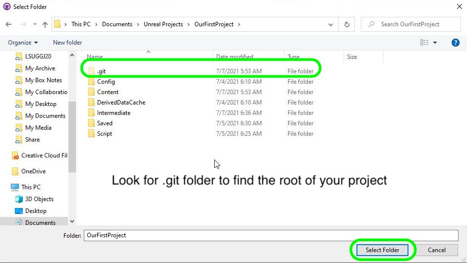


##### `Step 19.`\|`SUU&G`| :large_blue_diamond: :small_orange_diamond: :small_blue_diamond: :small_blue_diamond: :small_blue_diamond: :small_blue_diamond:

Locate the root folder of your project.  This is the folder that contains the `.git` folder.  This is the topmost folder of your Unreal project.


##### `Step 20.`\|`SUU&G`| :large_blue_diamond: :large_blue_diamond:

Press the <kbd>Add Repository</kbd> button to select this project. Then press the <kbd>Checkout</kbd> button to make sure that the permissions all work.

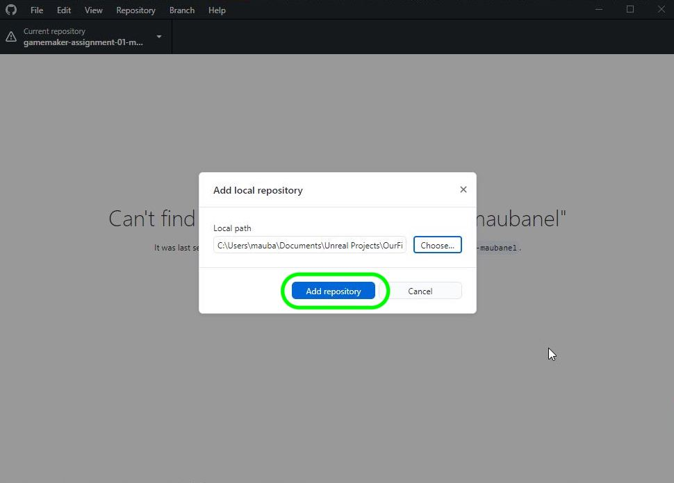
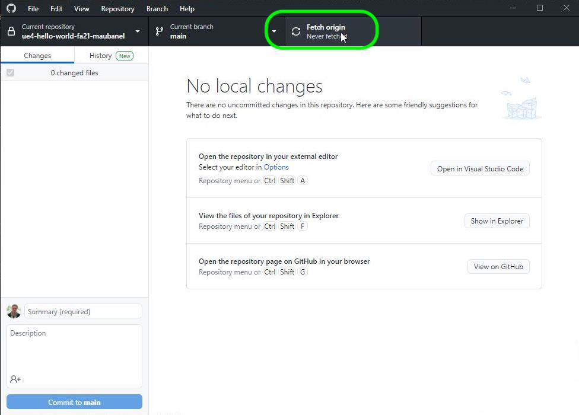
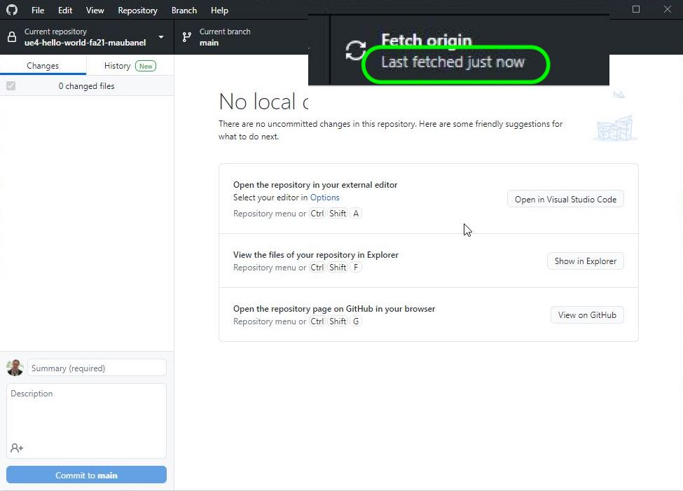


| [previous](../first-hour/README.md#user-content-first-hour-in-ue4)| [home](../README.md#user-content-ue4-hello-world) | [next](#)|
|---|---|---|
